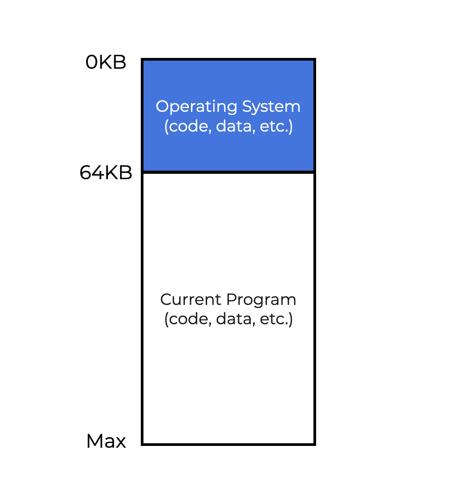
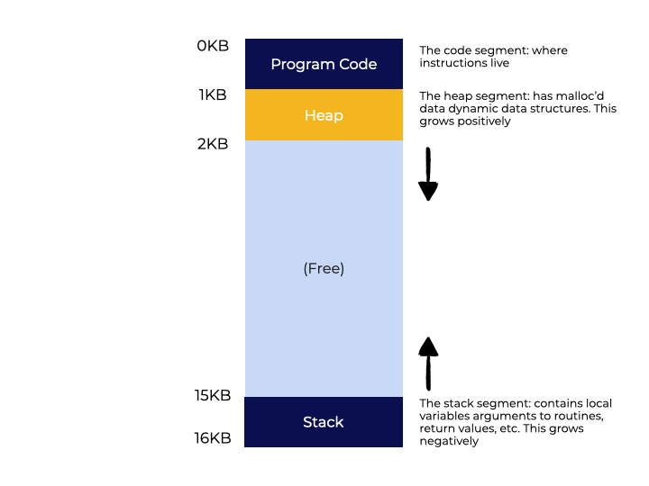
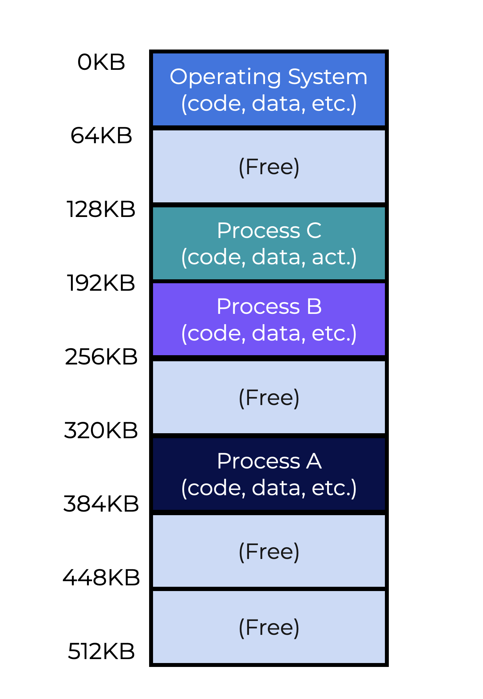

# Address Spaces
 
## Overview

This lesson explores how an operating system virtualizes memory. As you go over the core concepts, keep the following question in mind:

> With only a single, physical piece of memory, how does the OS represent separate memory spaces for the many processes running at the same time?

## Introduction

### Early Machines

The first computers did not have a **memory abstraction** for their users. The image to the left provides a good representation of how memory was initially treated.

The OS was treated as a library (or set of routines) stored in memory. In this example, the OS is encompassed by the first 64k of memory. The running program or process took up the rest of the memory.

<p align="center">
  
</p>

## Multiprogramming and Time Sharing

Due to their enormous cost, computers became shared resources. That means operating systems had to be able to handle more than one user at a time.  **Multiprogramming** was introduced so that several process ran at the same time. The system switched between them (performing I/O). This improved **CPU efficiency**.

Users needed **interactivity** from computers so they could get quick answers from the machine. This ushered in **time sharing**. Time sharing began by running a process for a little while, stopping it, saving the sate to disk, load the state for another process, run it for a short time, etc.

Writing to disk, however, is a relatively slow task for a computer. In order for time sharing to be more effective, process state is saved and loaded from memory, which is much faster than reading and writing to disk.

**Interactivity** became important because multiple users could be utilizing a system at the same time, each looking for a prompt answer from their current work, so the era of **time sharing** was born.

The diagram below shows how three processes (A, B, and C) share memory. Each process has its own block of memory. The CPU reads and writes to block of memory associated with each process. The other processes remain in a ready queue.

<p align="center">
  
</p>

### Question

How can the operating system handle time sharing effectively?

Select an answer and click the button below to submit.
- [x] By switching between processes while leaving processes in memory
- [ ] By saving the full contents of memory to disk
- [ ] By saving and restoring register-level state
- [ ] By allowing processes to run and finish before switching to another

> The OS can perform efficient time-sharing by **leaving processes in memory while switching between them**. Other methods, such as saving the entire memory contents to disk or allowing processes to run before switching, are sluggish, especially as the size of memory increases.

## The Address Space

The operating system now needs an abstraction to deal with separate areas of memory. This abstraction is call the **address space**. A running application can only see information in its address space. Other blocks of memory are off limits.

The address space for a process contains program’s state, which includes the **code**. A **stack** is used to create variables, send parameters, and generally keeps track of the process’s position in the function call chain. A **heap** is used to dynamically allocate memory. For example, the heap is used with a `malloc()` call.

A process’ **address space** contains all of the program’s memory state, including the **code**. The program uses a **stack** to monitor its position in the function call chain, allocate variables, and pass parameters. Finally, the **heap** is used for dynamically-allocated, user-managed memory, like when using a `malloc()` call.

The animation shows an address space of 16kb. Because the program code is static, it can go at the first 1K of the address space. The stack and heap are both dynamic, so they need room to increase and decrease over the life of the program. That is why they are put at opposite ends of the address space. They can grow and shrink to make use of all of the available free memory in the address space.

<p align="center">
  
</p>

### Question

Fill in the blanks to complete the statements below.

* **Address Space**: holds the entire memory state of the program, including the code.
* **Stack**: used by the program to keep track of its place in the function call chain, allocate variables, and pass parameters.
* **Heap**: used for dynamically allocated, user-managed memory.

> The **address space** holds the entire memory state of the program, including the code.
> 
> The **stack** is used by the program to keep track of its place in the function call chain, allocate variables, and pass parameters.
> 
> The **heap** is used for dynamically allocated, user-managed memory.

## Virtualizing Memory

We see how the abstraction of an address spaces works for a given example, but how does the system manage all of the separate address spaces running atop one physical memory?

This is called **virtualizing memory**. The animation from the previous page showed the program code occupying the first 1kb of memory. The stack and heap have different addresses. However, this is an abstraction. The address space of a process does not correspond to the physical memory.

According to the previous page, process A thinks that its program code resides at the beginning of the memory block (0kb). This is actually a **virtual address**. Now, look at the picture on the left. Each process is stored in various blocks of memory. Process A actually begins at address 320kb. The operating system and hardware work together to ensure that the load goes to the correct address (320kb) and not the virtual address (0kb).

<p align="center">
  
</p>

The process of translating between the virtual address and the actual address is key part of memory virtualization.

### Question

Fill in the blanks below.
* The **virtual** address is an abstraction used so that each address spaces starts at 0kb.
The **physical**  address is the actual address of a process in the larger block of memory.

> The correct answers are:
> * The **virtual** address is an abstraction used so that each address spaces starts at 0kb.
> * The **physical** address is the actual address of a process in the larger block of memory

## Where's my Program?

Perhaps you have printed the value of a pointer, which represents a space in memory. Taking into account everything we have learned up until now, the value of pointers represent a **virtual address**. Moreover, every address you see in a user-level program is a virtual address. The actual address in physical memory is only know to the OS and hardware.

Compile and run the program on the left will return three different address values. The first is for the `main()` function, the second address is for the heap, and the third is for the stack.

### Example

**Code**: [virtual_address.c](src/virtual_address.c)

```c
#include <stdio.h>
#include <stdlib.h>

int main(int argc, char *argv[]) {
    printf("virtual address of the code : %p\n", main);
    printf("virtual address of the heap : %p\n", malloc(100e6));
    int x = 3; // create a value on the stack
    printf("virtual address of the stack: %p\n", &x);
    return 0;
}
```

**Compile**

```
gcc -Wall virtual_address.c -o virtual_address
```

**Run**

```
./virtual_address
```

**Output**

```
virtual address of the code : 0x5fcc800006fa
virtual address of the heap : 0x79785d997010
virtual address of the stack: 0x7ffcc875e3d4
```

None of these addresses represent the physical memory. They correspond to a virtual address allocated for this program.

### Questions

What do printed addresses from a user-level program represent?

Click the button below to submit.
- [ ] Physical address
- [ ] The first 64kb from the address space
- [x] Virtual address
- [ ] The address of memory not used by the program, stack, or heap

> All user-level programs run in virtualized memory, so any printed values represent a virtual address.

## Goals
Having goals helps the operating system ensure that memory virtualization is working as intended. The system should focus on three areas:

* **Transparency** - Only the OS and hardware should be aware of the physical memory address. Everybody else should operate as if the virtual address is the physical memory address.
* **Efficiency** - Virtualization should be optimized for space and time. This means not allocating too much memory (space) and not slowing down programs as they run (time).
* **Protection** - Each address space should be an isolated silo where the process cannot affect other processes outside the silo. In addition, outside processes should not affect another address space.

### Question

Fill in the blank to complete the statements below.
 
* **Protection**  defends processes from themselves and each other.
* **Transparency** makes virtual memory invisible for the program.
* **Efficiency** optimizes virtualization for both space and time.

> **Protection** refers to defending processes from themselves and each other.
> 
> **Transparency** makes virtual memory invisible for the program.
> 
> **Efficiency** makes sure virtualization is optimized for both space and time.

## Summary

Here are the key concepts covered in this lesson:
* Memory utilization had to evolve computers focused on **time sharing** and **interactivity**.
* **Virtual memory (VM)** is an important part to how the OS functions.
* Virtualizing memory means the system needs a **virtual address** (an abstraction) to mimic a separate address space where instructions and data are stored. All addresses in a user-level program are virtual addresses.
* The OS and hardware translate the virtual address into a **physical address** in memory.
* Effective memory virtualization means the system provides **transparency**, **efficiency**, and **protection**.

