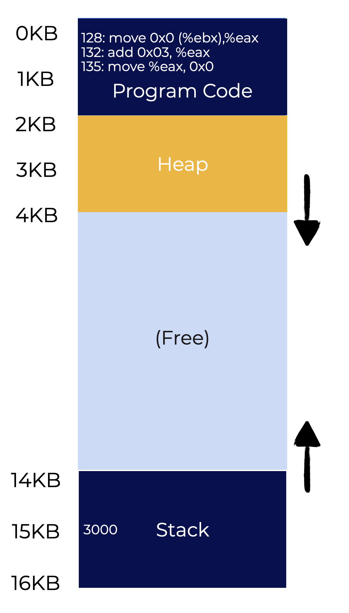
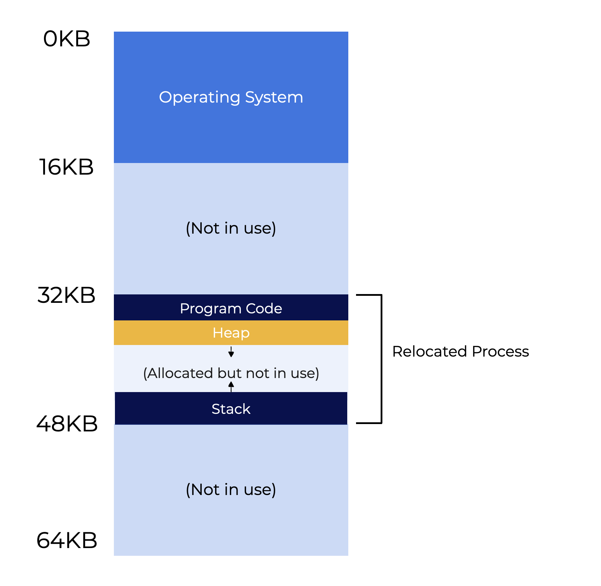
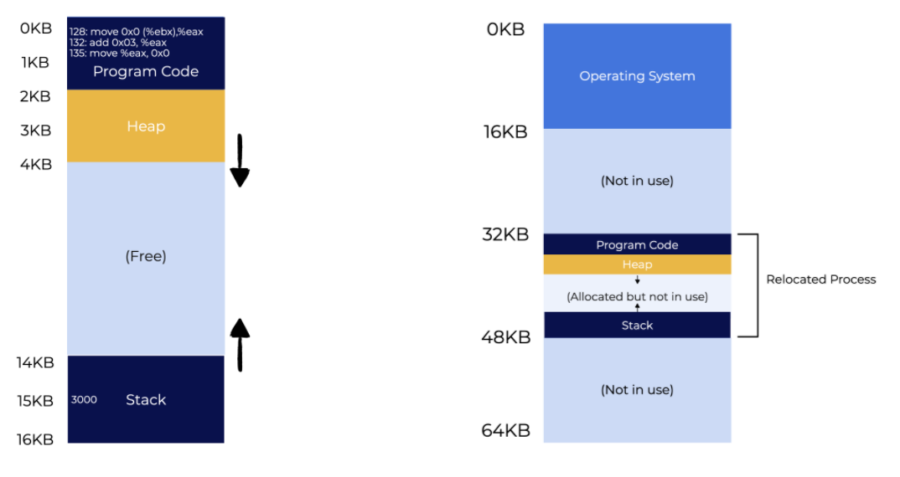

# Address Translation Base & Bounds

## Overview
This lesson will explore how to efficiently virtualize memory. As we move through the different topics, keep the following questions in mind:
* What are some ways to efficiently virtualize memory?
* How do we limit access to the memory location a program can use?
* How can we do the above efficiently?

## Introduction

In the lesson on CPU virtualization, we introduced the idea of **limited direct execution** (or **LDE**). Most of the time, the programs runs as expected. However there will be cases where the OS nneds to take **control**, like a timer interrupt or when a program makes a system call.

A similar approach is used when virtualizing memory. The end goal is likewise balance both **efficiency** and **control**. Efficiency starts as a simple affair (e.g., registers) and grows in complexity (e.g., page-table support). Control means the OS ensures that programs do not access memory allocated to other programs.

### Question

What does it mean for the OS to maintain control when virtualizing memory?
Select an answer and click the button below to submit.
- [ ] The OS makes sure the hardware offers adequate assistance.
- [ ] The OS makes sure to use LDE to let the program run.
- [x] The OS makes sure no application has access to any memory other than its own.

> The OS maintains control during memory virtualization by **making sure no program has access to any memory other than its own**. This requires support from the hardware to provide programs with protection.

## Address Translation

Making the system easy to program means that the virtual memory system needs to be flexible. For example, programs need to be allowed to make use of the address space any way they see fit.

The OS makes use of hardware to translate virtual memory to a physical memory address. This process is called **address translation**. Hardware is used every time memory is referenced so that software is accessing the correct memory location. Hardware is not responsible for memory virtualization itself, it performs the necessary low-level tasks. The system assists the hardware by monitoring which blocks of memory are currently free and which are free. The OS also keeps control over memory usage.

Memory virtualization is an abstraction, and when properly done the end user believes that each program has its own private memory containing the code and data for the program to run. They don’t experience slowdowns or any other indicators that the CPU is simultaneously juggling many processes wanting to access system resources.

### Question

Which of the following is responsible for converting each memory access from a virtual address to a physical address?

Select an answer and click the button below to submit.
- [ ] Memory Management
- [ ] Limited Direct Execution
- [x] Address Translation
- [ ] Process Control

> **Address translation** transforms each memory access, like a fetch, load, or store, from a virtual address to a physical address. The hardware does this on every memory reference.

## Assumptions

As we start learning how memory virtualization works, we will make some simple assumptions about how the system works. Note, these early assumptions are not an accurate reflection of how the OS works.
* **Assumption 1** - The user’s address space must be placed adjacently in physical memory.
* **Assumption 2** - The size of the address space is smaller than physical memory.
* **Assumption 3** - Each address space is exactly the same size.

We will gradually relax these assumptions as we study this process in greater detail. The new assumptions will more closely resemble how memory virtualization actually works. This will allow us to ease into a complex subject.

### Question

Who is responsible for memory virtualization?

Click the button below to submit.
- [ ] The OS
- [ ] Hardware
- [x] The OS and hardware
- [ ] The running program

## Translation Example

Here’s an example how address translation works. Use the image on the left to illustration the address space for the example.

The example revolves around these simple tasks:
* Load a value from memory
* Increment it by three
* Save it back into memory

In the C programming language, the above actions would look like this:

```c
void func() {
  int x = 3000;  
  x=x+3; 
  ...
```

When the compiler converts these actions to x86 assembly, the instructions would look like this:

```asm
128: movl 0x0(%ebx), %eax  ;load 0+ebx into eax
132: addl $0x03, %eax      ;add 3 to eax register
135: movl %eax, 0x0(%ebx)  ;store eax back to mem
```

The code makes the assumption that the address of `x` is in the register `ebx` and:
* Loads the value at that location into the general-purpose register `eax` using the `movl` instruction (for “longword” move).
* During the next instruction, 3 is added to `eax`.
* The last instruction stores `eax` back into memory.

<p align="center">
  
</p>

In the above illustration, address 128 (toward the top of the program code) stores the three-instruction code sequence, while the value of `x` is located at address 15KB (toward the bottom of the stack). You can find the initial value of `x` (3000) on the stack.

Executing these instructions causes the process to access memory in the following ways:
1. Get instruction at address 128
2. Execute this instruction (load from address 15KB)
3. Get instruction at address 132
4. Execute this instruction (no memory reference)
5. Get the instruction from address 135
6. Execute this instruction (store to address 15KB)

The user program operates as if its address space starts at address 0 and expands up to 16KB. Any reference to memory will be bound by these two addresses. However, the OS plans on virtualizing memory by locating the process someplace in physical memory.

### Question

What is the address in physical memory for the above example?

Click the button below to submit.
- [ ] 132KB
- [x] We don’t know
- [ ] 128KB
- [ ] 3000KB


> Virtual memory is an abstraction. We don’t know its address in physical memory, and we don’t need to know it. The OS and hardware will handle this for the user.

## Transparent Relocation

<p align="center">
  
</p>

The above image shows what is happening in physical memory. The program believes that it is working with the address space 0KB - 16KB. In reality, the address spaces has a different location in physical memory. The first slot of physical memory is reserved for the OS. Other processes will be located elsewhere.

In this example, the process is at 32KB. It does not have to be in the memory slot adjacent to the OS. Locations 16KB - 32KB and 48KB - 64KB remain free.

The next few pages will talk about relocation. Use the following questions as a guide:
* **What is the best way to maintain transparency and relocate a process in memory?**
* **How is the illusion of a virtual address space starting at possible when the address space is located elsewhere?**


### Select all of the true statements.

**Hint**: there is more than one correct answer.
- [ ] Processes in physical memory are always in adjacent slots of memory.
- [x] A process in virtual memory always starts with address 0.
- [x] The addresses in virtual memory are not the same as the addresses in physical memory.
- [ ] A process in physical memory always starts with address 0.

> **The correct answers are**:
> * The addresses in virtual memory are not the same as the addresses in physical memory.
> * A process in virtual memory always starts with address 0.
> 
> The OS itself is always at location 0 in physical memory; processes are placed somewhere else. While processes can end up in adjacent memory slots, there is no guarantee this will happen. It is more likely that processes will end up all over the place in physical memory.

## Dynamic (Hardware-based) Relocation: Base & Bounds

One translation technique that uses hardware is called **base and bounds**, which is also called **dynamic relocation**. These terms will be used interchangeably.

Each CPU requires two hardware registers: one register is called the **base** while the other is called the **bounds** (it is also sometimes called the limit register). The base-and-bound pair allows the system to place the address space wherever it wants in physical memory. The register pair also ensures that the process only has access to its own address space.

The program acts as if it were loaded at address 0. However, the OS figures out where the program should be loaded in physical memory and sets the base register to that value.

<p align="center">
  
</p>

The illustration on the above shows that the system determined that the process should be loaded at the physical address **32KB**. It then sets the value of the **base register** to **32KB**.

The translation from the virtual to physical address can be expressed as follows:

```
virtual address + base = physical address
```

For every **virtual address** created by a process, the hardware adds the base to the virtual address. This creates a physical address that can be used by the memory system.

Let’s break down what happens when a single instruction is performed. Assume the first instruction from the example a few pages ago:

```
128: movl 0x0(%ebx), %eax
```

The **program counter (PC)** becomes **128**.
Here is what the hardware does when it needs to fetch this instruction:
1. Add the PC value to the **32KB (32768) base register** value which generates the **physical address 32986**.
2. Use this new address to retrieve the instruction.
3. CPU starts the execution of this instruction.
4. Process issues a load from the **virtual address 15KB**.
5. CPU takes this address and combines it with the **base register** (**32KB**).
6. The end result the physical address **47KB** which has the desired contents.

Address translation can be summed up as taking a **virtual address** used by a process and transforms it into a **physical address** where the data actually resides. This is also called **dynamic relocation** because address space can be relocated even after a process has begun.

### Questions

**What is the benefit of using the base-and-bounds technique?**

Select an answer and click the button below to submit
- [x] It lets us put a process’s address space wherever we want in physical memory while making sure it can only access its own address space.
- It decides where the OS should be loaded in physical memory.
- It prevents user-mode applications from performing privileged actions

> The base-and-bounds pair **lets us put the address space wherever we want in physical memory while making sure the process only accesses its own space**.
> 
> It doesn’t determine where it should be loaded in physical memory. The OS does this.
> 
> Kernel mode prevents user-mode applications from performing privileged actions.

**How are virtual memory addresses translated using the base & bounds technique?**

Select an answer and click the button below to submit
- [x] virtual address + base = physical address
- [ ] physical address + base = virtual address
- [ ] virtual address + bounds = physical address
- [ ] physical address + bounds = virtual address

> Each **virtual address** that is generated by the process is **added to the contents of the base** register **to provide the physical address** that can be issued to the system.
> 
> ```
> virtual address + base = physical address
> ```
> <br>

## Address Translation

The previous page discusses what happens with the base register, but what happens with bounds (limit) register? The **bounds register** helps by protecting memory. This register makes sure that when a process creates an address, it is legal and reside within the process "bounds".

Generating a virtual memory address that is greater than the bounds value will cause the CPU to raise an exception. The offending process is often terminated.

Each processor has something called the **memory management unit (MMU)** which is the component that aids with address translation. As we look at more complex memory management techniques, the complexity of the MMU will likewise increase.

Assume a process has 4KB address space at location 16KB. The table below shows a series of address translations.

|Virtual Address	|	Physical Address|
|---|---|
|0|16KB|
|1KB|17KB|
|3000|19384|
|4400|*Fault (out of bounds)*|

As long as the virtual address (when added to the base) does not exceed the bound, the translation is successful. However, the last entry in the table requests a virtual address that exceeds the limits of the address space. This results in a **fault**, which causes the OS to issue an exception.

> [!important]
> **More on Bounds Registers** 
> 
> A CPU only has one pair of base and bounds registers. However, the bounds register can be defined in another way. It converts the end of the address space and converts it to a physical address. The end of the physical address is stored in the bounds register, and it verifies that each address is inside this boundary.

### Question

How does the bounds register help provide protection for processes?

Select an answer and click the button below to submit.
- [x] It makes sure the translated addresses are within the confines of the address space for the process.
- [ ] It keeps track of which places in memory are free and which are in use.
- [ ] It intervenes when necessary to maintain control over memory usage.
- [ ] It makes sure that no program can access memory other than its own.

> The bounds registers are used to make sure any addresses generated by the process are inside the confines of the process’ address space.

## Hardware Support

Let’s look back on what we covered so far and summarize how hardware helps make this an efficient process.
1. **Privileged (Kernel) Mode**
   * This prevents user applications from performing privileged operations.
2. **Base & Bounds Registers**
   * This pair of registers is used to store required information for the translation process.
3. **Address Translation and Verification**
   * Circuitry is required to perform the translations and then check limits.
4. **Update Bounds (Privileged Instruction)**
   * The OS has to be able to set these values before allowing a user program to run.
5. **Register Exception Handlers**
   * OS must have the ability to tell the hardware what code to run in the event of an exception.
6. **Raise Exceptions**
   * OS needs to raise exceptions when a process tries to perform an illegal operation (privileged instruction, out of bounds memory, etc.).

The graphics below and to the left show a timeline of hardware/OS interaction.

<p align="center">
  
</p>

On the left, hardware handles the memory translations for Process A without the operating system intervening. Process B, however, executes a “bad load” (an unauthorized memory address for example). In this case, the OS must step in to end the process, release the process memory, and delete the process from the process table.

All of this is done using a **limited direct execution** strategy. Typically, the operating system configures the hardware and lets the process run on its own unless the process performs an illegal activity.

### Question

Which of the following is NOT a necessary hardware support for efficient address translation?

Select an answer and click the button below to submit.
- [x] I/O Support
- [ ] Base and Bounds Registers
- [ ] Ability to Raise Exceptions
- [ ] Kernel Mode

> **I/O Support** is not necessary hardware support for address translation.

## Summary

This lesson applied what we know about limited direct execution to virtual memory through the use of address translation.
* **Address translation** permits the OS to regulate every memory access made by a process by keeping them within its address space.
* **Base and bounds** virtualization, also known as dynamic relocation, **protects against memory references outside a process’s address area**.
* **Internal fragmentation** results from the limitation of placing an address space in a fixed-sized slot even there may be enough sufficient physical memory for more processes.