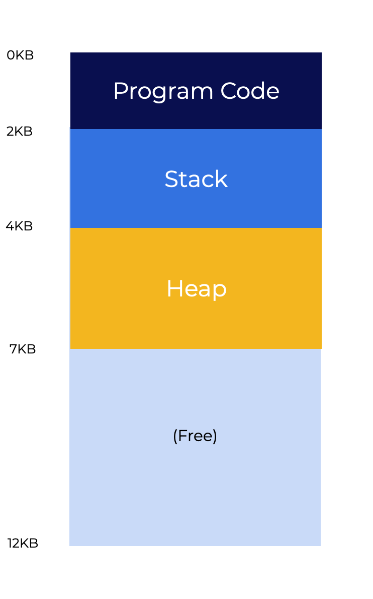

# Lab

## Intro

In this lab, we’ll use a simulator, `mem_relocation.py` to show how address translations work in a system with base and bounds registers.

**Note**: The lab assumes a slightly different layout as opposed to what was introduced earlier. Instead of the heap and stack on opposing sides of memory, the code, stack, and heap are all contiguous.

Memory can only grow toward higher areas of the address space.

<p align="center">
  
</p>

The bounds register in the above image is **7KB**, which represents the end of the address space. An exception would be raised if an address exceeds the limit.

**Run simulation**

```
python3 mem_relocation.py 1

Base and Boards Information
----------------------------
Base: 0x0003082 (decimal: 12418)
Limit: 472

Virtual Address Trace:
  * 0x01a9 (decimal: 425)
  * 0x0101 (decimal: 257)
  * 0x021d (decimal: 541)
  * 0x0182 (decimal: 386)
  * 0x0331 (decimal: 817)
```

The output should be:

```
Base and Boards Information
----------------------------
Base: 0x0003082 (decimal: 12418)
Limit: 472

Virtual Address Trace:
* 0x01a9 (decimal: 425)
* 0x0101 (decimal: 257)
* 0x021d (decimal: 541)
* 0x0182 (decimal: 386)
* 0x0331 (decimal: 817)
```

The simulation creates a set of virtual address spaces. You will be asked questions to determine if the address is out of bounds or what its base address is.
* `0x01a9` - valid address because it is less than the limit. The base address would become `0x0000322b`.
* `0x0101` - valid address because it is less than the limit. The base address would become `0x00003183`.
* `0x021d` - out-of-bounds address because it exceeds the limit.
* `0x0182` - valid address because it is less than the limit. The base address would become `0x00003204`.
* `0x0331`- out-of-bounds address because it exceeds the limit.

Calculations are performed using then converting them to hexadecimal. For the address `0x01a9`, the decimal value is `425` which is less than the limit of `472`. Add this decimal value with that of the base:

```
12418 + 425 = 12843
```

Take `12843` and convert it to hexadecimal. This gives you the final address of `0x0000322b`.

Use this information to help you answer the questions on the next page.

## Simulation 1

Run the simulation by clicking the button below. Use the output to answer the questions below. Use this [site](https://www.binaryhexconverter.com/decimal-to-hex-converter) to help you convert numbers to hexadecimal.

```
python3 mem_relocation.py 2

Base and Boards Information
----------------------------
Base: 0x0003082 (decimal: 12418)
Limit: 472

Virtual Address Trace:
  * 0x01e3 (decimal: 483)
  * 0x0171 (decimal: 369)
  * 0x0288 (decimal: 648)
  * 0x01ad (decimal: 429)
  * 0x0d3 (decimal: 211)
```

Select the proper address values for the simulation above.

* The address for 0x01e3 is out of bounds
* The address for 0x0171 is 0x000031f3
* The address for 0x0288 is out of bounds
* The address for 0x01ad is 0x0000322f
* The address for 0x0d3 is 0x00003155


### Simulation 2

Run the simulation by clicking the button below. Use the output to answer the questions below. Use this [site](https://www.binaryhexconverter.com/decimal-to-hex-converter) to help you convert numbers to hexadecimal.

```
python3 mem_relocation.py 3

Base and Boards Information
----------------------------
Base: 0x0003082 (decimal: 12418)
Limit: 472

Virtual Address Trace:
  * 0x01d8 (decimal: 472)
  * 0x0b6 (decimal: 182)
  * 0x0236 (decimal: 566)
  * 0x01d5 (decimal: 469)
  * 0x01d9 (decimal: 473)
```

Select the proper address values for the simulation above.

* The address for 0x01d8 is out of bounds
* The address for 0x0b6 is 0x00003138
* The address for 0x0236 is out of bounds
* The address for 0x01d5 is 0x00003257
* The address for 0x01d9 is out of bounds