# Free Space Management

## Overview
Let’s explore how to manage free space.

This section should help us answer the following questions:
* How should variable-size requests be managed?
* How can we reduce fragmentation?
* What are the time and space overheads of different approaches?

## Introduction

Our study of virtualizing memory in this chapter is interrupted by a key element of every memory management system, be it a malloc library (managing pages of a process’s heap) or the OS itself (managing portions of the address space of a process). We will focus on the difficulties that come with **free-space management**.

Managing free space can be simple, as we will see when we consider paging. When the area you manage is divided into fixed-sized units, keeping track of them is straightforward. When a client requests one, return the first entry.
When a user-level memory-allocation library (like `malloc()` and `free()`) or an OS managing physical memory uses segmentation to implement virtual memory, managing free space becomes more challenging (and interesting). In either case, we have to deal with **external fragmentation**: the free space gets chopped into little pieces of different sizes and is fragmented. Later requests may fail because there is no single contiguous space that can satisfy the request, even though the total amount of free space surpasses the size of the request.

<p align="center">
  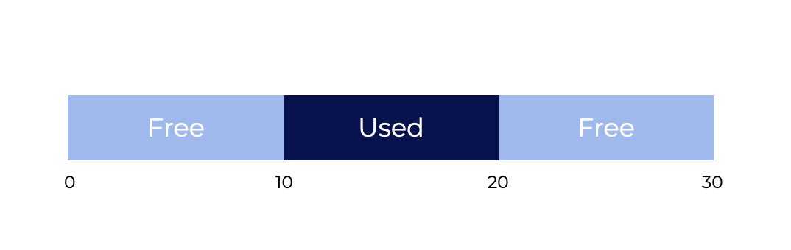
</p>

The graphic above shows us an example of this issue. The total free space available in this example is `20` bytes. Sadly, it’s fragmented into two portions of size `10` each. As a result, even though there are `20` bytes available, a request for `15` bytes will fail. This is the problem we want to address in this section.

## Assumptions

**We’ll begin our exploration with a few assumptions**:
1. We will assume a basic interface like `malloc()` or `free()`. `void *malloc(size t size)` takes 1 parameter, `size`. This is the number of bytes the program requests. It returns a **void pointer** to a region of that size (or larger).
   * The `void free(void *ptr)` method takes a pointer and frees the chunk pointed to by the pointer. The user doesn’t tell the library how big the space is when they free it, so the library has to be able to figure it out when only given a pointer.
   * This library manages the `heap`. A **free list** is a generic data structure used to manage free space in the heap. This structure holds all free space in the controlled memory region. It doesn’t have to be a list, just a way to track empty space.
2. Let’s assume that we are mainly concerned with the **external fragmentation** we talked about earlier.
   * We could be concerned with **internal fragmentation**, which happens when an allocator gives out memory chunks larger than what was requested. Unrequested and unused memory is called **internal fragmentation** (since the waste occurs *within* the allocated unit). In this section, we’ll focus more on **external fragmentation**.
3. We’ll also assume that once memory is given out to a client, it can’t be moved to another location.
   * For example, if a program calls `malloc()` and is given a pointer to some space inside the heap, the memory region is effectively “owned” by the program (and cannot be changed by the library) until the program returns it via a corresponding call to `free()`. No free space **compaction** is possible, which would help fight fragmentation. While compaction can be utilized in the OS to cope with fragmentation when implementing **segmentation**.

> [!important]
> **Compaction** refers to the fact that once memory is handed out to a client, it cannot be relocated to another location in memory

4. Finally, we’ll assume the allocator manages a byte range.
   * When an allocator runs out of space, it may ask the kernel to expand the heap (through a system call like `sbrk`). For simplicity, we’ll assume the region has a constant size throughout its life.

### Questions

**Fill in the blanks to complete the statement below**.

Click the button below to submit.

A **`free list`** is a generic data structure that holds references to all of the available space in a managed region of memory.

> **Solution**
>
> A **`free list`** is a generic data structure that holds references to all of the available space in a managed region of memory.

**Which of the following happens when an allocator gives out a portion of memory larger than what was requested, resulting in wasted space?**

Select an answer and click the button below to submit.
- [ ] Compaction
- [ ] Splitting
- [ ] External Fragmentation
- [x] Internal Fragmentation

> **Solution**
>
> **`Internal Fragmentation`** happens when an allocator gives out memory chunks larger than what was requested.

## Low-Level Mechanisms: Splitting and Coalescing

To begin, let’s review some common mechanisms used by most allocators.
1. First, we’ll cover **splitting and coalescing**, two typical allocator approaches.
2. Second, we’ll teach you how to easily **track the size of allocated regions**.
3. Finally, we’ll look at how to **create a basic list within the free space** to track what is and isn’t free.

### Splitting and Coalescing

A free list contains pieces that describe the heap’s remaining free space. Assume our 30-byte heap:

<p align="center">
  
</p>

This heap’s **free list** would have two components.
* The first entry describes the first 10-byte free segment (bytes 0-9)
* The second entry (bytes 20-29):

<p align="center">
  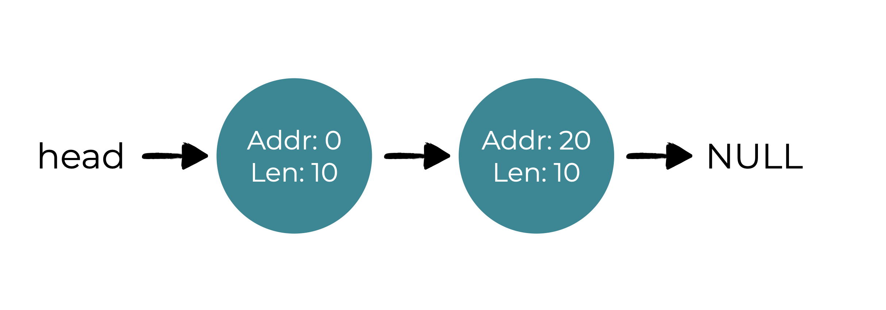
</p>

A request for more than 10 bytes will fail (return `NULL`). There isn’t a single contiguous piece of memory available. Either of the free portions could readily handle a request of that size (10 bytes).

### But what if the request is for less than 10 bytes?

<p align="center">
  
</p>

Assume we just need one byte of memory. In this situation, the allocator will perform a **splitting** operation, finding a free portion of memory that can handle the request and **separating it in two**.
* The first chunk goes back to the caller
* The second stays on the list.

In our previous example, if a request for 1 byte was made, and the allocator chose to fulfill the request by using the second of the two elements on the list, the call to `malloc()` would return 20 (the address of the 1-byte allocated region), and the list would look like this:

<p align="center">
  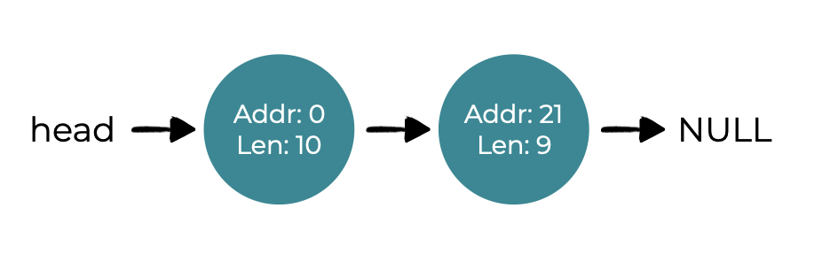
</p>

The list is largely the same, but the free region now starts at 21 instead of 
20, and it’s length is only 9. So, allocators typically use the **split** when requests are less than available free chunks.

**Coalescing** of free space is a common allocator corollary. Let’s reuse our last example (free 10 bytes, used 10 bytes, and another free 10 bytes).

### What happens when an application calls `free(10)` on this (small) heap, freeing the center space?

If we add this blank space back into our list, we can end up with something like this:

<p align="center">
  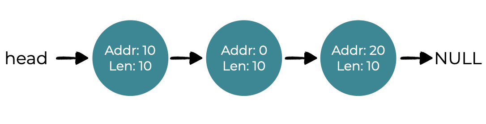
</p>

While the heap is now free, it appears to be partitioned into three portions of 10 bytes each. So, if a user wants 20 bytes, a basic list traverse will fail.

To avoid this issue, allocators combine, or **coalesce** free space when memory is freed. In this case, if the newly-freed space is exactly next to one (or two, as in this example) existing free chunks, merge them into a single larger free chunk. So, after merging, our final list should be:

<p align="center">
  
</p>

This is what the heap list looked like before any allocations were done. **Coalescing** allows an allocator to better ensure big free extents are available for the application.

### Questions

**Fill in the blanks to complete the statement below**.

Click the button below to submit.
1. **Coalescing** looks at the addresses of a chunk of memory you are freeing, as well as nearby free chunks, to find neighbors to merge into one larger section.
2. **Splitting**
 is used when the user asks for a section of memory smaller than an available segment. The allocator finds an adequate piece of memory and separates it into two pieces.

> **Solutions**
> 
> * **Coalescing** looks at the addresses of a chunk of memory you are freeing, as well as nearby free chunks, to find neighbors to merge into one larger section.
> * **Splitting** is used when the user asks for a section of memory smaller than an available segment. The allocator finds an adequate piece of memory and separates it into two pieces.

## Tracking the Size of Allocated Regions

You may have realized that the `free(void *ptr)` interface **doesn’t take a size parameter**. As a result, it is expected that, given a pointer, the malloc library can quickly compute the size of the portion of memory being freed and return the space to the free list.

Most allocators do this by storing extra information in a **header** block that is held in memory just before the memory is handed out. Let’s revisit our example using the figure below.

<p align="center">
  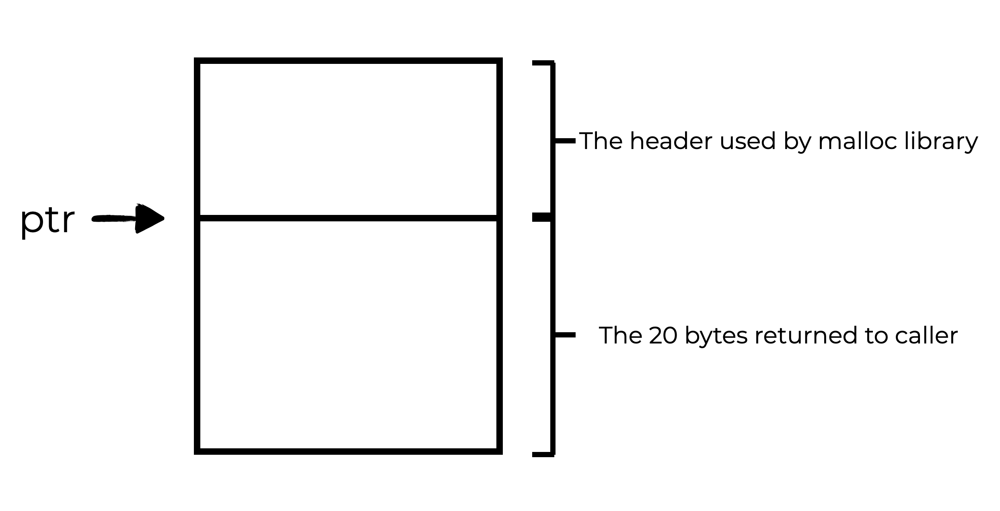
</p>

Let’s look at an allocated block of size `20` bytes that is pointed to by ptr. Say the user called `malloc()` and placed the results in `ptr`, e.g., `ptr = malloc(20)`.

In addition to the size of the allocated region (in this case, 20), the header also contains additional pointers to speed up deallocation, a magic number to provide additional integrity checking, and other information. Consider a simple header that contains the size of the region and a magic number, like this:

```c
typedef struct {
    int size;
    int magic;
} header_t;
```

This example would look like the graphic below.

<p align="center">
  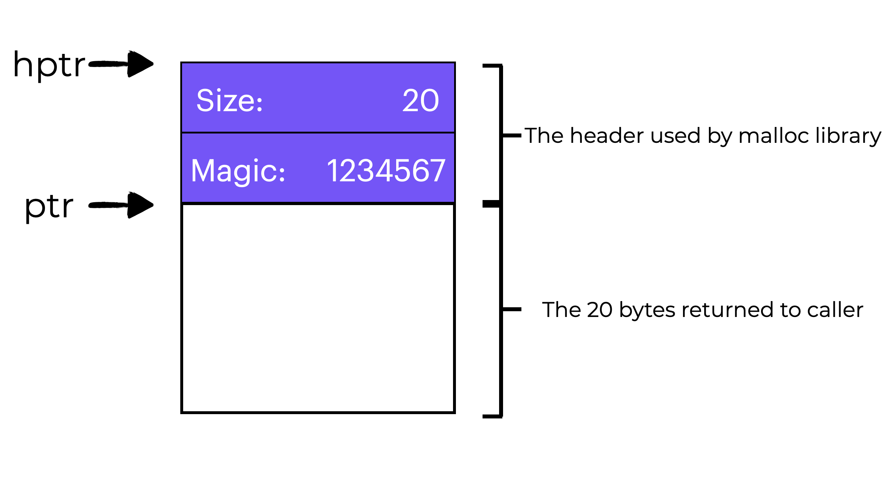
</p>

When then user calls `free(ptr)`, the library uses pointer arithmetic to figure out where the header begins:

```c
void free(void *ptr) {
    header_t *hptr = (header_t *) ptr - 1;
    ...
```

After getting this pointer to the header, the library can check if the magic number matches the expected value (`assert(hptr->magic == 1234567)`) and calculate the overall size of the newly-freed region using a little math (adding the size of the header to size of the region).

The size of the free zone is equal to the header plus the user’s space. So, when a user requests ***N*** bytes of memory, the library looks for a free chunk of size ***N*** plus the header size.

### Questions

Which of the following allows allocators to store extra information like the size of an allocated region, a magic number, and additional pointers?

Select an answer and click the button below to submit.
- [ ] Free List
- [x] Header
- [ ] Splitter
- [ ] Compactor

> **Solution**
>
> The **`header`** block can store information such as the size of an allocated region, magic number, and additional pointers.

## Embedding A Free List

So far, we’ve treated our free list as a concept. It’s just a list of free memory in the heap. But how do we create this list within the free space?

In a normal list, you would run `malloc()` to allocate a new node. Sadly, the memory-allocation library does not allow this! Instead, create the list within the empty space.

Say we need to handle `4096` byte memory (the heap is `4 KB`). To manage this as a free list, we first have to start it with one entry of size 4096. (minus the header size). Here is an example of a list node:

```c
typedef struct __node_t {
    int size;
    struct __node_t *next;
} node_t;
```

Next, let’s look at some code that initializes the heap and inserts the first free list item. We assume the heap is built inside some free space acquired by a call to the system call `mmap()`. This isn’t the only way to generate such a heap, but it works well here. The code is:

```c
// mmap() returns a pointer to a chunk of free space
node_t *head = mmap(NULL, 4096, PROT_READ|PROT_WRITE,
                    head->size,
                    head->next,
                    MAP_ANON|MAP_PRIVATE, -1, 0);
= 4096 - sizeof(node_t);
= NULL;
```

After running this code, the list has one entry, size `4088`. The head pointer contains the range’s start address (`16 KB`) (though any virtual address would be fine). The heap would look something like the graphic below.

<p align="center">
  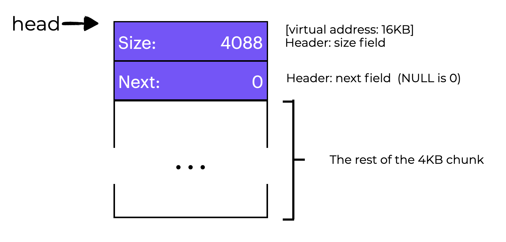
</p>


Let’s say that a 100-byte memory slice is requested. To fulfill this request, the library first has to find a chunk large enough to accept it. Since we only have one free chunk (size: 4088), this is the one that’s chosen. The chunk will then be **split** into two:
* One big enough to service the request (including header, as mentioned above), and
* One free chunk.

If we assume an 8-byte header (size and magic number are integers), the heap now looks like the graphic below.

<p align="center">
  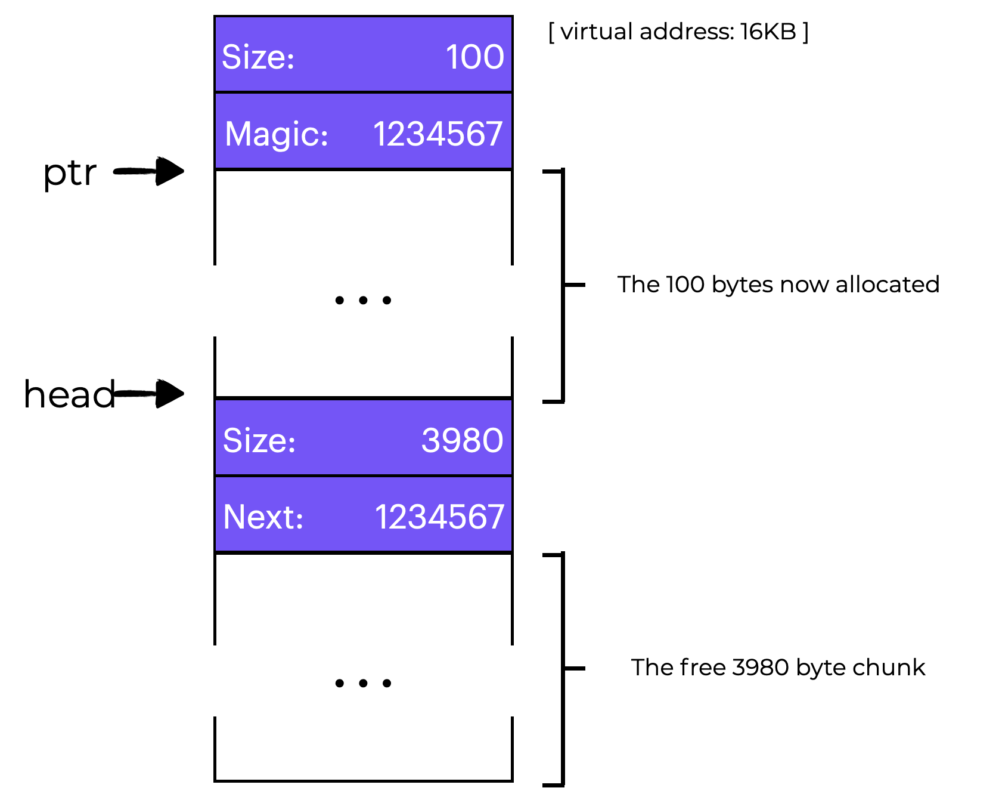
</p>

When the 100 bytes are requested, the library:
* Allocates 108 bytes from the one free chunk
* Returns a pointer (`ptr` in the image above)
* Saves the header information just before the allocated space for later use upon `free()`, and 
* Compresses the list to 3980 bytes (4088 - 108).

Now imagine the heap with three 100-byte allocated sections (or 108 including the header). You can see an example of what this might look like in the graphic to the below.

<p align="center">
  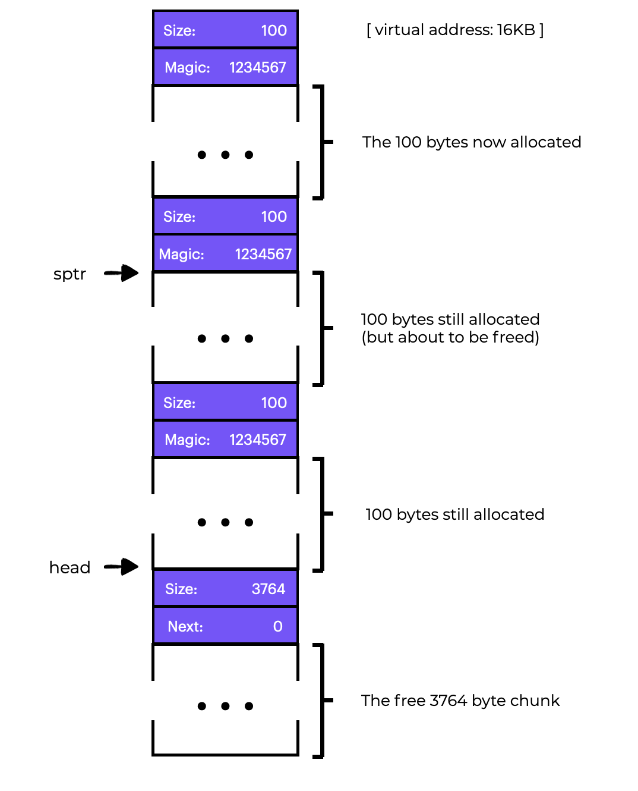
</p>

The first 324 bytes of the heap are now allocated, and the caller application is using three 100-byte chunks in that space. One node (pointed to by `head`) is still there, but it is now only 3764 bytes in size after the three splits.

### What happens when the calling program returns some memory using `free()`?

In this case, `free(16500)` returns the middle memory block (the value 16500 is arrived upon by adding the start of the memory region, 16384, to the 108 of the previous chunk and the 8 bytes of the header for this chunk). The previous diagram shows this value as `sptr`.

The library quickly calculates the free region’s size and adds it to the free list. If we add at the top of the list, the space look like the graphic below.

<p align="center">
  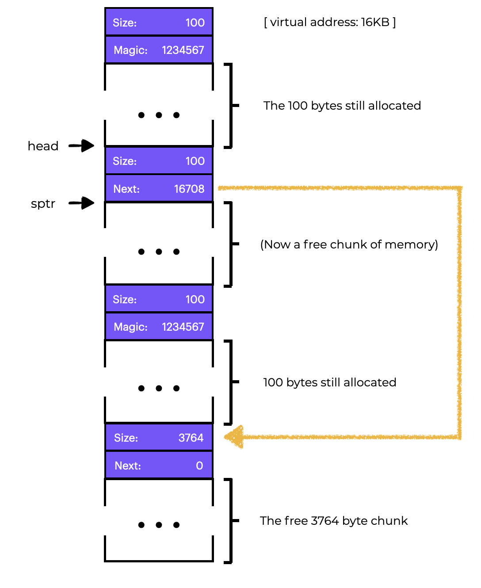
</p>

Now we have a list with a small free portion (100 bytes) and a huge free chunk (3764 bytes). Our list now has two elements! It is regrettable but typical that the free space is fractured.

As a last example, let’s say the final two in-use pieces are now free. Without coalescing, we get fragmentation as seen below.

<p align="center">
  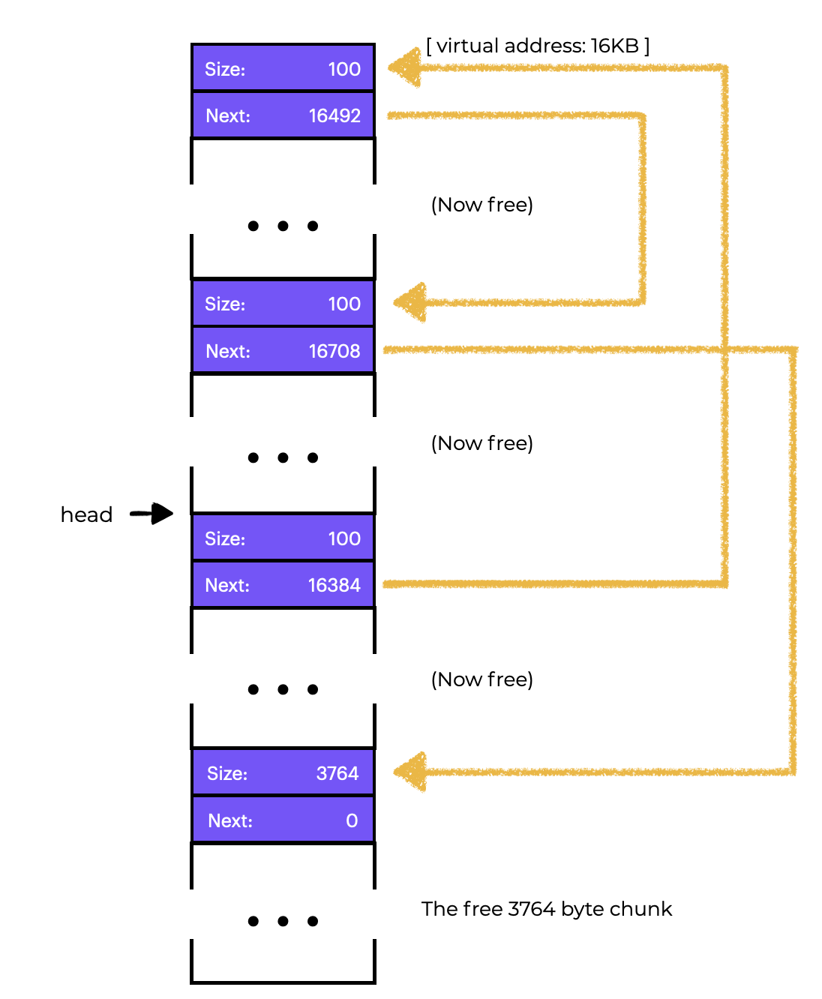
</p>

This is a big mess! Why? Because we didn’t **coalesce** the list. Although all memory is free, it is split up into bits, giving the illusion of fragmented memory. The solution is simple: run through the list and merge neighboring pieces. When we finish, the heap will be whole again.

### Growing The Heap

We should go over one more mechanism that can be found in many allocation libraries. What should you do, in particular, if the heap runs out of space? The most straightforward strategy is to simply fail. Returning `NULL` is an honorable approach in some circumstances where this is the only alternative.

Most classic allocators start with a tiny heap and then request extra memory from the operating system when it runs out. Typically, this means they use a system call (like `sbrk` in most UNIX systems) to expand the heap and then allocate new chunks from there. To service the `sbrk` request, the operating system searches for free physical pages, maps them into the address space of the asking process, and then returns the value of the end of the new heap; at that point, a larger heap is available, and the request can be successfully serviced.

## Basic Strategies

**Now that we have some tools, let’s look at some fundamental tactics for managing unused space.**

Allocators should be quick and reduce fragmentation. Unfortunately, because the stream of allocation and free requests is random, any strategy can perform poorly when given the wrong set of inputs. Determining the “best” technique is difficult because there are so many variables to consider, so we’ll talk about their pros and cons instead.

### Best Fit

The **best fit** technique is pretty straightforward:
* First, search the free list for memory chunks equal to or larger than the specified size.
* Then return the smallest contender in that group; this is the best-fit chunk (it could be called smallest fit too).
* One pass through the free list is enough to find the correct block.

Best fit works by returning a block that is near to the user’s request. However, naive implementations suffer a performance hit when searching for the correct free block.

### Worst Fit

The **worst fit** technique is to identify the largest chunk and return the required amount, leaving the leftover (huge) chunk on the free list.

Worst fit tries to leave huge chunks free instead of lots of small bits that best fit can produce. Again, a full search of free space is necessary, therefore this strategy can be expensive. Worse, most studies suggest it works poorly, leading to excessive fragmentation and significant overheads.

### First Fit

The **first fit** technique just finds the first block that’s big enough and returns the requested amount to the user. The remaining free space is kept for future requests.

**First fit** is faster because no full search of all open spaces is required, but it can contaminate the free list with little objects. An issue arises in how the allocator controls the free list. One technique is to use **address-based ordering**, keeping the list arranged by the address of the vacant space and helping coalesce and reduce fragmentation.

### Next Fit
Instead of starting the **first-fit** search at the top of the list, the **next fit** algorithm saves a pointer to the last location searched. The goal is to evenly distribute the searches for empty spaces throughout the list, avoiding splintering at the start. The performance is very close to first fit, as an extensive search is avoided.

## Examples

Here are some examples of the strategies mentioned.

Say we have a free list with three components of sizes 10, 30, and 20 (we’ll ignore headers and other specifics for now, instead focusing on how strategies work):

<p align="center">
  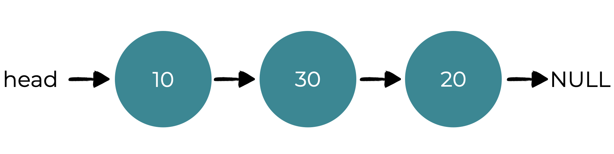
</p>

Say a request for a 15-byte allocation comes in. A **best-fit** strategy would search the full list and determine that 20 was the greatest fit since it had the fewest amount of open space that can fulfill the request. The free list that results would look like this:

<p align="center">
  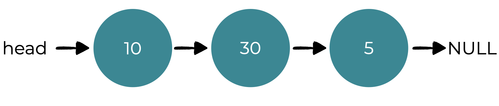
</p>

As is common with **best-fit** approaches, a small free chunk is now left over.

A worst-fit strategy is similar, except it looks for the largest portion, in this case 30, instead. The results of this search would look like this:

<p align="center">
  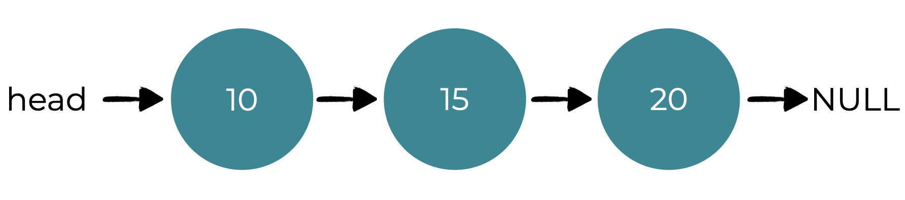
</p>

In this case, the **first-fit** strategy does the same thing as the **worst-fit strategy**. It finds the first free block that can satisfy the request. The difference is in the search cost. Both best-fit and worst-fit look through the complete list, where first-fit just checks free chunks until it finds one that fits, lowering search cost.

These are only a few examples of policy allocation. A better understanding will require more comprehensive analysis with real workloads and more complex allocator behaviors (e.g., coalescing).

## Other Approaches

Aside from the basic techniques we just explores, plenty of strategies and algorithms have been proposed to improve memory allocation in some way. Here are a few of them for your consideration.

### Segregated Lists

The concept of a **segregated list** is to create a separate list solely for managing objects of that size. All other requests are forwarded to a more generic memory allocator.

The advantages are clear. Allocating and freeing requests can be served quickly when they are the proper size because no complicated list search is necessary.

Like any good idea, this one adds to the system’s complexity. For example, how much memory should be allocated to the memory pool that fulfills specialized requests of a certain size? A **slab allocator** could be a solution for this.

When the kernel boots up, it could allocate a number of **object caches** for kernel objects that are likely to be requested frequently (such as locks, file-system inodes, etc.). The object caches thus are each segregated free lists of a given size and serve memory allocation and free requests quickly.

When a cache runs out of space, it asks a general memory allocator for help in the form of a **slab** of memory (the total amount requested being a multiple of the page size and the object in question). The general allocator can reclaim objects from the specialized allocator when the VM system requires more memory.

The **slab allocator** additionally keeps free items on the lists initialized, unlike most segregated list techniques. The slab allocator avoids numerous initialization and destruction cycles per object by holding freed objects in their initialized state in a list.

### Buddy Allocation

Because coalescing is important for allocators, certain techniques make it easy. The **binary buddy allocator** is one example.

In this system, free memory is initially thought of as a big $2^N$-sized space. An attempt to find free space is recursively divided by two until a block large enough to handle the request is found (and a further split into two would result in a space that is too small). The user is then returned the desired block. Let’s look at an example of a `64KB` free space being divided while searching for a `7KB` block.

<p align="center">
  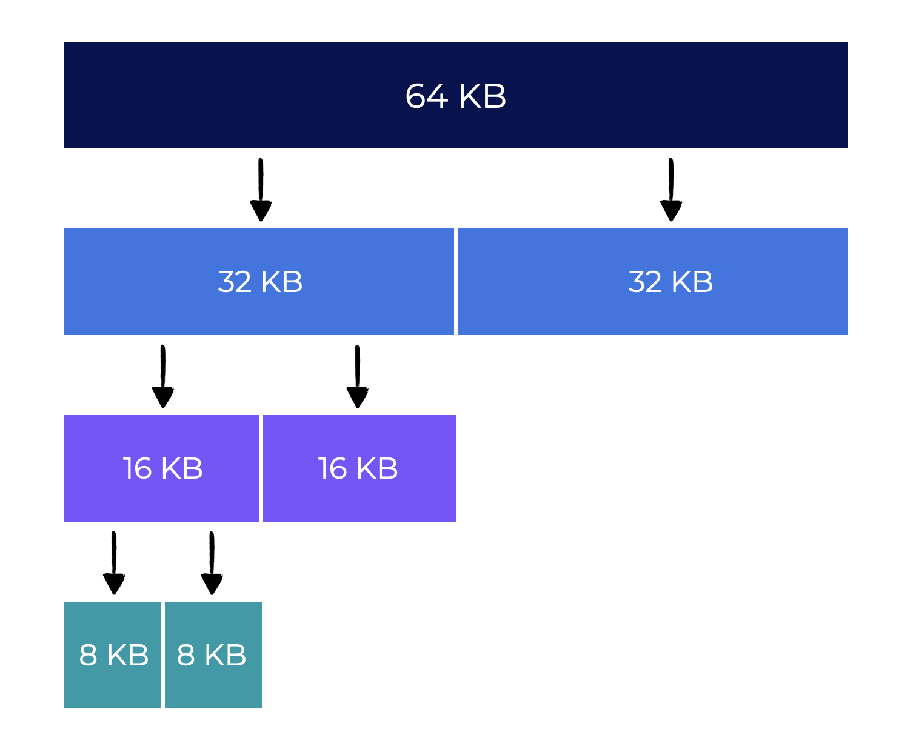
</p>

The leftmost `8KB` block is allocated and returned to the user. Keep in mind that this method can suffer from internal fragmentation because you can only send out power-of-two-sized blocks.

How **buddy allocation** works is when a block is released, if the "buddy" `8KB` block is free, the allocator merges the two `8KB` blocks into a `16KB` block. If the `16KB` block’s buddy is still free, the allocator coalesces the two blocks. This recursive coalescing continues until either the whole free space is restored, or a buddy is found to be in use.

The reason **buddy allocation** works so well is that determining a block’s friend is easy. So, how? Consider the block addresses in the free area above. If you look closely, each buddy pair’s address differs by only one bit, depending by the level in the buddy tree.

### Other Ideas

One key issue with many of the systems outlined above is their inability to **scale**. Searching lists, in particular, can be really slow. To offset these expenses, sophisticated allocators use more complex data structures, trading simplicity for performance. Balanced binary trees, splay trees, and partially-ordered trees are some examples.

Given that modern systems frequently have several processors and perform multi-threaded workloads (something you’ll learn about in great depth in the next course), it’s not surprising that a lot of effort has gone into making allocators work well on multiprocessor-based systems.

### Question

Fill in the blanks to match the Memory Management technique with its description.

Click the button below to submit.

1. Worst Fit - Searches the free list for memory chunks larger than the required size and returns the largest. It tries to reduce segmentation but still requires a full search.
2. Slab Allocator - Is used to create a segregated list. The object caches are individually segregated free lists of a given size that serve memory allocation and free requests efficiently.
3. Binary Buddy Allocator - Requires recursively dividing free space by two until a block large enough to meet the request is found. Once the block is freed, the allocator checks for a free neighboring block and merges them.
4. First Fit - Finds the first block that is large enough to accommodate the request. It has the potential to clog the beginning of the free list with little objects.
5. Next Fit - Keeps an extra pointer to the last chunk’s location in the free list. Avoids splintering at the start of the list and has the benefit of speed.
6. Best Fit - Searches the free list for chunks of free memory that are larger or larger than the requested size and returns the smallest of those candidates. It tries to decrease wasted space but may suffer a big performance penalty.
7. Segregated List - If a specific application makes a popular-size request, it keeps a separate list solely for managing items of that size.

> **Solutions**
>
>1. `Worst Fit` - Searches the free list for memory chunks larger than the required size and returns the largest. It tries to reduce segmentation but still requires a full search.
>2. `Slab Allocator` - Is used to create a segregated list. The object caches are individually segregated free lists of a given size that serve memory allocation and free requests efficiently.
> 3. `Binary Buddy Allocator` - Requires recursively dividing free space by two until a block large enough to meet the request is found. Once the block is freed, the allocator checks for a free neighboring block and merges them.
> 4. `First Fit` - Finds the first block that is large enough to accommodate the request. It has the potential to clog the beginning of the free list with little objects.
> 5. `Next Fit` - Keeps an extra pointer to the last chunk’s location in the free list. Avoids splintering at the start of the list and has the benefit of speed.
> 6. `Best Fit` - Searches the free list for chunks of free memory that are larger or larger than the requested size and returns the smallest of those candidates. It tries to decrease wasted space but may suffer a big performance penalty.
> 7. `Segregated List` - If a specific application makes a popular-size request, it keeps a separate list solely for managing items of that size.

## Summary

**We’ve covered the most basic types of memory allocators in this chapter.**
* Such allocators can be found in every C program you write, as well as in the operating system that manages memory for its own data structures.
* There are many trade-offs to be made in creating such a system, and the more information you have about the specific workload given to an allocator, the more you can tailor it to operate better for that workload.
* Making a quick, space-efficient, scalable allocator that can handle a wide range of workloads is still a difficult task in modern computer systems.

