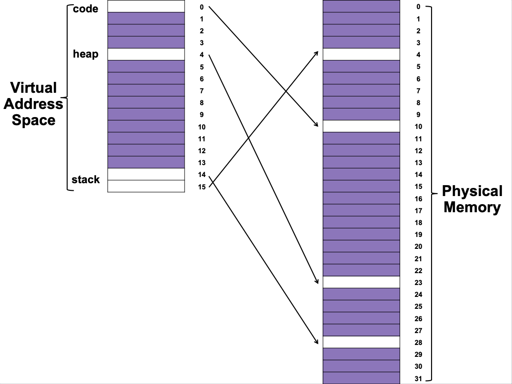
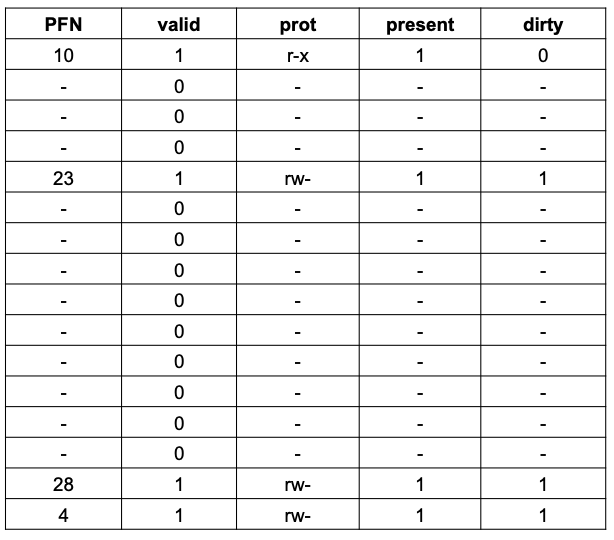
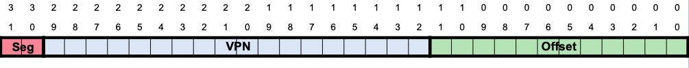
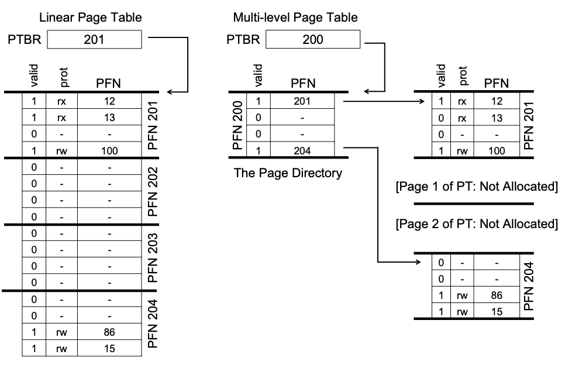
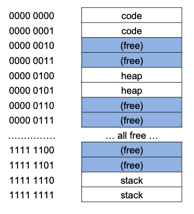
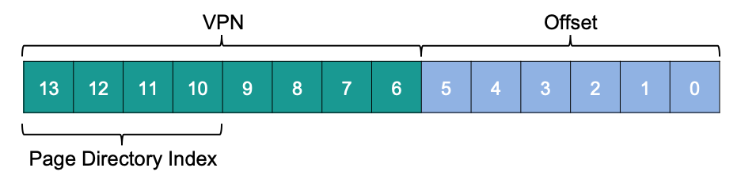
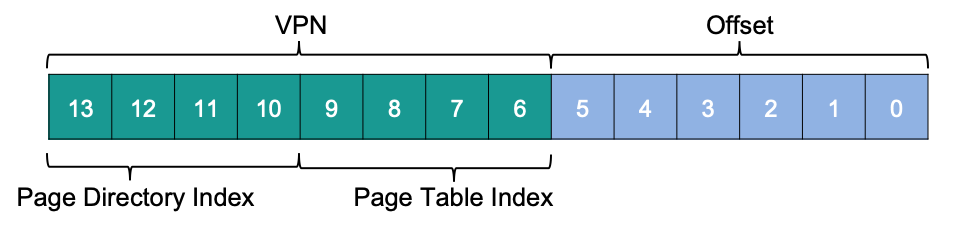
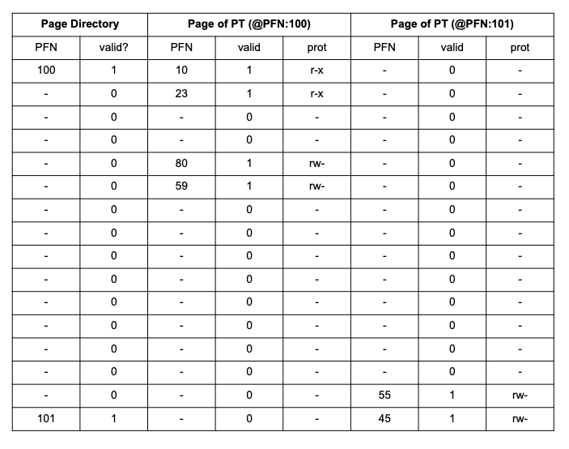
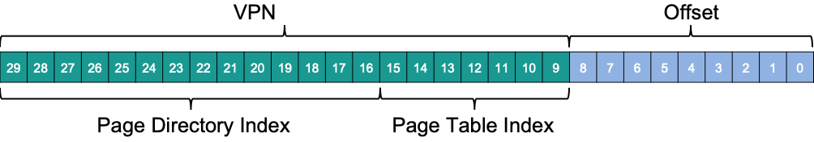
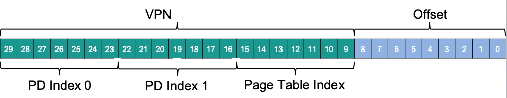

# Advanced Page Tables

## Overview

Simple array-based page tables (also known as linear page tables) are too big and take up too much memory. For the sake of our OS’s efficiency, let’s explore how to make tables smaller.

This section should help us answer the following questions:
* **How can we shrink page tables?**
* **What are the central ideas?**
* **What inefficiencies do these new data structures bring with them?**

## Introduction

Let’s start by imagining we have a $32$-bit address space ($2^{32}$ bytes) and $4 KB$ ($2^{12}  $ byte) pages and a $4$-byte page-table entry.

Considering the size of our page table and the size of our address space, our address space has roughly one million virtual pages ($2^{32}\div2^{12}$); multiply by the page-table entry size and we arrive at a $4 MB$ page table. In addition, each process in the database usually has one page table!

If $100$ processes are running in parallel (not uncommon on a modern system), we’ll be using hundreds of megabytes of memory for page tables alone! Therefore, we are searching for techniques to reduce this heavy burden.

### How can we make these page tables smaller?

## Larger Pages

One simple way to reduce the size of the page table is to use larger pages. Consider our 32-bit address space once more, but this time with 16-KB pages. As a result, we would have an 18-bit VPN with a 14-bit offset. Assuming that each PTE is the same size (4 bytes), our linear page table now has 218 entries and a total size of 1MB per page table, a factor of four reduction in the size of the page table (not surprisingly, the reduction exactly mirrors the factor of four increase in page size).

The major drawback to this strategy is that large pages result in waste within each page, a problem known as internal fragmentation (as the waste is internal to the unit of allocation). As a result, applications allocate pages but only use small portions of each, and memory quickly fills up with these excessively large pages. As a result, in the most common case, most systems use relatively small page sizes: 4KB (as in x86) or 8KB (as in SPARCv9). Unfortunately, our problem will not be solved so easily.

## Paging and Segments

When you have two legitimate but opposing viewpoints on something, you should always consider combining them to get the best of both worlds. A hybrid is such a mix. For example, why eat simply chocolate or plain peanut butter when you can have a Reese’s Peanut Butter Cup?

The Multics designers (particularly Jack Dennis) came across such a concept while developing the Multics virtual memory technology. Dennis proposed combining paging and segmentation to reduce page table memory consumption. A closer look at a typical linear page table reveals why this might work. Assume we have a modest heap and stack address space. **Figure 20.1** shows a modest 16KB address space with 1KB pages; **Figure 20.2** shows the page table for this address space.


<p align="center">
  
</p>
<p align="center">
<b>Figure 20.1</b>
</p>


<p align="center">
  
</p>
<p align="center">
<b>Figure 20.2</b>
</p>

That is, the code page (VPN 0) is mapped to physical page 10, the heap page (VPN 4) to physical page 23, and the two stack pages (VPNs 14 and 15) to physical pages 28 and 4. As you can see, much of the page table is empty or has erroneous entries. Wast! That’s for a 16KB address space. Imagine a 32-bit address space’s page table and all the possible wasted space! Imagine it; it’s far too awful.

So, instead of one page table for the process’s whole address space, why not one per logical segment? In this case, we’d have three page tables, one each for the code, heap, and stack.

We had a base register that told us where each segment was in physical memory, and a bound or limit register that told us how big it was. In our hybrid, the MMU still has similar structures, but the base now holds the physical address of the segment’s page table. The limits register indicates the page table’s end (i.e., how many valid pages it has).

Let’s look at a simple example. A 32-bit virtual address space with 4KB pages, divided into 4 pieces. For this example, we’ll use three segments: code, heap, and stack.

To figure out which segment an address relates to, we examine the top two bits. Assume 00 is unused, 01 is code, 10 is the heap, and 11 is the stack. A virtual address is thus:

<p align="center">
  
</p>

Assume three base/bounds pairings, one each for code, heap, and stack. When a process runs, the base register for each of these segments includes the physical address of a linear page table for that segment. During a context switch, these registers must be updated to reflect the new process’s page tables.

On a TLB miss (assuming a hardware-managed TLB), the hardware utilizes the segment bits (SN) to identify which base and bounds pair to use. The hardware then combines the physical address with the VPN to generate the page table entry (PTE) address:

```
SN           = (VirtualAddress & SEG_MASK) >> SN_SHIFT
VPN          = (VirtualAddress & VPN_MASK) >> VPN_SHIFT
AddressOfPTE = Base[SN] + (VPN * sizeof(PTE))
```

This sequence should be familiar from previous work with linear page tables. The only change is that instead of a single page table base register, a three segment base register is used.

Our hybrid method has a bounds register per segment, which holds the maximum valid page for that segment. Using the first three pages (0, 1, and 2) of the code segment allocates just three entries to the code segment page table, setting the boundaries register to 3. Memory accesses beyond the end of the segment raise an exception, potentially terminating the process. Our hybrid technique saves memory over the linear page table because unallocated pages between the stack and the heap are no longer needed (just to mark them as not valid).

As you can see, this method is not without flaws. First, it still requires segmentation; as previously noted, segmentation is not very flexible, as it assumes a fixed address space utilization pattern; a huge but sparsely used heap, for example, can result in a lot of page table waste. Second, this hybrid triggers external fragmentation. While most memory is maintained in pages, page tables can now be any size (in multiples of PTEs). So finding memory space for them is more difficult. So people kept looking for better ways to create smaller page tables.

## Multi-Level Page Tables

A different approach, which does not rely on segmentation, addresses the same issue: how to get rid of all those incorrect sections in the page table rather than retaining them all in memory. This method is known as a multi-level page table because it transforms a linear page table into a tree-like structure. This method is so effective that it is used by many modern systems (e.g., x86). We’ll go through this strategy in more depth now.

A multi-level page table is based on a simple concept. To begin, divide the page table into page-sized units; then, if an entire page of page-table entries (PTEs) is invalid, do not assign that page of the page table at all. Use a new structure called the page directory to track if a page of the page table is valid (and if so, where it resides in memory). As a result, the page directory can either inform you where a page of the page table is located, or that the entire page of the page table includes no valid pages.

<p align="center">
  
</p>
<p align="center">
<b>Figure 20.3</b>
</p>

An example can be shown in **Figure 20.3**. The conventional linear page table is shown on the left; even if most of the center regions of the address space are invalid, we still need page-table space for them (i.e., the middle two pages of the page table). A multi-level page table is located on the right. Only the first and end pages of the page table are marked as valid by the page directory, and so only those two pages of the page table are stored in memory. As a result, one way to understand what a multi-level table does is that it simply removes sections of the linear page table (freeing those frames for other purposes) and keeps track of which pages of the page table are allocated using the page directory.

In a simple two-level table, the page directory includes one entry per page of the page table. It’s made up of a number of page directory entries (PDE). A PDE, like a PTE, has a valid bit and a page frame number (PFN). However, as previously stated, if the PDE is valid, it signifies that at least one of the pages of the page table that the entry points to (via the PFN) is valid, i.e., the valid bit in at least one PTE on that page linked to by this PDE is set to one. The rest of the PDE isn’t defined if the PDE isn’t valid (i.e., equal to zero).

Multi-level page tables have a number of clear improvements over previous methods. The multi-level table, for starters, only allocates page-table space in proportion to the amount of address space you’re using; as a result, it’s generally compact and supports sparse address spaces.

Second, if appropriately created, each section of the page table fits neatly within a page, making memory management easier; when the OS wants to allocate or grow a page table, it may simply grab the next free page. In contrast, a simple (non-paged) linear page table2, which is simply an array of PTEs indexed by VPN, requires that the full linear page table be kept in physical memory. Finding a significant block of unused contiguous free physical memory for a large page table (say 4MB) can be difficult. We add a level of indirection to a multi-level structure by using the page directory, which points to bits of the page table; this indirection allows us to store page-table pages wherever we want in physical memory.

On a TLB miss, two loads from memory are necessary to acquire the proper translation information from the page table (one for the page directory, and one for the PTE itself), whereas a linear page table only requires one load. As a result, the multi-level table is a simple illustration of a time-space trade-off. We sought smaller tables (and got them), but not for free; while performance is comparable in the common scenario (TLB hit), a TLB miss has a larger cost with this smaller table.

Another evident disadvantage is the level of intricacy. Whether the page-table lookup (on a TLB miss) is handled by the hardware or the OS, it is clearly more complicated than a basic linear page-table lookup. In the case of a multi-level table, we make page-table lookups more complicated to save important memory.

## Multi-Level Example

Let’s look at an example of multi-level page tables. Imagine a 16KB address space with 64-byte pages. 8 bits for VPN and 6 bits for offset gives us a 14-bit virtual address space. Even if only a fraction of the address space is used, a linear page table has 28 (256) entries. **Figure 20.4** below is an example.

<p align="center">
  
</p>
<p align="center">
<b>Figure 20.4</b>
</p>

The code is on virtual pages 0 and 1, the heap is on virtual pages 4 and 5, and the stack is on virtual pages 254 and 255; the rest of the address space is unused.

Start with our whole linear page table and divide it up into page-sized parts. Assume each PTE is 4 bytes OPERATING SYSTEMS in size. So our page table is 1KB (256 4). With 64-byte pages, the 1KB page table can be partitioned into 16 pages, each holding 16 PTEs.

Now we need to learn how to utilize a VPN to index first into the page directory, then into the page table. Each is an array of entries; we only need to figure out how to build the index for each from portions of the VPN.

Let’s start with the page directory. In this example, we have 256 entries on 16 pages. The page directory comprises 16 entries, one for each page of the page table. As a result, we need to index four pieces of the VPN into the directory:

<p align="center">
  
</p>

We can utilize the VPN’s page-directory index (PDIndex) to find the PDE’s address by doing the following calculation: (PDIndex * sizeof(PDE)) This creates our page directory, which we now examine to continue our translation.

If the page-directory entry is invalid, we raise an exception. But if the PDE is valid, we have additional work. We must now retrieve the PTE from the page of the page table referenced to by this page directory entry. To find this PTE, we must index it into the page table using the remaining VPN bits:

<p align="center">
  
</p>

After that, the PTIndex can be used to index into the page table itself, giving us our PTE’s address:

```
(PDE.PFN SHIFT) + (PTIndex * sizeof(PTE))
```

Remember to left-shift the PFN from the page directory entry before combining it with the PTE’s page-table index.

To test this, we’ll populate a multi-level page table with real data and translate a single virtual address. Let’s start with the example page directory (left side of **Figure 20.5**).

<p align="center">
  
</p>

As seen in the image, each PDE explains numerous erroneous mappings.
Physical page 100 (the 0th page of the page table) contains the first page of 16 page table entries for the address space’s first 16 VPNs. **Figure 20.5** (middle) shows the contents of this page table.

In our example, VPNs 0 and 1 (the code section), as well as 4 and 5 (the page table) are legitimate (the heap). That data is in the table. The rest are invalid.

PFN 101 has the other valid page of the page table. **Figure 20.5** (right) shows the mappings for the last 16 VPNs of the address space.

In this case, VPNs 254 and 255 (the stack) map. This example should show how much space may be saved by using a multi-level indexed structure. Instead of allocating the entire sixteen pages for a linear page table, we merely allot three: one for the page directory and two for the valid mapping chunks. Larger (32-bit or 64-bit) address spaces may save even more.

Finally, let us translate this data. The 0th byte of VPN 254 is 0x3F80, or 11 1111 1000 0000 in binary.

In the page directory, we will use the top 4 bits of the VPN. So 1111 picks the last entry (15th if you start at 0) in the page directory above. This points to a legitimate page table at address 101. So we utilize the VPN’s next 4 bits (1110) to index into the page table and find the necessary PTE. 1110 tells us that page 254 of our virtual address space is matched to physical page 55. Our desired physical address is formed by adding PFN=55 (or hex 0x37) to offset=000000 and sending it to the memory system: PTE.PFN + offset = 00 1101 1100 0000 = 0x0DC0

To build a two-level page table, you need a page directory that points to the page table’s pages. Sadly, our work is not done. As we’ll see, two layers of page table isn’t always enough!

## More Than Two Levels

So far, we’ve assumed that multi-level page tables have only two levels: a page directory and then individual page table parts. A deeper tree may be achievable in some circumstances (and indeed, needed).

Let’s look at a basic example to demonstrate why a deeper multi-level table can be beneficial. Assume we have a 30-bit virtual address space and a tiny (512-byte) page in this example. As a result, our virtual address comprises a virtual page number component of 21 bits and a 9-bit offset component.
Remember our goal while building a multi-level page table: each item of the table should fit on a single page. We’ve only looked at the page table thus far; however, what if the page directory grows too large?

To figure out how many levels are required in a multi-level table such that all components of the page table can fit on a single page, we first figure out how many page-table entries can fit on a single page. Given our 512-byte page size and a PTE size of four bytes, you should be able to fit 128 PTEs on a single page. As a result, we can deduce that we’ll use the VPN’s least significant 7 bits (log2128) as an index when indexing into a page of the page table:

<p align="center">
  
</p>

You might also notice how many bits are left in the (big) page directory in the diagram above: 14. Our aim of fitting every item of the multi-level page table into a page vanishes if our page directory has 214 entries and spans 128, rather than one page.

To fix this, we create a new level of the tree by separating the page directory into many pages and then adding another page directory on top of that to point to the page directory’s pages. As a result, we can divide our virtual address as follows:

<p align="center">
  
</p>

We now utilize the very top bits of the virtual address (PD Index 0 in the diagram) to index the upper-level page directory; this index may be used to get the page-directory entry from the top-level page directory. If the physical frame number from the top-level PDE and the next part of the VPN are valid, the second level of the page directory is checked (PD Index 1). Finally, if the page-table index and the address from the second-level PDE are valid, the PTE address can be constructed. Whew! That’s a significant amount of effort. And it was all for the purpose of looking something up in a multi-level table.

## Remember the TLB

```
VPN = (VirtualAddress & VPN_MASK) >> SHIFT
(Success, TlbEntry) = TLB_Lookup(VPN)
if (Success == True) // TLB Hit
  if (CanAccess(TlbEntry.ProtectBits) == True)
    Offset = VirtualAddress & OFFSET_MASK
    PhysAddr = (TlbEntry.PFN << SHIFT) | Offset
    Register = AccessMemory(PhysAddr)
  else
      RaiseException(PROTECTION_FAULT)
else // TLB Miss
  // first, get page directory entry
  PDIndex = (VPN & PD_MASK) >> PD_SHIFT
  PDEAddr = PDBR + (PDIndex * sizeof(PDE))
  PDE = AccessMemory(PDEAddr)
if (PDE.Valid == False)
  RaiseException(SEGMENTATION_FAULT)
else
  // PDE is valid: now fetch PTE from page table
  PTIndex = (VPN & PT_MASK) >> PT_SHIFT
  PTEAddr = (PDE.PFN << SHIFT) + (PTIndex * sizeof(PTE))
  PTE = AccessMemory(PTEAddr)
  if (PTE.Valid == False)
    RaiseException(SEGMENTATION_FAULT)
  else if (CanAccess(PTE.ProtectBits) == False)
    RaiseException(PROTECTION_FAULT)
  else
    TLB_Insert(VPN, PTE.PFN, PTE.ProtectBits)
    RetryInstruction()
```
<p align="center">
<b>Figure 20.6</b>
</p>

We present the control flow in algorithmic form once more to summarize the full process of address translation using a two-level page table (**Figure 20.6**). On every memory reference, the graphic depicts what happens in hardware (assuming a hardware-managed TLB).

As shown in the diagram, before any of the sophisticated multi-level page table access takes place, the hardware first examines the TLB; if it finds a match, the physical address is produced directly, without having to consult the page table. The hardware only needs to do the complete multi-level lookup if the TLB misses. The cost of our standard two-level page table is seen on this path: two additional memory requests to look for a valid translation.

## Inverted Page Tables

Inverted page tables offer even more severe space reductions in the world of page tables. Rather than having many page tables (one for each system process), we have a single page table with an item for each physical page of the system. This entry indicates which process uses this page and which virtual page of that process corresponds to this physical page.

It’s now just a matter of looking through this data structure to find the correct entry. Because a linear scan would be costly, a hash table is frequently added on top of the underlying structure to speed up lookups. One example of such an architecture is the PowerPC.

Inverted page tables, in general, demonstrate what we’ve been saying all along: page tables are essentially data structures. You can make data structures smaller or larger, slower or faster, and do all sorts of weird things with them. Multi-level and inverted page tables are only two of the numerous options available.

## Swapping the Page Tables to Disk

Finally, we talk about how one final assumption can be relaxed. So far, we’ve assumed that page tables are stored in physical memory owned by the kernel. Even with all of our tactics for shrinking page tables, it’s still possible that they’ll be too large to fit into memory all at once. As a result, some systems store page tables in kernel virtual memory, allowing the system to swap portions of these page tables to disk if memory becomes scarce. We’ll go over this in further detail in a later chapter (specifically, the case study on VAX/VMS), once we’ve figured out how to move pages in and out of memory.

## Summary

We’ve now seen how real page tables are constructed, which isn’t always as simple as linear arrays but can also include more complicated data structures. The time and space trade-offs that such tables present are in time and space — the larger the table, the faster a TLB miss may be serviced, and vice versa — and hence the best structure depends heavily on the constraints of the current environment.

Small structures make sense in memory-constrained systems (such as many older systems); with a system with enough memory and workloads that actively employ a large number of pages, a larger table that speeds up TLB misses would be the better option. The full space of data structures becomes available to the operating system innovator (hint: that’s you) with software-managed TLBs. What innovative constructions can you devise? What issues are they attempting to address? As you drift off to sleep, consider these questions and imagine the huge fantasies that only operating-system developers can imagine.

