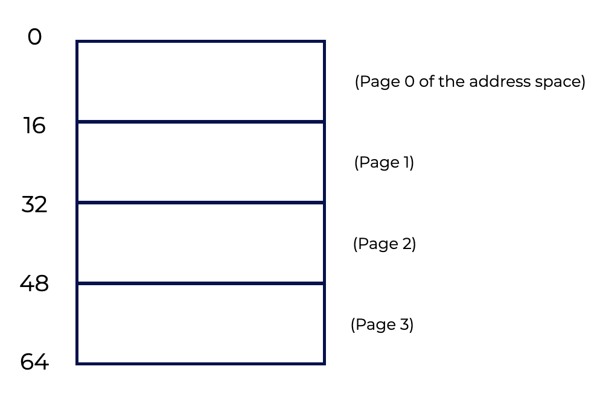
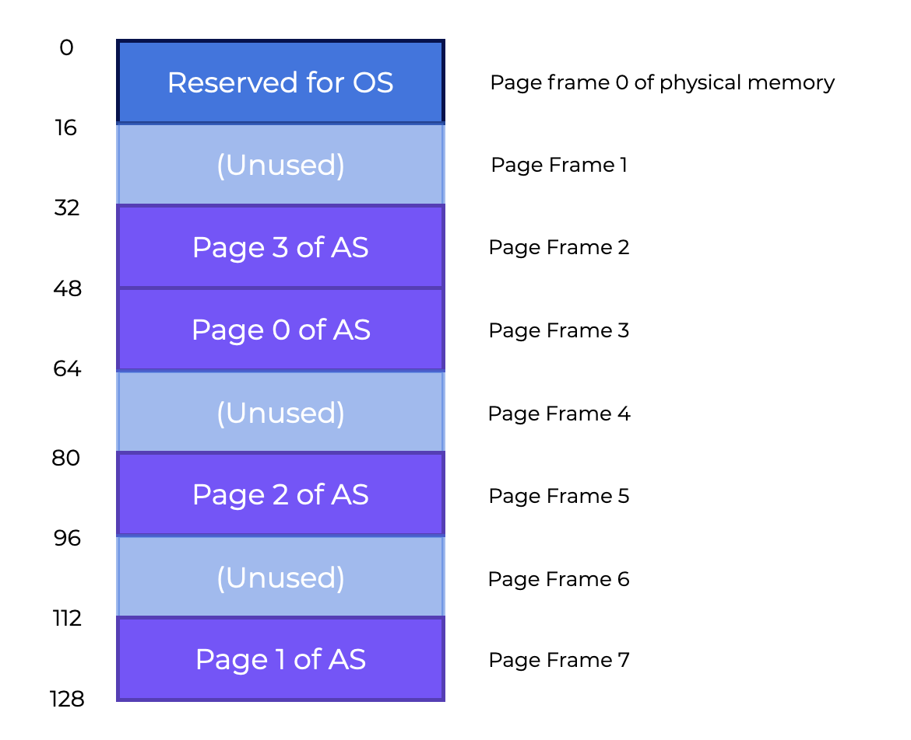
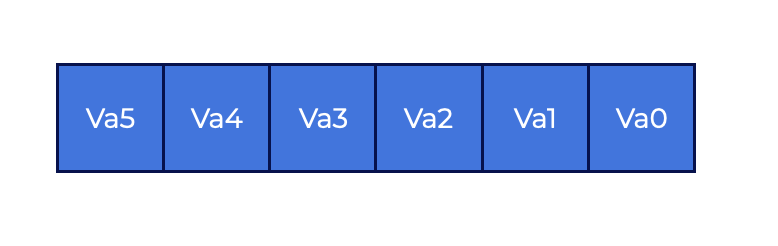
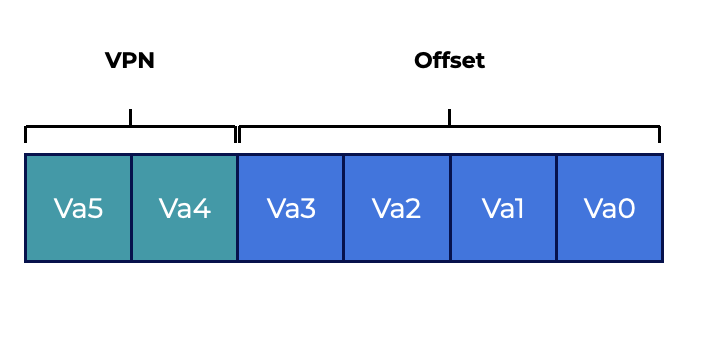
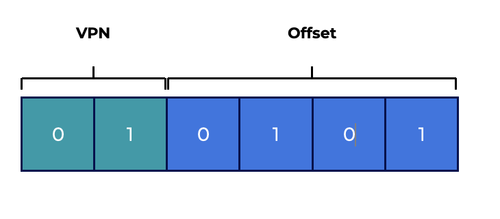
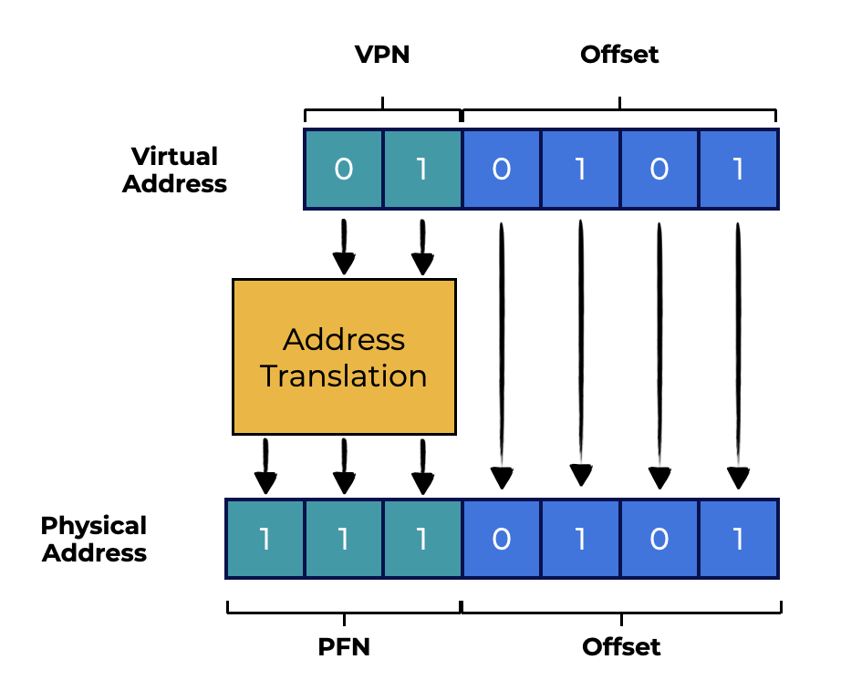
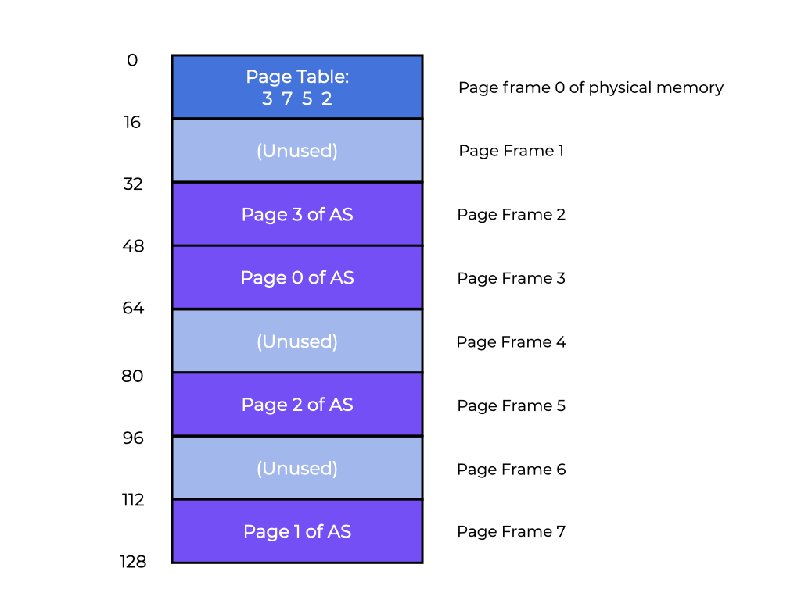

# Introduction to Paging

## Overview

Let’s begin by exploring how to virtualize memory with pages.

This section should help us answer the following questions:
* **How can we virtualize memory with pages without segmentation issues?**
* **What are the basic concepts?**
* **How can we make those strategies work well while saving space and time?**

## Introduction

When tackling space-management challenges, the operating system usually takes one of two approaches.
1. The first approach is to cut up the address space into variable-sized sections. This is called **segmentation** which was covered previously. However, this solution has several challenges. When dividing space into different-sized parts, the area itself might become **fragmented**, which makes memory allocation more difficult over time.
2. The second approach is **paging** in which the address space is divided into fixed-sized chunks. Instead of dividing a process’s space into variable-sized logical **segments** (e.g., code, heap, stack), it gets divided into fixed-sized units called **pages**. Physical memory is represented as an array of fixed-sized slots called **page frames**, each of which can hold a single virtual-memory page.

### Questions

1. Which of the following describes generally how paging works?
   Select an answer and click the button below to submit.
   - [ ] Address spaces and physical memory of each process is divided into fixed-sized units
   - [ ] Address spaces and physical memory of each process is divided into variable-sized units
   - [ ] Utilizes several base & bounds pairs for each process
   - [ ] Only allows one process to use RAM at a time.
   
   > **Solution**:
   > 
   > Paging involves dividing the address spaces and physical memory of each process into **fixed-sized units**.

2. Fill in the blanks to complete the statement below.
   In the case of paging, we can think of physical memory as being an array of fixed-sized slots called **page frames**. Each of which can hold a single virtual memory **page**.

## A Simple Example And Overview

Let’s use a basic example to better understand this method. The graphic below shows a 64-byte address space with four 16-byte pages (virtual pages 0, 1, 2, and 3). 

<p align="center">
  
</p>

Typical address spaces are much larger, however we utilize modest examples to explore these concepts.

Physical memory contains a number of fixed-sized slots. In the graphic below, there are eight page frames that give us 128-bytes of physical memory. The pages of the virtual address space in our graphic have been put at different locations across physical memory. Our graphic also shows that the OS is using some of the physical memory for itself.

<p align="center">
  
</p>

**Paging has significant advantages over our earlier methods.**
* Paging is more **flexible** than previous methods.
  * The system will be able to support the abstraction of an address space effectively, regardless of how a process uses the address space. We won’t make assumptions about the way the heap and stack grow and how they are used.
* Paging also **simplifies** free-space management.
  * For example, to fit our little 64-byte address space into our eight-page physical memory, the OS simply seeks four free pages. Maybe the OS keeps a **free list** of all free pages and grabs the first four free pages from this list. In our example, the OS puts:
    * Virtual **page 0** of the address space (AS) in physical **frame 3**
    * **Page 2** in frame **frame 5**, and
    * **Page 3** in frame **frame 2**.
    * **Page Frames 1**, **4**, and **6** are **free** 

A **page table** is a per-process data structure that records where each virtual page of the address space is located in physical memory. The page table **stores address translations for each virtual page of the address space, indicating where in physical memory each page is located**. In our example, the **page table** would have four entries:
* $VP\ 0 \rightarrow PF\ 3$
* $VP\ 1 \rightarrow PF\ 7$
* $VP\ 2 \rightarrow PF\ 5$
* $VP\ 3 \rightarrow PF\ 2$

This page table is a **per-process** data structure (most page table structures we discuss are per-process structures. The **inverted page table** is an exception). In our example, if another process ran, the OS would have to manage a different page table for it because its virtual pages corresponded to different physical pages (aside from any sharing going on).

### Questions

1. Which of the following describes a page table?
   Select an answer and click the button below to submit.
   - [ ] A data structure that keeps track of all free pages.
   - [x] A data structure that stores translations of virtual address to physical addresses.
   - [ ] A section of free memory that cannot be allocated

   > **Solution**:
   > 
   > Page tables contain translations for each virtual page of the address space, showing where in physical memory each page is located.

## Address Translation Example

With this knowledge, we can do an address-translation example.

<p align="center">
  
</p>

**Assume we have a process with a small address space (64 bytes) that is accessing memory**:   

```asm
movl <virtual address>, %eax
```

Notice the explicit load of data from address `<virtual address>` into register `eax`.

To **translate** the virtual address the process generates, we have to break the resulting virtual address into two parts:
* The **virtual page number (VPN)** and
* The **offset** within the page.

Because the process’s virtual address space is **64** bytes, we need **6** bits total for our virtual address ($2^6=64$). So, we can think about our virtual address as follows:

<p align="center">
  
</p>

In this diagram, $Va5$ is the highest-order bit while $Va0$ is the lowest. We can further divide the virtual address as follows, knowing that the page size is $16$ bytes:

<p align="center">
  
</p>

The page size is $16$ bytes in a $64$-byte address space, so we need to be able to choose $4$ pages, which the top $2$ bits do. Now we have a $2$-bit **virtual page number** (
$VPN$). The rest of the bits tell us which byte of the page we want to look at, in this case $4$ bits. This is called the **offset**.

When a process generates a virtual address, the OS and hardware have to work together to translate it into a meaningful physical address. Let’s say the load we issued earlier, `movl <virtual address>, %eax`, was to virtual address $21$:

```asm
movl 21, %eax
```

If we convert "$21$" into its binary form, we’ll get "$010101$". With this, we can explore this virtual address and see how it breaks down into a **virtual page number** and **offset**

<p align="center">
  
</p>

So, virtual address "$21$" is on the $5th$ ("$0101$"th) byte of virtual page "$01$" (or $1$). Using our **virtual page number**, we can now index our page table and find out which physical frame virtual page $1$ lives in. The **physical frame number (PFN)** is $7$ in the page table to the left (binary $111$). So, we can translate this virtual address by replacing the **VPN** with the **PFN**, then issue the load to physical memory, as in our graphic below.

<p align="center">
  
</p>

Because the offset just tells us the byte inside the page we want, it remains constant (it is not translated). Our final physical address is $1110101$ ($117$ in decimal), and this is the location from which we want our load to retrieve data.

With this basic understanding in mind, we can now ask (and hopefully answer) a few fundamental paging questions.
* Where, for example, are these page tables stored?
* What are the typical page table contents, and how large are the tables?
* Is paging causing the system to (become) too slow?

## Page Table Storage

**Page tables can grow to be much larger than the segment tables or base/bound pairs we previously discussed.**

<p align="center">
  
</p>

Say we have a standard $32$-bit address space with $4KB$
 pages. This virtual address is composed of:
* A $20$-bit VPN, and
* A $12$-bit offset
  * Recall that $10$ bits would be needed for a $1KB$ page size, and just add two more to get to $4KB$.

A $20$-bit VPN implies that the OS has to maintain $2^20$  translations for each process (about a million). Assuming $4$
bytes per **page table entry (PTE)** to carry the physical translation plus any other helpful information, we get an enormous $4MB$ of RAM required for each page table!

## That’s a lot of space.

Now, think about $100$ processes running. The OS would require $400MB$ of memory just for address translations! Even though computers have gigabytes of memory, its still pretty wild to consume a huge portion of it just for translations. We won’t even get into how large such a page table would be for a $64$-bit address space. That’s just plain scary!

We don’t have any specific on-chip hardware in the MMU to hold the page table of the presently-running process because page tables are so large. Instead, **we keep the page table for each process in memory somewhere**.

For now, we’ll **assume that page tables are stored in physical memory that the OS manages**. Later, we’ll see that much of the OS memory itself can be virtualized, so page tables can be stored in OS virtual memory (and even swapped to disk).

The graphic to the left shows us a page table in OS memory. See the little set of translations there?

## What's in the Page Table?

### Let’s look at table page organization.

The **page table** is a **data structure** that maps virtual addresses (or virtual page numbers) into physical addresses (physical frame numbers). So, any data structure could work for this.

A **linear page table** is just an array.
* A **virtual page number (VPN)** is used to index the array, and
* A **page-table entry (PTE)** determines the **physical frame number (PFN)**.
  
We’ll use a linear structure for now. We’ll use more complex data structures in later sections to help ease certain paging challenges.

As for the contents of each PTE, there are several different **bits** to understand.

* A **valid bit** indicates if a translation is valid.
  * For example, when a program starts, the code and heap are at one end of the address space and the stack at the other. The unused space in between will be marked **invalid** If the process tries to access this memory, it will trigger an OS trap, which will likely terminate the process.
  * By marking all unused pages in the address space illegal, we eliminate the need to allocate actual frames for those pages, saving huge amounts of memory.
* **Protection bits** may also signal whether a page can be read, written to or executed. Trying to read a page in a way that these bits don’t allow will result in an OS trap.
* A **present bit** shows whether a page is in RAM or disk (i.e., it has been **swapped out**).
  * We’ll learn more about this mechanism when we look at how to **swap** parts of the address space to disk to support address spaces larger than physical memory. 
* A **dirty bit** indicates if the page has been modified since it was brought into memory.
* A **reference bit** (also known as an **accessed bit**) is occasionally used to track whether a page has been accessed, and is so preserved in memory. This information is important during **page replacement**, which we will explore in later sections.

<p align="center">
  
</p>

The graphic above shows an x86 architecture page table entry. It contains:
* A present bit - **P**
* A read/write bit - **R/W**
  * This determines if writes are allowed on this page
* A user/supervisor bit - **U/S**
  * This determines if user-mode processes can access the page
* **PWT**, **PCD**, **PAT**, and **G** determine how hardware caching will work for these pages
* An accessed bit (**A**), and
* A dirty bit (**D**)
  * This dictates how hardware caching works for these pages.
* And, the **page frame number** (**PFN**).

## Paging is Slow!

```c
// Extract the VPN from the virtual address
VPN = (VirtualAddress & VPN_MASK) >> SHIFT
// Form the address of the page-table entry (PTE)
PTEAddr = PTBR + (VPN * sizeof(PTE))
// Fetch the PTE
PTE = AccessMemory(PTEAddr)
// Check if process can access the page
if (PTE.Valid == False)
    RaiseException(SEGMENTATION_FAULT)
else if (CanAccess(PTE.ProtectBits) == False)
    RaiseException(PROTECTION_FAULT)
else
    // Access is OK: form physical address and fetch it
offset = VirtualAddress & OFFSET_MASK
PhysAddr = (PTE.PFN << PFN_SHIFT) | offset
Register = AccessMemory(PhysAddr)
```

We already know that page tables in memory may be too big. **They can potentially slow things down**.

Consider this instruction as an example:

```asm
movl 21, %eax
```

Let’s look at the explicit reference to address $21$ and not so much at the instruction fetch. We’ll assume the hardware does the translation for us. To retrieve the required data, the system has to first translate the virtual address ($21$) into the proper physical address ($117$). As a result, before requesting the data at address $117$, the system has to:
1. Get the correct page table entry from the process’s page table
2. Translate it, and
3. Load the data from physical memory

The hardware has to know the process’s page table location to do this.

Let’s say, for now, that a **single page-table base register** has the page table’s physical address. The hardware will conduct the following functions to locate the necessary PTE:

```c
VPN     = (VirtualAddress & VPN_MASK) >> SHIFT
PTEAddr = PageTableBaseRegister + (VPN * sizeof(PTE))
```

In our example:
* `VPN_MASK` is set to `0x30` (hex `30`, or binary `110000`), and
* `SHIFT` is set to `4` (the number of bits in the offset), such that the VPN bits generate the right integer virtual page number.
* For example, masking turns virtual address $21$ ($010101$) into $010000$. Shifting puts it into $01$, or virtual page $1$. The page table base register’s index into the array of PTEs.

In order to get the physical address, the hardware has to:
* Retrieve the PTE from memory,
* Extract the PFN, and
* Combine it with the virtual address offset.

The PFN is left-shifted by SHIFT, then bitwise OR’d with the offset to generate the final address:

```c
offset   = VirtualAddress & OFFSET_MASK
PhysAddr = (PFN << SHIFT) | offset
```

Finally, the device can read data from memory into register eax. The application now has a value loaded from memory!

In short, we can describe the initial memory reference mechanism. The code example to the left shows us this approach. To use paging, we have to first get the translation from the page table for every memory reference (instruction fetch, explicit load, or store). That takes effort! This will slow down the procedure by a factor of two or more.

Now you can see that we have two serious issues to address. Page tables **slow down the system** and **consume too much memory** if not designed carefully. In order to use this for memory virtualization, we have to first solve these two problems.

## Summary

We introduced the concept of **paging** to solve the challenges of virtualizing memory. There are many advantages to **paging** over prior methods (like segmentation).
* The first benefit is **that paging does not cause external fragmentation** since by design, memory is split into fixed-sized segments.
* In addition, it is **adaptable**, allowing for minimal use of virtual address spaces.
* Implementing paging functionality carelessly will result in a **slower computer** (due to the additional memory visits required to reach the page table) and memory waste (with memory filled with page tables instead of useful application data).