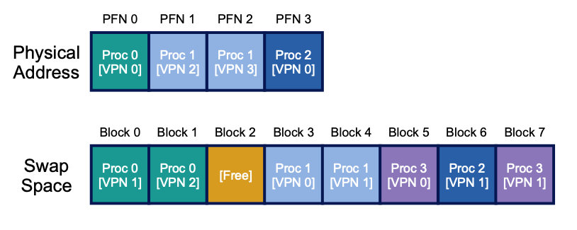
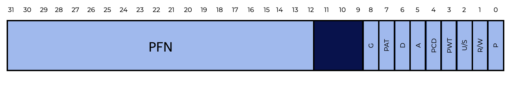
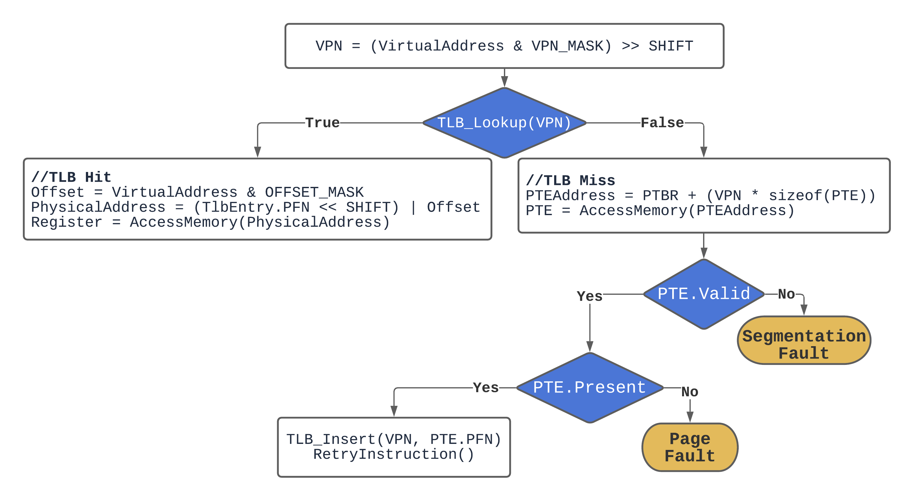

# Swapping

## Adding the Disk

In our previous discussions about Operating Systems, we’ve assumed that:
* The total address space is small and fits in physical memory.
* Every running process’s address space fits in memory.
* We only needed to worry about 1 process’s address space at a time.

In reality, we frequently run programs concurrently.

To support multiple large address spaces running at the same time, we’ll need to add a new level to our memory hierarchy:

|Memory Level	| Description
|---|---|
|Central Processing Unit (Processor) | Registers and cache in CPU are very fast but very small |
|RAM (Memory) | Fast but limited space|
|**Hard disk drive (Disk)**	| **Large but slow, contains file system** |

If the OS can support one large address space for a process, the programmer doesn’t have to worry about whether the program’s data structures will fit in memory and can allocate memory as needed. This means the OS will need to somehow leverage the disk space for when memory gets full.

### Swap Space

**Swap space** allows the OS to support several processes running at the same time by allowing running programs to use more RAM than is physically accessible.

> **Swap space** is reserved space on the disk for moving pages between memory and the file system.

Operating systems call this swap space because it is used to swap **pages** out of memory and back in. This assumes the OS can read and write to swap space in page-sized units.

The amount of the swap space the OS reserves defines the maximum number of memory pages that a system can use at any given time. Let us pretend that is pretty massive for now.

Take a look at how 3 processes (Proc 0, 1, and 2) might share the limited memory with the help of the swap space on the disk:

Note that only a portion of any given process’s valid pages are in memory, with the rest in swap space on disk.

We can also tell that in the example above, the fourth process (Proc 3) isn’t functioning since none of it is loaded into memory.

> ### In the terminal on the left... ###
> Type `free` and press enter. The system will display some memory usage information.
> 
> Notice:
> 1. In the “Mem” or memory row, there is more “available” space than “free” - that’s because there are pages the system knows it can get rid of if needed.
> 2. There is a second “Swap” row which reports the usage of the swap space as distinct from your memory.
> 3. If your memory is relatively empty, your swap space will also be empty since the OS hasn’t needed to move any pages to it yet.

### Other data swapping disk spaces

Swap space is not the only place on disk where data is swapped. Assume you are executing a binary program (e.g., ls, or your own compiled main program). This binary’s code pages are stored on disk and loaded into memory when the application runs. If the system has to free up memory for other purposes, it can safely reuse the code pages’ memory space, knowing it can subsequently swap them in from the on-disk binary in the file system.

### Questions 
**Which of the following statements are true about Swap Space? There may be more than one answer.**
- [x] Swap space extends the memory available to a process beyond the system RAM.
- [ ] With swap space, a process still needs to worry about data structure size.
- [x] A portion of disk space is reserved for swapping pages in and out of memory.
- [x] Swap space supports multiple processes running at the same time in that they aren’t limited by the available memory.

> Swap space extends the memory available to a process by reserving disk space to use for swapping pages out of memory and back in.

## Swapping Mechanisms: The Present Bit and Page Faults

Now that we have disk space, we need to handle the mechanics of page swapping.

### A quick review of how to get a page from memory

At a high-level, virtual memory references (for fetching instructions or data) are generated by the operating process and are translated into physical addresses by the hardware before fetching data from memory:

At a finer-grain, this translation requires:
1. Locating the page table or Translation Lookaside Buffer (TLB)
2. Looking up a page table entry (PTE) using the VPN as an index

Assume, for simplicity, we have a hardware-managed TLB. If the TLB finds a match for the VPN (a TLB hit), it generates the physical address and gets it from memory.

However, this step is now complicated by the fact that some of our pages that were in memory are now in the swap space. A page may not exist in physical memory when examined by hardware.

### Revisiting: The Present Bit

In a software-managed TLB architecture, the OS determines if a page exists in physical memory using a new piece of information in each page-table entry called the **present bit**.

Recall the graphic below which shows an x86 architecture page table entry (and notice that it contains a present bit - **P**):

Assuming the present bit is set to one, the page is in physical memory and everything continues as before.

Alternatively, a **page fault** occurs when a program accesses a page that isn’t in physical memory. (This looks like either a TLB miss or a TLB hit where the present bit is set to zero.)

The OS is called, triggering a page-fault handler to run, to service the page fault.

### Handling a Page Fault

A page fault will require the OS to swap in a page from disk. (Even with a hardware-managed TLB, the hardware relies on the OS to manage page faults.)

#### 1. OS locates the required page

In many systems, a page’s disk location is stored in the page table. For example, the OS might use the PTE’s data bits, like the page’s PFN, to store a disk address. When the OS receives a page fault, it searches up the address in the PTE and requests the page from disk.

#### 2. Disk I/O

Once the page is located on the disk, it is swapped into memory. The process will be blocked while the I/O is running, so the OS can run other ready processes while the page fault is handled.

Because I/O is expensive, overlapping I/O (page fault) of two processes is another method a multiprogrammed system might use to maximize its hardware.

#### 3. Update the page table

After the disk I/O, the OS will update the page table to reflect the new page, update the PFN field of the page-table entry (PTE) to reflect the new page’s address in memory, and retry the instruction.

The process of retrieving memory now looks like:

Note that on a TLB miss with a valid PTE, the handler performs an I/O request to read the page from swap space with the physical frame in hand. Then, the OS changes the page table (`TLB_Insert`) and retries the instruction after the slow procedure is complete.

A TLB miss could occur on the first retry if the new page is inserted into the page table but not the TLB. A second retry would then result in a TLB hit.

### Fill in the blanks below to create a correct statement.
The **`present bit`** in the **`page-table`** entry informs the **`operating system`** that a page exists in **`physical memory`**.

## What if Memory is full?

In the example described earlier, we assumed there was sufficient free memory to page in a page from swap space. This isn’t always the case; one’s memory may be overburdened (or close to it). As a result, the OS may want to page out one or more pages before bringing in the new page(s).

> ### Page Replacement Policy
> The **page-replacement** policy is the process of deciding which pages should be removed or replaced.

A lot of thinking has gone into developing a proper page-replacement policy, because removing the incorrect page can have a significant impact on program performance. Making the wrong decision can cause a program to run at disk-like rates rather than memory-like speeds, which means a program could run 10,000 or 100,000 times slower in today’s technology.

The different page replacement policies are described and compared in the next section. For the time being, knowing that such a policy exists, based on the procedures explained here, is sufficient.

### When to Swap Out?

The method for replacement we’ve discussed so far assumes that the OS waits until memory is completely full before replacing (evicting) a page to make room for another. As you might expect, this is unrealistic, and there are numerous reasons for the OS to maintain a tiny percentage of memory free more frequently.

Most operating systems feature some type of high watermark (HW) and low watermark (LW) to help decide when to start evicting pages from memory to preserve a small amount of memory free:
1. When the OS detects that there are more pages in memory than the high watermark (HW), a background process called the swap daemon or page daemon starts to evict pages from memory.
2. This daemon continues until the number of pages is less than the low watermark (LW).
3. The daemon then sleeps until the HW is reached again.
   
In addition to when the high watermark is reached, the swap or page daemon can also be awoken by a process if there are no free pages available; once the daemon has freed up some pages, it will re-awaken the original thread, which will then be able to page in the appropriate page and continue working.

New performance optimizations can be achieved by doing many replacements at the same time. Many systems, for example, will cluster or group a number of pages and write them out to the swap partition all at once, increasing disk efficiency; as we will see later when we discuss disks in greater detail, such clustering reduces seek and rotational overheads of a disk, resulting in noticeably improved performance.

### Question

**Fill in the blanks to explain how the operating system manages page replacement**.

A proper page replacement strategy will optimize **`program performance`**.

Most operating systems will **`evict`** pages from memory when there are more than the **`high`** watermark.

Another way page replacement can be optimized is by writing pages out to disk **`in a cluster`**.

## Summary

We’ve seen how Operating Systems provide more memory to programs than is physically available in a system.
* A present bit (of some kind) indicates whether the page is present in memory or not.
* If a page is not in memory, the operating system’s page-fault handler kicks in, arranging for the transfer of the required page from disk to memory.
* Some pages in memory are replaced or removed once the high watermark is reached to preemptively create space for those that will be swapped in soon.

In terms of the process, it’s simply gaining access to its own private, contiguous virtual memory. Pages are stored at arbitrary (non-contiguous) positions in physical memory behind the scenes, and they are sometimes not even present in memory, necessitating a fetch from disk. While we anticipate that memory access is quick in most instances, it may require numerous disk operations in other cases; even something as basic as performing a single instruction can take many milliseconds in the worst scenario.