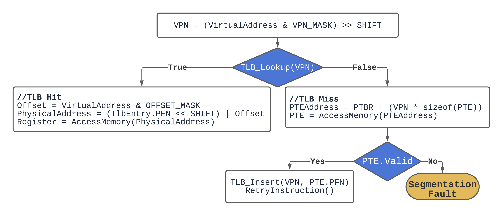
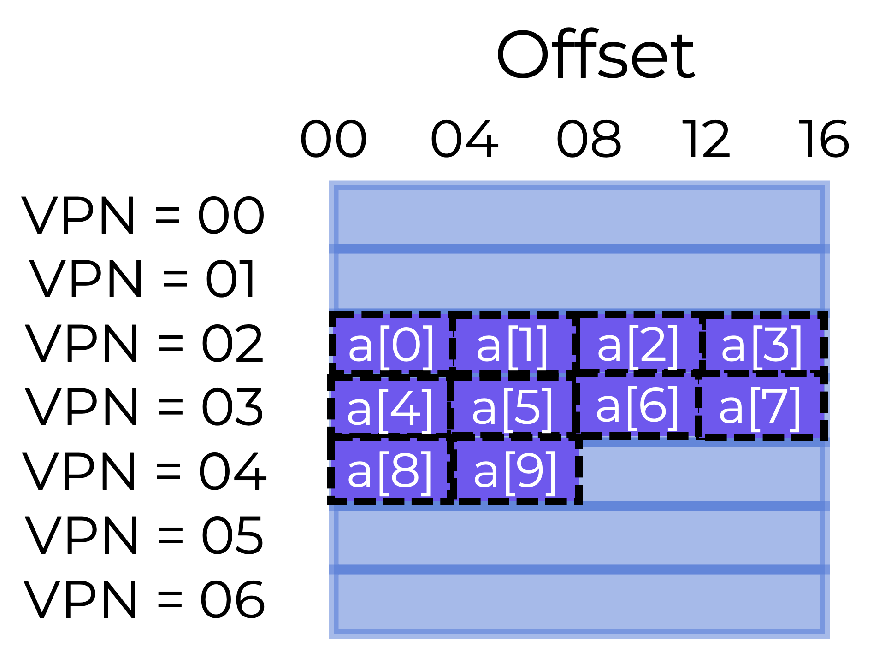
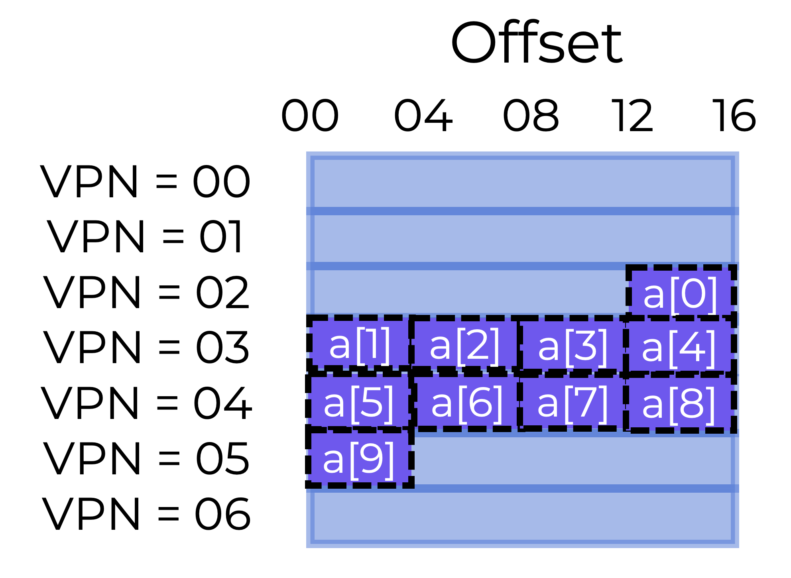

# Translation Lookaside Buffers (TLB)

## Overview

This section should help us answer the following questions:
* **How can we speed up address translation and prevent paging’s unnecessary memory reference?**
* **What hardware support is needed?**
* **How much OS involvement is required?**

When context-switching between processes, the last process’s TLB translations are useless to the next process.
* **What should the hardware or OS do to fix this problem?**

## Translation Lookaside Buffers (TLBs)

In practice, paging needs an additional memory lookup in order to translate each virtual address (as illustrated below), but it takes too long to obtain translation information before every instruction fetch, load, or store.

<p align="center">
  
</p>

To speed up address translation, we’ll use a **translation lookaside buffer (TLB)**.

> **Translation Lookaside Buffer or TLB**
> A **translation lookaside buffer (TLB)** is a hardware cache of popular virtual-to-physical address translations that is part of the chip’s MMU.

If the request translation is stored in the TLB, the hardware does not need to access the page table holding all of the translations.

Virtual memory would not be possible without the performance improvement afforded by TLBs.

### Inside the TLB

TLB entries might look something like this:

```          
VPN                     PFN                 other bits
```

Both the VPN and PFN are contained in each entry (in hardware terms, the TLB is known as a **fully-associative cache**). To see if there is a match, the hardware searches the entries in parallel.

Let’s look at a real TLB. The figure below shows a somewhat simplified TLB entry from a modern system that uses software-managed TLBs.

<p align="center">
  
</p>

* 20 bits: Virtual Page Number (VPN)
* 6 bits: Process ID (PID); sometimes called Address Space ID or ASID
* 6 bits: unused
* 20 bits: Page Frame Number (PFN)
* N bit: If set, memory access bypasses the cache (this will be discussed in a future section)
* D bit: Dirty bit - If set, memory is writeable (this will be discussed in a future section)
* V bit: Valid bit - indicates whether the entry has a valid translation or not
* G bit: Global bit - If set, TLB does not check PID for translation (see below)

TLBs generally include **32** or **64** of these entries, most of which are used by user processes, but a few are for the OS (using the G bit). The OS can set a wired register to instruct the hardware how many TLB slots to reserve for it. The OS uses these reserved mappings for code and data it needs to access during key moments when a TLB miss would be troublesome (e.g., in the TLB miss handler).

When a TLB is software managed, there must be instructions to update it. The system provides four such instructions:
* **`TLBP`** probes the TLB for a specific translation
* **`TLBR`** reads the contents of a TLB entry into registers
* **`TLBWI`** replaces a specific TLB entry, and
* **`TLBWR`** replaces a random TLB entry

### Questions

**Fill in the paragraph below to describe the address translation process with a TLB**

The operating system gets a `virtual page number (VPN)` from a process. It then translates it to a `page frame number (PFN)`.

Instead of going to the `page table` on the disk, the OS can use a `Translation Lookaside Buffer` on the MMU.

There are some helpful bits in the TLB entry that include things like `process ID`.

Other helpful bits include whether that memory location is writable, global or valid.

## How TLBs Work

The flowchart below sketches out how hardware might handle a virtual address translation.

<p align="center">
  
</p>

The process involves 2 big switch points:
1. After the virtual page number (VPN) is pulled from the virtual address, the system checks whether the TLB has the translation for this VPN
   * If it does, we have a **TLB hit**, which means the translation is stored in the TLB. We can concatenate the page frame number (PFN) from the necessary TLB entry with the offset from the initial virtual address to create the desired physical address (PA), and access memory.
   * If the CPU does not locate the translation in the TLB (a **TLB miss**), we have to check the page table to find the translation.
2. In the case of a TLB miss, we have to check if the virtual memory reference generated by the process is valid and available
   * If so, we update the translation in the TLB, the hardware retries the instruction and (this time) the translation is found in the TLB so the memory reference is quickly processed
   * If not, we have a segmentation fault

The TLB, like all caches, anticipates that translations are located in the cache (i.e., are hits). If this is the case, the TLB is located close to the processing core, so any extra overhead is minimal.

When there is a miss, the high cost of paging is paid. The page table has to be searched to find the translation, causing an additional memory reference. If this happens a lot, the program will likely run significantly slower. Memory accesses are pretty expensive in comparison to other CPU instructions, and TLB misses lead to more memory accesses.

Our goal is to avoid TLB misses as much as possible.

### Array Access Example

Let’s look at a virtual address trace and see how a TLB can increase its speed. Let’s pretend we have a memory array of 10 4-byte integers. Say we have an 8-bit virtual address space with 16-byte pages. So, a virtual address is broken down into a 4-bit VPN and a 4-bit offset.


<p align="center">
  
</p>

The array’s first entry (`a[0]`) starts on page VPN=02, offset=00. The array continues on the next page (VPN=3) with `a[4] ... a[7]` elements. The last two entries (`a[8]` and `a[9]`) are on the next page (VPN=04).

Consider a basic loop that doubles each array item, like the following example:

```c
for (i = 0; i < 10; i++) {
    a[i] *= 2;
}
```

Let’s imagine that the loop’s only memory accesses are to the array (ignoring the variable `i`, as well as the instructions). As soon as the CPU accesses the first array element (`a[0]`), it will see a load to virtual address. To check the TLB for a valid translation, the hardware pulls the VPN from here (VPN=02). This turns out to be a TLB miss if this is the first time the program accesses the array.

The next access is to `a[1]`, and it’s a **TLB hit!** The translation is already loaded into the TLB because the second element of the array is packed next to the first. This is why we were successful.

Because `a[2]` and `a[3]` are on the same page as `a[0]` and `a[1] `they are also accessible and therefore a **hit**.

The program hits another **TLB miss** when it accesses `a[4]`. However, the following entries (`a[5] ... a[7]`) will still be a TLB hit, since they are all stored on the same page.

Access to `a[8]` causes one last TLB **miss**... The hardware searches the page table again to find the virtual page in physical memory and updates the TLB. The final accesses (`a[9]`) benefits from the TLB update, causing another **hit**.

For our **10** array accesses, we had the following TLB activity:
1. miss
2. hit
3. hit
4. hit
5. miss
6. hit
7. hit
8. hit
9. miss
10. hit

So our TLB **hit rate** (number of hits divided by total accesses) is **70**. This is not very high (we want **100**  hit rates), but it is not zero. The TLB improves performance even though this is the first time the application accesses the array. Because the array’s elements are closely packed into pages (in space), only the first access to an element on a page causes a TLB miss.

This example also shows the importance of page size. The array access would have been better if the page size had been doubled (**32** bytes instead of **16**). Since pages are typically **4 KB** in size, dense array-based accesses have excellent TLB performance, with only one miss per page of accesses.

> **Temporal locality**, i.e., the rapid re-referencing of memory elements in time, would increase TLB hit rate. TLBs, like any cache, rely on program-specific spatial and temporal proximity. If the program has such locality (and many do), the TLB hit rate will be high.

The program would likely run better if it accessed the array again soon after the loop ended, provided the TLB was large enough to cache the necessary translations:

```c
//70% hit rate
for (i = 0; i < 10; i++) {
    a[i] *= 2;
}
//100% hit rate
for (i = 0; i < 10; i++) {
    printf("%d", a[i])
}
```

### Question

Given the array stored as shown below, what is the TLB hit rate the first time the array is accessed?

<p align="center">
  
</p>

- [x] 60%
- [ ] 40%
- [ ] 50%
- [ ] 70%

The array would have the following access pattern:
1. Miss (VPN 2 stored in TLB)
2. Miss (VPN 3 stored in TLB)
3. Hit (VPN 3)
4. Hit (VPN 3)
5. Hit (VPN 3)
6. Miss (VPN 4 stored in TLB)
7. Hit (VPN 4)
8. Hit (VPN 4)
9. Hit (VPN 4)
10. Miss (VPN 5 stored in TLB)
    
This totals **4** misses and **6** hits or a **60%** hit rate

## Context Switching

TLBs complicate process switching (and address space switching). Virtual-to-physical translations are only valid for the currently running process. So, when switching processes, the hardware or OS (or both) must make sure that the new process does not reuse past translations.

Let’s look at an example. When one process (**P1**) runs, the TLB is assumed to be caching valid translations from **P1**'s page table. Imagine **P1**'s **10*th*** virtual page is assigned to frame **100**.

Assume another process (**P2**) exists, and the OS decides to run it via a context switch. Assume **P2**'s **10*th*** virtual page is assigned to frame **170**. The TLB would contain entries for both processes if they existed:

|VPN | PFN | valid | prot |
|---|---|---|---|
|10 | 100 |	1 |rwx |
|- | - | 0 | - |
|10 | 170 |	1 |	rwx |
|- | - | 0 | - |

We have a problem in the TLB: VPN **10** is either PFN **100** (**P1**) or PFN **170** (**P2**), but the hardware can’t tell the difference. So the TLB needs more development to appropriately and efficiently enable multi-process virtualization. So, a dilemma:

### How do we manage the contents of the TLB while switching processes?

When context-switching between processes, the last process’s TLB translations are useless to the next process. What should the hardware or OS do?

The simplest solution is **flushing**. Flushing the TLB means emptying it before beginning the next process. It can be done using privileged hardware instructions or by modifying the page-table base register in a hardware-managed TLB. **Flushing clears the TLB by setting all valid bits to 0**. Flushing the TLB on each context switch is a viable method, but this causes a lot of TLB misses. Costly process switching may be a problem if it happens too often.

To reduce this overhead, some systems allow hardware TLB sharing across context transitions. Some TLBs include an **address space identifier (ASID)** field. The ASID is a Process ID (PID) with less bits.

Adding ASIDs to our previous TLB shows that processes can easily share TLBs: only the ASID field distinguishes otherwise identical translations. Here is an example of a TLB containing an ASID field:

|VPN | PFN | valid | prot | ASID |
|---|---|---|---|---|
|10 | 100 | 1 | rwx	| 1 |
|- | - | 0 | - | - |
|10 | 170 |	1 | rwx | 2 |
|- | - | 0 | - | - |

With address-space IDs, the TLB can hold several processes’ translations. Since the hardware needs to know which process is executing, the OS has to set a privileged register to the process’s ASID.

Perhaps you have also considered the situation where two TLB entries are surprisingly similar. Here, two entries for two processes with two VPNs point to the same physical page:

|VPN | PFN | valid | prot | ASID |
|---|---|---|---|---|
| 10 | 101 | 1 | r-x | 1 |
| - | -	 | 0 | - | - |
| 50 | 101 | 1 | r-x | 2 |
| -	 | - | 0 | - |  - |

When two processes share a page (for example, a code page), this can occur. **Process 1** shares physical page **101**  with **Process 2**, but **P1** maps it to the **10*th*** page of its address space, where **P2** maps it to the **50*th*** page. Sharing code pages reduces memory overheads by reducing the number of physical pages needed.

### Question

**Which of the following is true about the different approaches to context switching?**

- [x] Flushing is the easiest approach to implement (you set all valid bits in the TLB to 0) but it causes a lot of TLB misses which hurt performance.
- [ ] Tracking the process or address space ID is easiest to implement (you have to store and check PID or ASID) but it causes a lot of TLB misses which hurt performance.
- [x] Tracking the process or address space ID is harder to implement (you have to store and check PID or ASID), but it increases TLB hits which helps performance.
- [ ] Flushing is harder to implement (you set all valid bits in the TLB to 0), but it increases TLB hits which helps performance.

> **Answers**
>
> * Flushing is the easiest approach to implement (you set all valid bits in the TLB to 0) but it causes a lot of TLB misses which hurt performance.
> * Tracking the process or address space ID is harder to implement (you have to store and check PID or ASID), but it increases TLB hits which helps performance.

## Other TLB Logistics

There are two pieces of logistics we have not yet addressed:
1. Who handles a TLB miss?
2. What gets removed from the TLB when it gets full?

### Trap Handlers: Who handles a TLB miss?

There are two options:
1. The hardware, or
2. Software (OS).

In earlier system designs, the hardware would handle the TLB miss completely. To do this, the hardware has to know the exact location of the page tables in memory (through a **page-table base register**), as well as their exact format. If a miss occurs, the hardware walks the page table, finds the correct entry, extracts the translation, updates the TLB, and tries the instruction again.

In more recent systems, on a TLB miss, the hardware mimics an exception, pausing the current instruction stream, switching to kernel mode, and jumping to a **trap handler**.

> **Trap Handler**
>
> A trap handler is code inside the OS intended to handle TLB misses. When run, the trap handler looks for the translation in the page table, uses “privileged” instructions to update the TLB, and exits the trap (resulting in a TLB hit).

<details>
  <summary><b>Trap Handler implementation details</b></summary>
  
  1. The return-from-trap command has to be different than the one used to service a system call. The return-from-trap should continue running at the instruction following the OS trap, exactly as a return from a procedure call does. Returning from a TLB miss-handling trap causes the hardware to retry the instruction, resulting in a TLB hit. To continue properly, the hardware has to save a separate procedure call when trapping into the OS, depending on how the trap or exception happened.
  2. Operating systems must avoid creating endless loops of TLB misses by keeping TLB miss handlers in physical memory (unmapped and not subject to address translation) or reserving some TLB entries for always valid translations and using some of those slots for the handler code itself.
</details>

The main benefit of a software-managed page table is flexibility: the OS can use any data structure it wants to implement the page table. The hardware doesn’t do much on a miss; it only raises an exception and lets the OS TLB miss handler do the rest.

### TLB Replacement Policy: What gets removed from the TLB when it gets full?

Cache replacement is a concern with any cache, including the TLB. Specifically, while adding a new entry to the TLB, we must replace an existing one.

When we add a new TLB entry, which one should be replaced? Of course, the idea is to reduce misses (or increase hits) and therefore improve performance.

We’ll go over a few common principles when we discuss saving pages to disk. A common technique is to evict the **least-recently-used** entry. In the memory-reference stream, LRU tries to exploit locality, assuming that unused entries are eligible for eviction.

Another option is a **random** policy that evicts TLB mappings at random.

Which policy works best depends a lot on context. For example, when a program cycles through ***n + 1*** pages with a TLB of size ***n***, a “reasonable” policy like LRU behaves very irrationally. In this case, LRU misses on every access, where random performs significantly better.

### logistics
**Complete the paragraph below to describe how the OS handles TLB logistics**

Many systems use a software-driven approach to handling TLB misses called a **`trap handler`**, which allows flexibility in TLB implementation.

When a miss occurs and a new entry is added to the TLB, an old entry must be replaced. Which entry is determined by the 
**`replacement policy`**.

One way to pick is by replacing the **`least recently used`**
entry, which leverages locality, but there are certain contexts where replacing a **`random`** entry performs better.

> While systems aim to minimize TLB misses as much as possible, the OS handles both retrieving and storing addresses in the TLB as well as choosing what in the TLB gets replaced.

### Summary

**In this section, we explored how hardware can help speed up address translation**.
* By providing an on-chip TLB for address translation, most memory references should be handled without accessing the main memory page table.
* If a program accesses more pages than the TLB can hold in a short period of time, it will cause many TLB misses and so run much slower.

