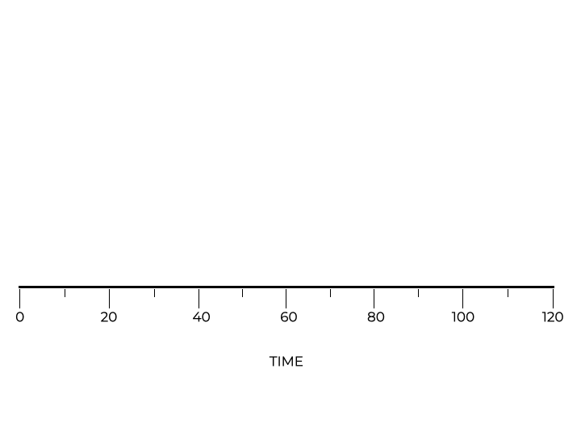

# FIFO: First In, First Out

This straightforward mechanism, while easy to understand and implement, comes with its own set of challenges.

Imagine a coffee shop where the barista prepares orders strictly based on when they were placed. If someone orders a complex, time-consuming drink, everyone else behind them in line has to wait, even if their orders might take a fraction of the time.

This delay for the smaller, quicker orders is similar to what happens in **FIFO scheduling**, and it’s known as the **convoy effect**.

As an example, let’s assume:
* Three jobs, A, B, and C, arrive in the system simultaneously ($T_{arrival} = 0$)
* While they all arrived "at the same time", A arrived slightly before B, which likewise arrived just before C
* Each of these jobs takes 10 seconds to complete

The animation below demonstrates how FIFO scheduling works.

<p align="center">
  
</p>

If we were to compute the average turnaround time for these three tasks, we would use this formula:

$$\frac{10 + 20 + 30}{3} = 20$$

## Relaxing Assumption #1

It is more realistic to assume that each of these tasks do not take the same amount of time to execute. Now, job A takes 100 seconds while jobs B and C still take 10 seconds.

How does the FIFO algorithm perform under these circumstances?

Let’s calculate the average turnaround time for these three jobs.

$$\frac{100 + 110 + 120}{3} = 110$$

The average turnaround time jumped dramatically even though two of the jobs still only take 10 seconds to complete. This is the **convoy effect** in action, having small jobs that are stuck waiting behind a heavyweight job.

### Let’s explore this with a simulator!

[fifo.c](fifo.c) is a program that simulates the FIFO scheduling algorithm. This will also allow us to explore the convoy effect, which is a significant concern in FIFO scheduling.

First, let’s explore the first scenario, with all 3 jobs having 10 second execution times.
* **Job A**: 10 seconds
* **Job B**: 10 seconds
* **Job C**: 10 seconds

```
gcc fifo.c -o fifo; ./fifo
```

Now, let’s tweak our scenario. Job A will take a significantly longer time compared to B and C. This will help us witness firsthand how the convoy effect influences the average turnaround time in FIFO.
* **Job A**: 100 seconds
* **Job B**: 10 seconds
* **Job C**: 10 seconds

After running the simulation, notice the average turnaround time.

Even though jobs B and C only take 10 seconds each, they have to wait for the lengthy execution of Job A.

This results in a drastically increased average turnaround time for all jobs combined, a prime example of the convoy effect in action.

While it treats tasks fairly in the order of their arrival, this can lead to inefficiencies, especially when shorter tasks are queued behind a much longer one. Recognizing this limitation is essential when evaluating the appropriateness of **FIFO** for specific use cases.

#### Checkpoint

Drag the code blocks below to to finish the template and write a simple scheduler that schedules jobs using FIFO by:
* Creating a `Job` structure that represents each job with a unique `job_id` and its `duration`.
* Build the fifo_scheduler function that takes in an array of `jobs[]` and the total count of jobs.
* Inside the scheduler, we loop over each job:
* Print the execution message for the job.
* Use `sleep()` to simulate the duration the job runs for.* Print the completion message for the job.

Ensuring each job is executed in the order they’re present in the array, and they run to completion based on our assumptions.

```c
// TEMPLATE CODE

#include <stdio.h>
#include <unistd.h>  // for sleep()

#define JOB_COUNT 3

// COMPLETE THE CODE HERE

int main() {
    Job jobs[JOB_COUNT] = {
        {1, 4},
        {2, 2},
        {3, 6}
    };

    fifo_scheduler(jobs, JOB_COUNT);
    return 0;
}
typedef
```

**Sol:**

```c
typedef struct {
    int job_id;
    int duration;
} Job;

void fifo_scheduler(Job jobs[], int count) {
    for(int i = 0; i < count; i++) {
        printf("Executing Job %d for %d seconds...\n", jobs[i].job_id, jobs[i].duration);
        sleep(jobs[i].duration); 
        printf("Job %d completed!\n", jobs[i].job_id);
    }
}
```

