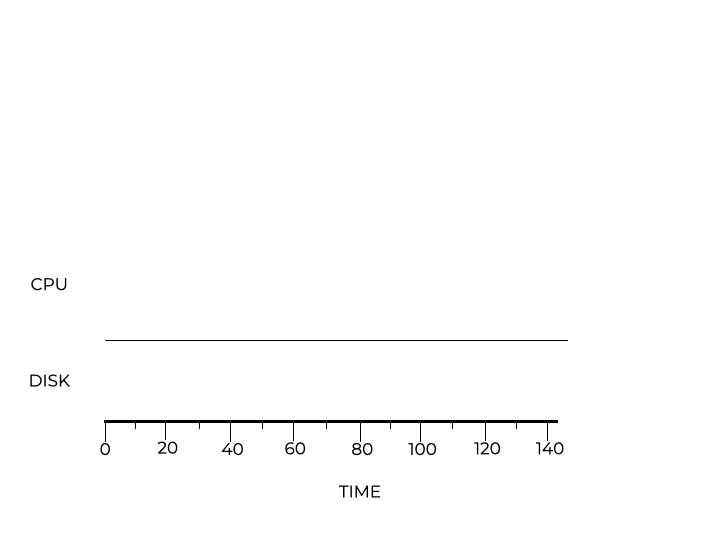

# Incorporating I/O

## Relaxing Assumption #4

Another assumption we need to change is that **programs don’t request any I/O**. This is not true. The scheduler’s job is to decide when to request I/O because the current job cannot access the CPU during I/O requests. Having another job use the CPU during this time is a good idea. Another task of the scheduler is to determine when I/O is complete. This requires raising an interrupt and putting the I/O process back into its ready state.

Assume jobs A and B both require 50ms to complete. Job A runs for 10ms and then requests I/O, which takes 10ms. Job B does not use I/O. Notice how there are gaps when the CPU is not being used during I/O operations. This is an inefficient use of resources.

  

A better solution would be to start job B when job A is performing I/O tasks. Upon completion of I/O, the scheduler could preempt job B and return Job A to the CPU. During the next I/O block, the scheduler resumes job B.

  

In this scenario, there is always a task running on the CPU, which increases efficiency.

#### Checkpoint

What is the best way to run jobs when I/O is involved?
- [ ] Schedule the CPU-only job before the job that performs I/O.
- [ ] Schedule the CPU-only job after the job that performs I/O.
- [x] Schedule a job to use the CPU while the other job performs I/O.
- [ ] Use RR to work on both jobs in a fair manner.

> The most efficient way to schedule these processes is to have one using the CPU while the other is performing I/O. You do not want to perform these processes one after the other.

