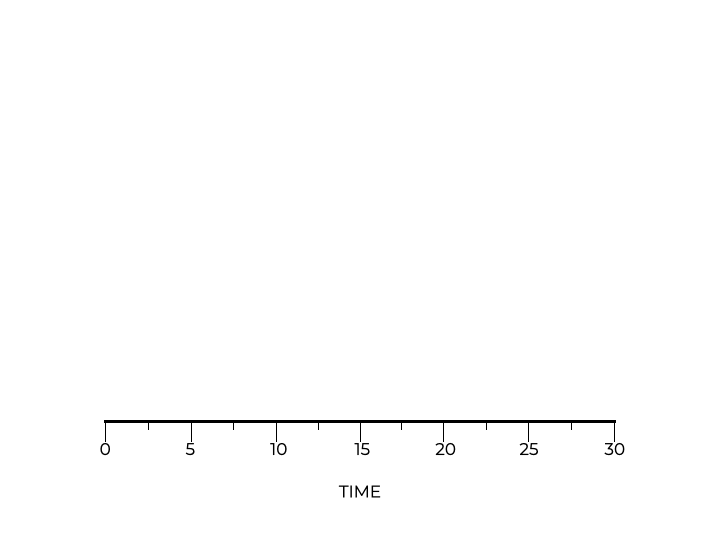

# Round Robin

The **round-robin (RR)** scheduling technique helps address the response time of a scheduler. Jobs are not run to completion. Instead, **RR runs them for a slice of time** (this is known as a scheduling quantum), and then moves on to the next job. The scheduler repeats this process until all of the jobs are done.

The length of a time slice is related to the timer interrupt. Imagine that the system will send the interrupt signal every 10 milliseconds. The time should be a multiple of the interrupt (10ms, 20ms, 30ms, etc.).

Assume three jobs (A, B, and C) arrive at the same time. Each job has a duration of 5 seconds. Using SJF, each job runs to completion before starting the next one. The average response time would be:

$$\frac{(0) + (5) + (10)}{3} = 5$$

  

Using RR and a time-slice of 1 second, the scheduler would cycle through the jobs quickly. This scheduling policy produces a response time of:

$$\frac{(0) + (1) + (2)}{3} = 1$$

  

The time slice is important for performance. The shorter the better. However, if you make the time slice too small, all of that context switching (storing registers) begins to affect performance. Striking a balance is important. You need a time slice that reduces switching costs but does not make the scheduler unresponsive.

## Trade-Offs

RR is great for response time, but let’s look at how it works with regards to turnaround time. In the previous example, jobs A, B, and C arrive at the same time. The scheduler has a one-second time slice. We can see that job A finishes at 13 seconds, job B finishes at 14, and job C finishes at 15 seconds. That is an average turnaround time of 14 seconds. RR often has worse turnaround times than FIFO because RR does not care about job completion.

Performance (turnaround time) and fairness (response time) are at odds. Increasing one decreases the other. Trade-offs must be made as there is no one solution that optimizes for everything.

> **Important**:
> * RR is great for response time.
> * RR often causes terrible turnaround time.
> 
> RR is about maximizing fairness and response time. This algorithm is not concerned with job completion, so turnaround time suffers.

