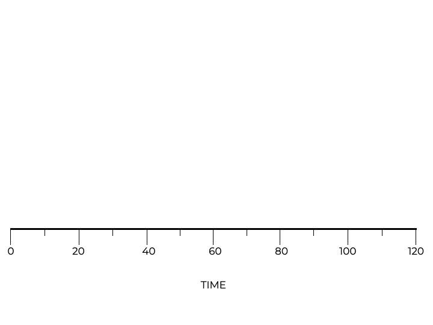
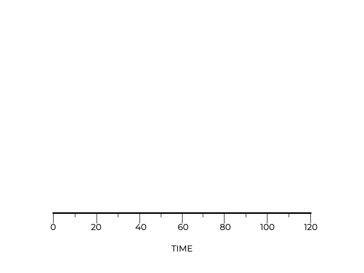

# SJF: Shortest Job First

**Shortest Job First (SJF)** scheduler prioritizes the execution of jobs based on their **duration**, with the shortest job going first.

This approach, while optimal in minimizing the average waiting time, does present challenges when the arrival times of jobs vary.

Imagine you are at a fast-food counter. If the person in front of you ordered a full meal that takes a while to prepare, but you only asked for a soda, the cashier might decide to serve your soda first since it’s quicker. That’s SJF in action!

However, what if you arrived at the counter slightly later than the person who ordered the full meal? Would you still be served first?

SJF’s turnaround time is shown in the animation below.

<p align="center">
  
</p>

SJF runs jobs B and C before job A. Doing this means the average turnaround time is now 50 seconds.

$$\frac{10+20+120}{3} = 50$$

Using SJF provides an advantage, but some of our current assumptions are still not realistic.

## Relaxing Assumption #2

It is unrealistic to assume that all jobs arrive at the same time. Let’s now assume now that **jobs can arrive at any time**.

Job A now arrives at time $t=0$ and must run for **100 seconds**. Jobs B and C arrive at time $t=10$.

<p align="center">
  
</p>

Because job A arrives first, it is the “shortest” job so our scheduling policy starts with that job. Jobs B and C must wait for A to finish. As a result, we see the same convoy issue.

The average turnaround time for these jobs now jumps up to **103.33 seconds**.

$$\frac{100+(110 - 10)+(120 - 10)}{3} = 103.33$$

### Let’s explore this with a simulator!

[sjf.c](sjf.c) is a program that simulates the **SJF scheduling algorithm**. This will allow us to see how different arrival times and job durations can affect the average turnaround time.

For the first scenario, keep all jobs arriving at the same time ($T_{arrival} = 0$) and try different job durations. Notice how SJF prioritizes shorter jobs.

```
gcc sjf.c -o sjf; ./sjf
```

Unlike FIFO, where jobs are executed in the order they arrive, SJF schedules jobs based on their execution time. The job with the shortest duration is executed first.

For the second scenario, stagger the arrival times. What happens if a long job arrives before short ones?

```
gcc sjf.c -o sjf; ./sjf
```

When all jobs arrive simultaneously, SJF efficiently minimizes the waiting time. However, when job arrival times differ, SJF can run into the same challenges as FIFO, especially if a longer job arrives before shorter ones.


Under what condition does SJF outperform FIFO?
- [ ] SJF always outperforms FIFO
- [ ] SJF never outperforms FIFO
- [ ] When the jobs arrive at different times
- [x] When all the jobs arrive at the same time

> SFJ only outperforms FIFO when all of the jobs arrive at the same time. We can see the same convoy issue from FIFO when the jobs arrive at different times.