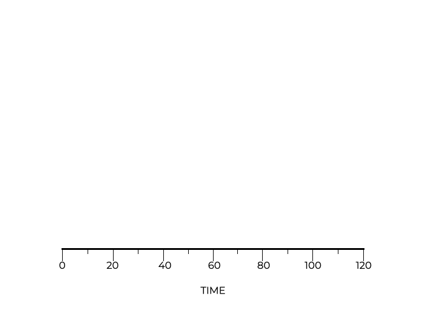

# STCF: Shortest Time-to-Completion First

The essence of scheduling algorithms is to make efficient use of resources. While we’ve looked at algorithms like FIFO and SJF, neither of them considers the scenario where a running job can be interrupted. The **STCF** (or **PSJF**) algorithm fills that gap.

When a job arrives, the **shortest time-to-completion first (STCF)** or **preemptive shortest job first (PSJF)** and I, has the scheduler compare it to the remaining jobs and schedules the one with least amount of time first.

## Relaxing Assumption #3

To see how STCF works, we need to do away with our assumption **that that jobs have to run until completed**. We also need the ability for the scheduler to **preempt** or interrupt a job to perform another job.

Notice how the scheduler preempts job A when jobs B and C arrive. The shorter jobs are performed first, and upon their completion job A is completed.

The **Shortest Time-to-Completion First (STCF)** or Preemptive Shortest Job First (PSJF) scheduler adds **preemption** to SJF.

<p align="center">
  
</p>

STCF improves the **average turnaround** time to **50 seconds**.

$$\frac{(120-0)+(20-10)+(30-10)}{3} = 50$$

### Let’s explore this with a simulator!

From the code to the left, you can see that we keep looping until all jobs are complete. On each iteration, the STCF scheduler selects the job with the least remaining time and executes it for a second, simulating the preemption.

Take a look at the `jobs` array that defines 3 jobs and:
* their job id
* their duration
* arrival time
* remaining run time, and
* whether or not the job has begun.

```
Job jobs[] = {
    {1, 100, 0, 100, 0},
    {2, 10, 10, 10, 0},
    {3, 10, 15, 10, 0}
};
```

Run the simulator:

```
gcc stcf.c -o stcf; ./stcf
```

This scheduling algorithm ensures that smaller tasks don’t get trapped behind longer tasks, reducing the average wait time.

#### Check point

Why is STCF an improvement upon SJF?
- [ ] STCF waits until all jobs are submitted and then determines the best order.
- [ ] STCF executes the jobs in the reverse order in which they were received.
- [ ] STCF is not an improvement of SJF.
- [x] STCF can interrupt a job currently being completed to execute shorter jobs first.

> STCF has the ability to interrupt jobs currently being completed. That means if shorter jobs arrive, the scheduler can interrupt the slow job and execute the shorter jobs. This helps the scheduler avoid the convoy issue we have seen in previous examples.

