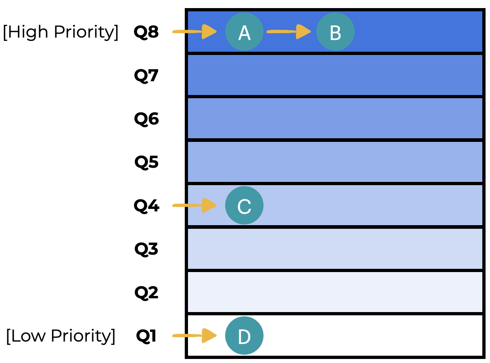
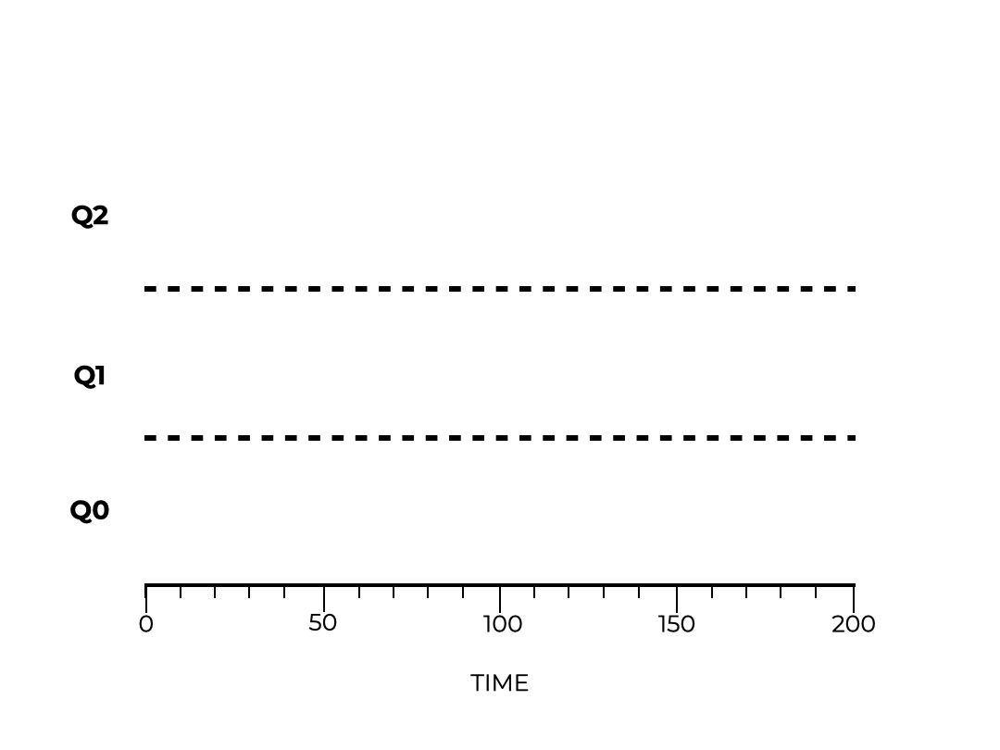
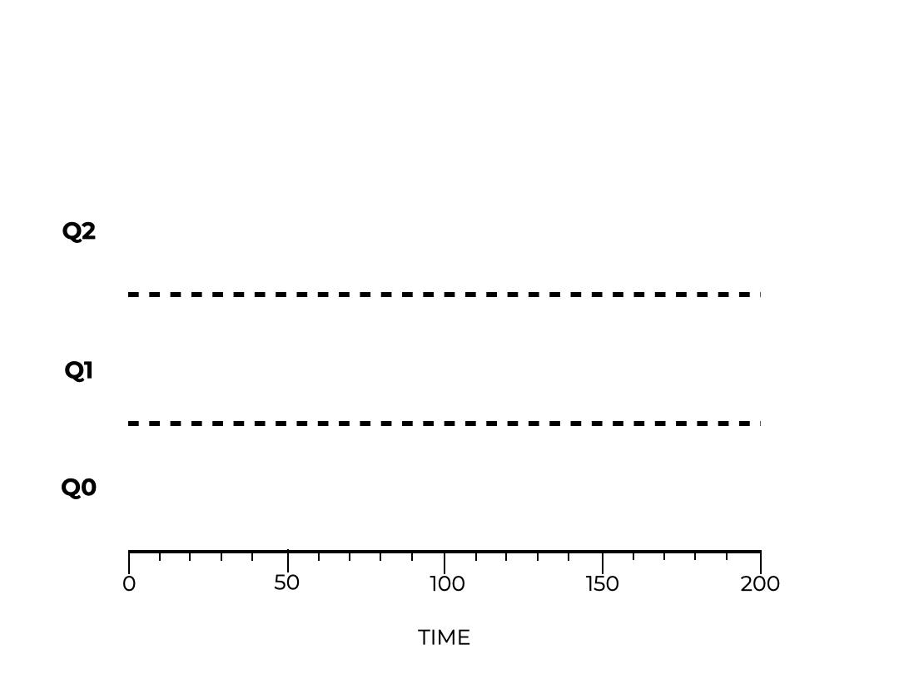
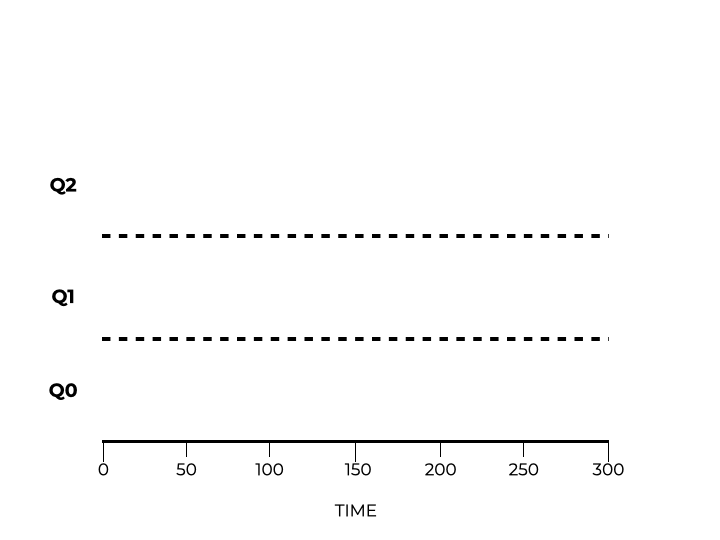

# MLFQ

## Job Duration

We ended the lesson by revising the assumption that the scheduler knows the duration for every job. In fact, it does not, which makes implementing the previously discussed policies difficult.

The use of a **multi-level feedback queue** scheduler will address these issues. This scheduler predicts the future using events in the recent past.

Over the course of this lesson, we aim to answer the following question?
* **How can we create a scheduler that improves turnaround time and response time and turnaround time when job duration is unknown?**

## Introduction

Modern systems make use of a **Multi-level Feed-back Queue (MLFQ)** scheduler, which has been developed over many years.

  

The **MLFQ** can help us reduce turnaround time by running the shorter job first (even when job duration is not known). It can also reduce reaction time,which makes the system feel more responsive to users. To do this, though, we need to keep the following questions in mind:

* **How can a scheduler meet these goals when so little is known about the jobs?**
* **How can a scheduler make better decisions about scheduling by learning from the jobs it completes?**

## MLFQ: Basic Rules

The MLFQ has several different **queues**. Each queue has its own **priority level**. You can run a job at any time. When you have competing jobs, the MLFQ selects the job that has the highest priority (found in the queue with the highest priority). If there are several jobs in the same queue, you can use round-robin scheduling. We can take these ideas and distill them down to two rules:
* **Rule 1 - If Priority(A) > Priority(B), run A but not B**
* **Rule 2 - If Priority(A) = Priority(B), run both A and B with a round-robin**

**Prioritizing** is very important in MLFQ scheduling. You determine a job’s **priority** by the job’s **observed behavior**. You do not use a fixed value to set the priority. This means that if a job uses I/O instead of the CPU, the MLFQ will keep the priority high. As the CPU gets used for extended periods of time, the priority will lower. The MLFQ uses these past jobs to anticipate the behavior of future jobs.

A queue (at any given moment) may look like the image to the left. Jobs A and B have the highest priority, while jobs C and D have a lower priority. The scheduler would use round-robin to alternate between jobs A and B due to their priority. In this example, jobs C and D do not run.

We need to better understand how the MLFQ changes priority over time.

### Fill in the blanks to complete the statement below.

1. In a Multi-Level Feedback Queue scheduler, a job’s 
**priority** is decided by its **observed behavior**.

   > When using a Multi-Level Feedback Queue, a job’s observed behavior is used to determine its priority.

2. If 2 jobs share the same priority level, how does the OS decide which job to run?

   Choose an answer and click the button below to submit.
   - [ ] The jobs run using First-In-First-Out Scheduling
   - [x] The jobs run using Round Robin Scheduling
   - [ ] The jobs run using Shortest Job to Completion Scheduling
   
   > **Rule 2**: If Priority(A) = Priority(B), then A & B run in Round Robin

## Attempt #1: How To Change Priority

Let’s think about the workload for a scheduler. There is a mix of jobs that either run quickly or use the CPU for an extended period of time. Using this, we can create some more MLFQ rules:
* **Rule 3 - Jobs added to the system are given the greatest priority (topmost queue)**.
* **Rule 4a - The priority is downgraded if the job cannot be completed in one time slice (moved down one queue)**.
* **Rule 4b - The priority remains the same if the job is completed before the time slice ends or if the job gives up access to the CPU.**

### Example: One Long Job

Assume there is a single a job that runs for a long time. The animation shows how the job moves across three different queues. The job goes first into the highest priority queue. However, it cannot finish within the time slice, so it’s priority is downgraded. The job cannot finish in another time slice, so its priority goes to the lowest setting. Here, the job remains until it is complete.

  

### Questions

1. What priority is given to new jobs that enter the system?
   
   Choose an answer and click the button below to submit.
   - [ ] Priority of any available queue
   - [ ] Highest available priority
   - [x] Priority level midway between the highest and lowest available.
   - [ ] Lowest available priority
   
   > **Rule 3**: When a job is added to the system, it is given the highest priority.

## Examples

### Example: One Long Job, One Short Job

Let’s look at a more complex example that has two jobs. Job A runs for a long time and uses the CPU. Job B runs briefly and is interactive. Assume that job A runs for a while until job B arrives. The graphic below shows how a MLFQ scheduler would handle this.

  

Job A descends through the priority levels due to its long duration. When job B arrives, it goes into the highest queue. The system then runs job B. It gets demoted since it did not finish in the first time slice. The system runs B from the next queue and completes the task. Finally, the system resumes job A at the lowest priority.

The system did not know that job B would be long or short. It guesses and places job B in the highest priority queue. The system will quickly finish the job if is small. If not, the job will go down through the queues. MLFQ comes close to replicating the SJF policy.

### Example: I/O

Here’s an example in which a job uses I/O. Job A is a long-running, CPU-intensive task, while job B makes heavy use of I/O. Recall that Rule 4b states that a process that maintains its priority if it gives up access to the CPU.

  

Job A works its way down the different queues until it settles in at the lowest priority. When job B arrives, it is placed in the highest priority queue. Because it continually gives up access to the CPU, the priority does not change. While job B is access I/O, the scheduler continues with job A until job B is done with I/O. This process continues until job B is complete. The scheduler them finishes job A.

You can see how MLFQ efficiently balance the two jobs.

### Questions

1. Why do jobs with lots of I/O not lose priority?
   Select an answer and click the button below to submit.
   - [x] Jobs with lots of I/O can always be completed within a single time slice.
   - [ ] Jobs that give up access to the CPU do not decrease in priority.
   - [ ] Round-robin policy states that I/O jobs get priority.
   - [ ] FIFO policy dictates that I/O tasks get the highest priority.
   
   > **Rule 4b** states that jobs that give up access to the CPU do not decrease in priority. So jobs with lots of I/O do not lose priority.

## Issues With Our Current Model

The last few examples have one of the jobs being a long-running, CPU-intensive job. The MLFQ policy seems to do well with these kinds of jobs. However, this is not a perfect model. If you were to have lots of I/O jobs, they would get all resources due to their priority. The long-running jobs would suffer from **starvation** because they are denied system resources. In addition, software developers can **game the scheduler** by writing code with lots of I/O calls to push their application to the top of the priority queue.

The scheduler should try and maintain fairness and not incentivize developers to game the system so their program gets preferential treatment. For example, a developer can write to a file that is not important. The numerous calls to I/O ensure that the job remains in the highest priority queue. The animation to the left shows how jobs B and C dominate the resources and leave job A waiting for its turn on the CPU.

Another potential problem occurs when a long-running job suddenly needs to access I/O. Being in the lowest priority queue, the program will not get the opportunity to run these I/O tasks as other jobs have priority.

  

### Questions

1. What does starvation mean?
   
   Select an answer and click the button below to submit.
   - [x] A job is denied the computing resources it needs in order to complete the job.
   - [ ] A job is given too many resources which results in an inefficiency.
   - [ ] When a software developer writes code in such a way that their program remains in the highest priority queue when it should be downgraded.
   - [ ] Starvation occurs when competing jobs are given adequate resources in a timely manner.
   
   > Starvation refers to the situation when a job is not given the resources it needs to finish running.

## Attempt #2: The Priority Boost

Adding another rule should help us avoid starvation. We want to ensure that long-running jobs can still make progress (even if a bit slow) by regularly raising the priority of all jobs in the system.

* **Rule 5 - After a predetermined amount of time, S, all jobs in the system are moved to the topmost queue.**

By pushing all jobs to the topmost queue, you guarantee that a job will not starve. Also, if a long-running job suddenly needs to access I/O, it will be in the highest priority queue, and these tasks will be addressed.

Compare the two animations and note how, on the right, job A gets promoted back to the topmost queue and can access I/O. On the left, there is no priority boost. Job A is stuck in the lowest queue and becomes starved by the two jobs using lots of I/O.

  
  Without Priority Boost

  
  With Priority Boost

Selecting the proper value for S (the time limit for boosting priority) can be difficult. If the time period is too short interactive jobs will see slower performance. Set the interval too big and long-running jobs will not perform in a timely manner. You need to strike a balance.

### Questions

1. How do you ensure that jobs do not starve?
   
   Select an answer and click the button below to submit.
   - [x] Boost all jobs to the topmost queue.
   - [ ] Kill jobs in the topmost queue.
   - [ ] Decrease the priority of other jobs to bring them all into the lowest queue.
   - [ ] Only have one queue for all tasks regardless of priority.
   
   > By boosting the priority of all jobs to the topmost queue, you guarantee that all jobs get the resources they need.

## Attempt #3: Better Accounting

Boosting priority helps prevent starvation, but it does not keep developers from gaming the scheduler. Rules 4a and 4b state that jobs will maintain their priority as long ass they release the CPU before a time slice expires. Look at the animations below. The animation on the left is a long-running job, but can game the scheduler by using I/O calls to keep its high priority. Now look at the animation on the right. The same job does not keep its status in the topmost queue.

  
  Without Gaming Tolerance

  
  With Gaming Tolerance

You can keep developers from gaming the scheduler by keeping track of how many time slices are used at the priority level. If a job exceeds a limit, decrease the job’s priority. In the animation below, both jobs A and B make use of the CPU and I/O. However, they do not maintain the highest priority. The jobs are demoted in priority the longer they run.

  
  Lower Priority, Longer Quanta

This solution requires that we rewrite Rule 4 into a single rule:

* **Rule 4 - Jobs exceeding a time limit have their priority lowered (move down a queue).**

Jobs can no longer artificially maintain a privileged place in the topmost queue. This helps to maintain fairness in the scheduler.

### Questions

1. Why is gaming the scheduler a bad idea?
   
   Select an answer and click the button below to submit.
   - [ ] Gaming the scheduler slows down all jobs in the system.
   - [x] Gaming the scheduler means that certain jobs get more than their fair share of resources.
   - [ ] Gaming the scheduler means that long-running jobs get all of the resources.
   - [ ] Gaming the scheduler decreases the security of the operating system.
   
   > Gaming the scheduler means that certain jobs receive more than their fair share or resources.

## Tuning MLFQ and Other Issues

We have seen how priority boosting and keeping track of time spent help improve the performance of MLFQ. However, there are still additional issues. How can the scheduler be **parameterized**? What should the size of each queue be? There is no simple answer to these questions, which is why you will see variations of MLFQ.

Some MLFQ schedulers will change the time slice durations between the different queues. Other schedulers use more complex math to determine how priority changes over time, how long each time slice should be, and how often the priority of a job is boosted.

Finally, people develop MLFQ schedulers with new features to help balance performance. For example, the topmost priority is only available to operating system work. This would keep user programs from abusing the highest priority queue.

### Questions

1. Select all of the ways MLFQ can be improved to increase performance.
   
   **Hint**: there is more than one correct answer.
   - [x] Use sophisticated formulas to set priority
   - [x] Add additional functionality
   - [x] Change the length of the time slice in each queue

   > All of the above are ways in which changes can be made to MLFQ to increase performance.
   
## Summary

In this lesson, we introduced the Multi-Level Feedback Queue (MLFQ) scheduler. This policy has several queues, each with their own priority level. The scheduler places jobs in the appropriate queue to maximize performance. MLFQ uses the behavior of each job to determine the priority for the job. As the behavior changes over time, so too can the job’s priority.
These MLFQ rules are provided here for your convenience:
* **Rule 1**: If Priority(A) > Priority(B), then A runs
* **Rule 2**: If Priority(A) = Priority(B), then they are both run using a round-robin policy
* **Rule 3**: Jobs entering the system are placed in the topmost queue with the highest priority
* **Rule 4**: If a job takes longer than a specified time (even if it frees up the CPU), it’s priority is downgraded
* **Rule 5**: Move all jobs to the topmost queue after some time period S

**MLFQ** is interesting because it is hard to optimize performance without knowing information like the duration of a task. This information is unknowable in advance. Yet, MLFQ uses behavior to make educated guesses about job priority. MLFQ strikes a pretty good balance between turnaround time and response time.

