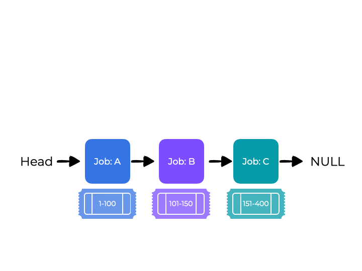
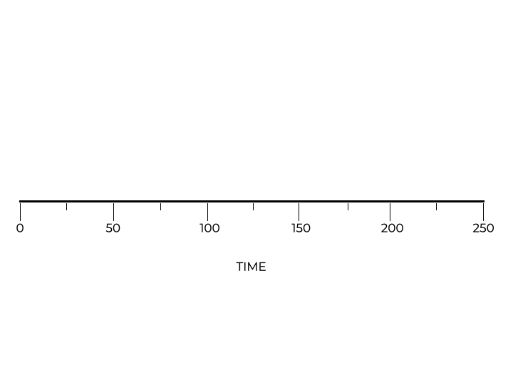

# Lottery Scheduling

## Overview

This lesson introduces another type of scheduler called the **proportional-share scheduler**. This scheduler shares the CPU proportionally. It is also know as a **fair-share scheduler**.

The following questions will help guide our discussion:
* **How can a scheduler be built so that it shares the CPU proportionally?**
* **What are the key mechanisms used to help proportional sharing?**
* ***How effective are these schedulers?**

## Introduction

Previously, we discussed schedulers in terms of **turnaround** and **response** times. This time we want to look a scheduler that dictates that **each job gets a specified percentage of CPU time**. This is why it is called a fair-share scheduler.

The operating system repeatedly holds a **lottery** to determine which job is run next. Processes that should be run with greater frequency should have a better chance of winning the lottery.

Instead of optimizing for **turnaround** or **response** time, a scheduler can seek to guarantee that **each job gets a certain percentage of CPU time**.

The idea is to hold a **lottery** every now and then to choose which process should run next. Processes that should run more often should have greater chances to win.

### How does the lottery system work?

Select an answer and click the button below to submit.
- [ ] All jobs have the same chance of winning
- [x] The most frequent jobs have the greatest chance to win
- [ ] The longest jobs have the greatest chance of winning
- [ ] The shortest jobs have the greatest chance of winning

> The lottery system works in proportion to frequency. Those jobs that are run the most often have the greatest chance of winning.

## Tickets Represent Your Share

Unsurprisingly, a lottery schedule uses **tickets**. Each ticket represents a **share of a resource**. The percentage of tickets owned by a single process means it gets the same percentage of a system resource.

Assume there are two processes, A and B. Process A has $75$ tickets, while process B only has $25$ tickets. That means process A is entitled to $75$
 of the CPU and process B only gets $25$.

The operating system periodically (every time slice for example) holds a lottery. In order to this, the scheduler needs to know the total number of tickets. For our examples, we will assume there are $100$  tickets. A winner is then selected between $0$ and $99$. Using the example above, process A has tickets $0-74$ and process B owns tickets $75-99$.

To hold a lottery, the scheduler has to know the total number of tickets (in our example, there are $100$). The scheduler then selects a winning ticket from $0$ to $99$.

If the scheduler picks a ticket of process A, then that process runs. Selecting a ticket of process B means that process runs. Here is an example of a lottery scheduler’s results as it holds a series of lotteries:

| 73 | 75 | 32 | 19 | 96 | 07 | 69 | 27 | 42 | 53 | 12 | 82 | 48 | 99 | 57 | 02 | 13 | 80 | 51 | 7 |
|:--:|:--:|:--:|:--:|:--:|:--:|:--:|:--:|:--:|:--:|:--:|:--:|:--:|:--:|:--:|:--:|:--:|:--:|:--:|:-:|
| A  |    | A  | A  |    | A  | A  | A  | A  | A  | A  |    | A  |    | A  | A  | A  |    | A  | A |
|    | B  |    |    | B  |    |    |    |    |    |    | B  |    | B  |    |    |    | B  |    |   |

Notice that process B only won the lottery four times out of 20 ($20$). Just because process B is entitled to $25$ of the resources doesn’t mean that every fourth lottery will produce a winning ticket for process B. As the two jobs compete in the lottery, they will reach their desired proportion of system resources.

### What does a process’ percentage of tickets represent?

Choose an answer and click the button below to submit.
- [ ] The process’ workload
- [x] The process’ share of resources
- [ ] The process’ success rate
- [ ] The process’ runtime

> Lottery scheduling uses the concept of tickets to represent the share of a resource that a process should receive. **A process’s percentage of tickets represents its share of a system resource**.

## Ticket Mechanisms

Tickets can be manipulated in a variety of ways. Here are some common examples of ticket mechanisms.

### Ticket Currency

Lottery scheduling also allows for the manipulation of tickets in various and occasionally effective ways, including the idea of a **ticket currency**. The system issues a set number of tickets to a user. The user can then issue tickets to their own jobs in a “different” currency. The operating can convert the different currencies back to the global currency.

For example, the system issues 100 tickets to both user A and user B. User A runs two jobs and they assign each job 500 tickets out of 1000 possible tickets. Similarly, user B has one job to perform and they assign 10 tickets to the job out of 10 possible tickets. Each user created their own currency to handle their jobs.

While this may seem confusing, the operating system can covert these currencies back into the global currency (where each user ha 100 tickets).

| User | Job | User Currency | Global Currency |
|------|-----|---------------|-----------------|
| A    | A1  | 500           | 50              |
| A    | A2  | 500           | 50              |
| B    | B1  | 10            | 100             |

## Ticket Transfer

The **ticket transfer** mechanism means a process can temporarily give its tickets to another process. This is common with the client/server relationship. The client generates tickets for a job but then sends them to the server which handles the request and sends the tickets back to the client.

### Ticket Inflation

**Ticket inflation** is a mechanism that allows a process to temporarily increase or decrease the amount of tickets it holds.
In a competitive environment with distrusting processes, this makes little sense. It’s possible for one selfish process to take control of the machine by giving itself a hoard of tickets.

**Inflation** can be used in situations where mutual trust exists between processes. If a process needs more CPU time, it can boost its ticket value without having to communicate with any other processes.

## Implementation

Implementing a **lottery scheduling** requires you to have:
* a quality **random number generator**
* a **data structure** to keep track of system processes
* the **total number of tickets** available

The animation below shows what a lottery winning process would look like. Job A has tickets 1 to 100, job B has tickets 101 to 150, and job C has tickets 151 to 400. The system chooses a random number between 1 and 400 (300 in this case). Since 300 falls into the block of tickets for job C, this job wins the lottery.

<p align="center">
  
</p>

The code sample to the left provide a more concrete example of this. There are variables to keep track of current job (`currentJob`), the winning ticket (`winner`), and the largest ticket of the current job (`currentTicket`). As the program runs, `winner` is set to 300, `currentTicket` is set to 100, and `currentJob` is set to job A.

Since currentTicket (100) is less than `winner` (300), `currentJob` becomes job B and `currentTicket` becomes 150. `currentTicket` is once again less than `winner` so currentJob becomes job C and `currentTicket` becomes 400. `currentTicket` is now greater than `winner` and you break out of the loop. The value of `currentJob` is the lottery winner.

Arranging the jobs from highest to lowest number of tickets means that you will select the winner with the fewest amount of iterations. This increases the efficiency of this process and does not affect the accuracy of the lottery scheduler.

### Which of the following are necessary to implement lottery scheduling?

Choose your answer and click the button below to submit.

**There may be more than one correct answer**
- [ ] the total number of jobs
- [ ] the lengths of all jobs
- [x] a data structure for processes
- [x] the total number of tickets
- [x] a random number generator

> To implement lottery scheduling, you need:
> * A random number generator
> * A data structure to track the system’s processes, and
> * The total number of tickets

## Example

Let’s look at the completion time of two jobs. Both jobs have 100 tickets and run for the given time `R`. We will adjust `R`. This example will help us better understand how lottery scheduling.

Ideally, each job to finish at about the same time. However, there is some randomness in lottery scheduling so one job might finish before the other. We want to measure this difference with the **fairness metric** $F$. We can calculate $F$ by dividing the completion time of the first job by the completion time of the second job.

$$F=\frac{EndTime_A}{EndTime_B}$$

If `R` is 10, that would mean job A finishes at time 10. Job B would run directly afterwards and finish at time 20. Using the above formula, we can calculate the fairness metric for these two jobs.

$$F=\frac{10}{20}=0.5$$

If two jobs finish at the same time, then $F=1$. This is the goal of our scheduling, get $F$ to be as close to 1 as possible.

### Arrange the blocks in order from least fair to most fair.

Drag the code blocks to the area below to form your response.
1. `F = 0.01`
2. `F = 0.27`
3. `F = 0.51`
4. `F = 0.79`
5. `F = 0.93`

If 1 is the most fair value, then the blocks should be arranged in order from smallest to largest values of `F`.

## Completely Fair Scheduler (CFS)

A key component to lottery scheduling involves **assigning tickets to jobs**. Distributing tickets affects system behavior, so this can become a difficult problem to solve.

We could assume that each user can perform this task. The system provides the user with a set number of tickets, and they assign them as they wish. But this doesn’t really solve the problem, it just hands the problem off to the user.

A **completely fair scheduler (CFS)** can ensure fair-share scheduling in a way that is efficient and works with a large number of jobs. CFS uses data structures and a sophisticated design to achieve these goals.

### CFS Basics

A CFS doesn’t use a set time slice as this is not an accurate way of trying to measure job duration. Fairness requires a better estimate of duration. Instead, the CFS uses **virtual runtime (vruntime)** which is a counting method. `vruntime` increases as the job runs in real time. The system then records the `vruntime` in a data structure. When it comes time to schedule a task, it can look it up in the data structure and **select the process with the lowest** `vruntime` to run next.

However, we see a familiar conflict here. Switching too frequently improves fairness but sacrifices speed. If the CFS switches less frequently speed increases while sacrificing fairness. The CFS balances these opposing goals by using control parameters.

#### Select all of the true statements about `vruntime`.

**Hint**: there is more than one correct answer.
- [x] The system calculates a `vruntime` value for every job it runs.
- [x] `vruntime` values are stored in a data structure.
- [ ] As a job takes more time, the `vruntime` value decreases.
- [ ] Jobs with the highest `vruntime` value are scheduled next.

<br>

> The correct answers are:
> * The system calculates a `vruntime` value for every job it runs.
> * `vruntime` values are stored in a data structure.
> 
> The `vruntime` value is proportional to the time it takes to complete a job. The longer the time, the larger the `vruntime` value. The CFS schedules the jobs with the lowest `vruntime` value.

## sched_latency and min_granularity

The first parameter used to fine tune the performance of the CFS is `sched_latency`. This value is used to determine **the duration of a process before switching**. $48\ milliseconds$ is commonly used as the `sched_latency`. The CFS divides `sched_latency` by the number of processes ($n$). This creates a fair time slice for a process.

Assume there are four processes ($n=4$), the CFS divides the sched_latency by $n$. This means each process time slice has a duration of $12\ ms$. So the CFS schedules the first job, runs it for $12\ ms$, and then looks for a job that has a lower vruntime value to run.

<p align="center">
  
</p>

In the animation, you will see how the four jbos (A, B, C, and D) are scheduled. The scheduler runs each job for 
$12\ ms$. When jobs C and D are done, the time slice is recalculated to $24\ ms$ (48 / 2). Jobs A and B are run with the new time slice in a round-robin until they are completed.

### min_granularity

You can imagine a scenario in which there are so many jobs that the resulting time slice is so small that switching becomes inefficient. The CFS introduces another parameter, `min_granularity`, to deal with this scenario. `min_granularity` is a limit (commonly $6\ ms$) for the shortest time slice allowable. This prevents inefficiencies resulting from too many jobs trying to be scheduled.

Assume that the `sched_latency` is the traditional $48\ ms$ and there are 10 jobs to process. We would expect the time slice to be $4.8\ ms$, but this is below the `min_granularity`. Instead, the scheduler will set the time slice to $6\ ms$.

The CFS will fall short of the $48\ ms$ `sched_latency`, the system will not waste resources on excessive switching. It is okay if time slices are not multiples of `sched_latency` or timer interrupts. Keeping track of `vruntime` will help approximate the best way to share the CPU.

#### If there are 5 jobs and the time slice is 15ms, what is the `sched_latency`?

Click the button below to submit.
- [x] 75 ms
- [ ] 3 ms
- [ ] 48 ms
- [ ] 15 ms

> If the time slice is 15ms and there are 5 jobs, you can calculate `sched_latency` by multiplying the time slice by the number of jobs. Therefore, `sched_latency` is **75ms**.

## Weighting (Niceness)

Another metric commonly used is the **nice** level. This metric is a number between -20 and 19. The default is 0. You may think that jobs with a high nice level would get priority. However, the opposite is true. Jobs with a worse nice level get higher priority.

CFS maps the nice value of each process to a `weight`. The [array](weights.c) demonstrates how the mapping would work. 

```c
static const int nice_to_weight[40] = {
  88761, 71755, 56483, 46273, 36291, //-20 to -16
  29154, 23254, 18705, 14949, 11916, //-15 to -11
   9548,  7620,  6100,  4904,  3906, //-10 to -6
   3121,  2501,  1991,  1586,  1277, //-5 to -1
   1024,   820,   655,   526,   423, //0 to 4
    335,   272,   215,   172,   137, //5 to 9
    110,    87,    70,    56,    45, //10 to 14
     36,    29,    23,    18,    15, //15 to 19
};
```

The first element corresponds to -20, the second element corresponds to -19, etc. These weights are used in the calculation of the appropriate time slice:

$$timeSlice_k = \frac{weight_k}{\sum_{i=0}^{n-1}weight_i} * schedLatency
$$

Here’s an example. Job A is more important than job B, so it has a nice value of -5. Job B has the default nice value of 0. Using the array on the left, we can convert these nice values into weights. Job A has a weight of 3121 while job B has a weight of 1024.

If we want to calculate the time slice for job A, plug in the weights to the formula. The denominator is the sum of the weights (4145) while the numerator is the weight for job A (3121). This means the time slice for job A is roughly $3/4$ of `sched_latency` (about $36\ ms$
). The time slice for job B would be $1014/4145$ which is roughly $1/4$ of `sched_latency` (about $12\ ms$).

In addition, the `vruntime` calculation needs to be changed. The new `vruntime` is calculated with the following formula:

$$vruntime_i = nvruntime_i + \frac{weight_0}{weight_i} * runtime_i$$

Notice how the default weight is divided by the weight of the process. This means the higher the priority the lower the `vruntime` becomes. Using the example from above, the `vruntime` for job A accumulates at a third of the rate of job B.

### Select all of the true statements about niceness.

**Hint**: there is more than one correct answer.
- [x] The nice value ranges from -20 to 19.
- [ ] Jobs that are less nice get a lower priority.
- [x] The default nice value is 0.
- [x] The nice value is mapped to a weight. 

> The nice value goes from -20 to 19, with a default value of 0. These values are then converted into a weight, which helps with determining priority. However, jobs that are nice receive a lower priority.

# Using Red-Black Trees
In order to maximize efficiency, the CFS should find the next job to schedule as soon as possible. Using a list or other common data structure do not scale very well. Every millisecond you can shave off the search time makes a difference. The CFS uses a **red-black tree**, a type of binary tree. Because this data structure is balanced, the tree is not too deep which helps maintain operations that are logarithmic and not linear in time.

<p align="center">
  
</p>

Runnable (or running) processes are kept in the CFS. If a list was used to keep track of processes, removing and inserting processes would be an $O(n)$ operation. In a red-black tree, however, these same operations are $O(\log n)$. For an operating system, can be in the thousands, so the red-black tree provides a massive performance enhancement over traditional data $n$ structures. 

### Why is a red-black tree better than a traditional binary tree?

**red-black trees reading question**

Click the button below to submit.
- [x] Red-black trees are more balanced than a traditional binary tree.
- [ ] Red-black trees require less processing power than a traditional binary tree.
- [ ] Red-black trees require less memory than a traditional binary tree.

> Red-black trees do a better job at being balanced when compared to a traditional binary tree. That means a red-black tree should have fewer levels to traverse when performing operations. This provides a speed advantage.

## Dealing with I/O and Sleeping Processes

How does the CFS select the lowest `vruntime` value when a job has been inactive for a long time? Imagine that job A run consistently while job B goes to sleep for 10 seconds.

When job B wakes up, you run the risk of it hogging the CPU as it catches up to job A. This could lead to starvation. The CFS deals with this by changing job B’s `vruntime` when it wakes up. The scheduler sets the value to the smallest value in the tree.

This solution keeps from starving other processes, but there is a trade-off. If a process goes to sleep quickly, it does not receive its fair share of the CPU.

### How does the CFS deal with processes that are inactive?

Click the button below to submit.
- [x] The scheduler sets the vruntime to the smallest value in the tree.
- [ ] The scheduler sets the vruntime to the largest value in the tree.
- [ ] The scheduler increases the time slice for the inactive process.
- [ ] The scheduler changes the niceness for the inactive process.

> When an inactive process wakes up, the CFS sets the vruntime value to the smallest value in the tree. This keeps the system from starving other processes.

## Summary

In this lesson, we have covered how to proportionally share scheduling with lottery scheduling and the completely fair scheduler.
* **Lottery scheduling** uses randomness to select a “winning” job.
* **CFS**, like a weighted round-robin with time slices that change. However, the CFS scales better than previously discussed options.
* No scheduler (even the CFS) works perfectly. Trade-offs have to be made.
* Oftentimes, I/O jobs do not get their fair share of CPU.
* Other general-purpose schedulers can address the issues of discussed may solve these concerns automatically and be easier to deploy.
* Proportional-share schedulers work well in many contexts where these issues are minor.

