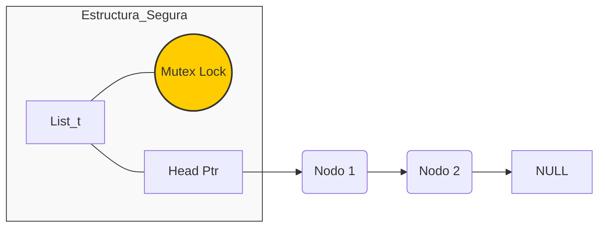
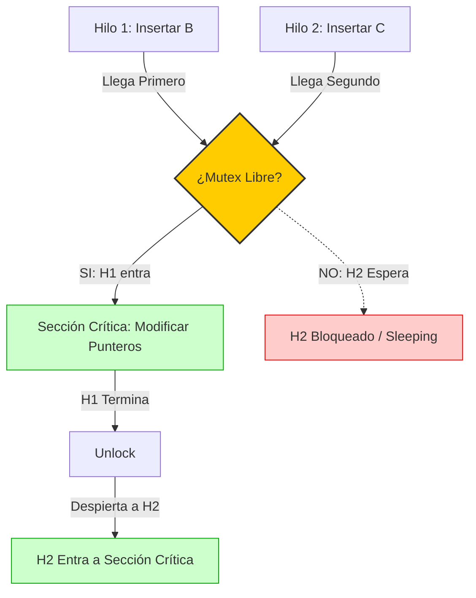

# Implementación de Lista Enlazada Concurrente (Con Bloqueos / Thread-Safe)

Este directorio contiene la versión **Thread-Safe** (Segura para Hilos) de la lista enlazada. A diferencia de la versión en [sin_locks](../sin_locks/), esta implementación utiliza primitivas de sincronización para garantizar la integridad de los datos en entornos multiprocesador.

## Descripción Técnica

El objetivo de esta implementación es resolver las **Condiciones de Carrera** observadas en la versión sin protección. Se utiliza la estrategia de **Bloqueo de Grano Grueso (Coarse-Grained Locking)**.

* **Mecanismo:** Mutex (`pthread_mutex_t`).
* **Estrategia:** Se bloquea la lista completa antes de realizar cualquier operación crítica (inserción o búsqueda) y se desbloquea al finalizar.
* **Garantía:** Exclusión Mutua (Solo un hilo puede modificar la lista a la vez).

### Estructuras de Datos (`list.h`)

La estructura de la lista ahora incluye un "cerrojo" o lock:

```c
typedef struct __node_t {
    int key;
    struct __node_t *next;
} node_t;

typedef struct __list_t {
    node_t *head;
    pthread_mutex_t lock; // <--- El mecanismo de sincronización
} list_t;
````

### Visualización de la Estructura Protegida



## Funciones Principales

Las funciones (`list.c`) ahora envuelven la lógica crítica entre llamadas de bloqueo y desbloqueo:

1.  **`List_Init(list_t *L)`**
      * Inicializa `head` a NULL.
      * **Crucial:** Inicializa el mutex con `pthread_mutex_init`.
2.  **`List_Insert(list_t *L, int key)`**
      * `pthread_mutex_lock(&lock)`: Adquiere el permiso.
      * Inserta el nodo (modifica punteros).
      * `pthread_mutex_unlock(&lock)`: Libera el permiso.
3.  **`List_Lookup(list_t *L, int key)`**
      * Protege la lectura de la lista para evitar leer un nodo que otro hilo está borrando o modificando.

## Compilación y Ejecución

Al igual que en la versión anterior, se requiere la librería de hilos POSIX.

### 1\. Compilar

```bash
gcc -o main main.c list.c -Wall -pthread
```

### 2\. Ejecutar Pruebas

```bash
./main [número_de_hilos] [iteraciones_por_hilo]
```

**Ejemplo:**

```bash
./main 2 100000
```

*A diferencia de la carpeta `sin_locks`, esta ejecución terminará correctamente y la longitud final de la lista será exactamente 200,000 (sin pérdida de datos).*

## Comparación con `sin_locks` (La Solución)

En la carpeta [sin_locks](../sin_locks/), dos hilos podían entrar a la "Sección Crítica" al mismo tiempo, corrompiendo los punteros. Aquí, el **Mutex** actúa como un semáforo o puerta de seguridad.

### ¿Cómo se arregló el problema?

El siguiente diagrama ilustra cómo el Mutex fuerza la **Serialización** de las operaciones en la sección crítica. Aunque Hilo 1 y Hilo 2 lleguen casi al mismo tiempo, uno debe esperar.



### Resultado en Memoria

Gracias a esta espera forzada, la memoria nunca se corrompe:

1.  H1 inserta B -\> `HEAD -> B -> A`
2.  H1 sale.
3.  H2 entra e inserta C -\> `HEAD -> C -> B -> A`

Todos los nodos se conservan.

### Consideración de Rendimiento

Aunque esta solución es **Correcta**, introduce un costo de rendimiento (Overhead). Si muchos hilos intentan acceder a la lista, pasarán mucho tiempo en estado `Wait` (esperando el lock), reduciendo el paralelismo.

> [!note]
> **Nota sobre IA**: Este contenido fue elaborado y estructurado con la asistencia de un modelo de inteligencia artificial. 

> [!warning]
> **Aclaración**: Como todo código (especialmente los ejemplos didácticos diseñados pueden fallar (o de hecho fallan)), el contenido debe ser revisado críticamente y puede contener errores.
