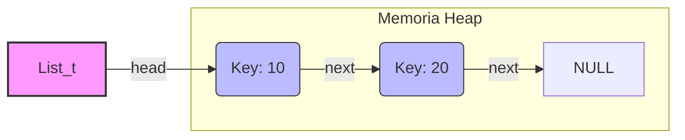

# Implementación de Lista Enlazada (Sin Bloqueos / No Thread-Safe)

Este directorio contiene una implementación básica de una **Lista Simplemente Enlazada** en lenguaje C. 

**Propósito:** Este código sirve como **caso base** para demostrar problemas de concurrencia (como Condiciones de Carrera) cuando múltiples hilos intentan manipular una estructura de datos compartida sin mecanismos de sincronización (locks/mutexes).

---

## Descripción Técnica

La estructura implementada es una lista enlazada simple donde cada nodo contiene un valor entero y un puntero al siguiente nodo.

* **Tipo:** Lista Simplemente Enlazada (Singly Linked List).
* **Gestión de Memoria:** Dinámica (uso de `malloc` y `free`).
* **Comportamiento:** LIFO (Last-In, First-Out). Las inserciones se realizan en la cabeza (`head`) para mantener una complejidad O(1).

### Estructuras de Datos (`list.h`)

```c
typedef struct __node_t {
    int key;                // Valor almacenado
    struct __node_t *next;  // Puntero al siguiente nodo
} node_t;

typedef struct __list_t {
    node_t *head;           // Puntero al primer elemento de la lista
} list_t;
````

### Visualización de la Estructura

Representación de una lista con dos elementos (`10` y `20`):



## Funciones Principales

Las funciones están declaradas en `list.h` e implementadas en `list.c`:

1.  **`List_Init(list_t *L)`**
      * Inicializa la lista estableciendo el puntero `head` a `NULL`.
2.  **`List_Insert(list_t *L, int key)`**
      * Crea un nuevo nodo con el valor `key`.
      * Inserta el nuevo nodo al **inicio** de la lista.
      * **Nota:** Esta es la sección crítica donde ocurren los fallos en entornos concurrentes.
3.  **`List_Lookup(list_t *L, int key)`**
      * Recorre la lista buscando un nodo que contenga `key`.
      * Retorna `0` si lo encuentra, `-1` si no.

## Compilación y Ejecución

Para compilar el código, asegúrate de tener `gcc` instalado. Se incluye la bandera `-pthread` porque el archivo `main.c` lanza hilos para probar la robustez de la lista.

### 1\. Compilar

```bash
gcc -o main main.c list.c -Wall -pthread
```

### 2\. Ejecutar Pruebas

El archivo `main.c` realiza una prueba de inserción masiva concurrente.

```bash
./main [número_de_hilos] [iteraciones_por_hilo]
```

**Ejemplo:**

```bash
./main 2 100000
```

*Esto lanzará 2 hilos, cada uno insertando 100,000 elementos.*

## Advertencia de Concurrencia (Race Conditions)

**Esta implementación NO es segura para hilos (Not Thread-Safe).**

Si ejecutas este código con un solo hilo, funcionará perfectamente. Sin embargo, si múltiples hilos llaman a `List_Insert` simultáneamente sobre la misma lista, ocurrirá una **Condición de Carrera**.

### El Problema

La inserción consta de dos pasos críticos que no son atómicos:

1.  Apuntar el `next` del nuevo nodo al `head` actual.
2.  Actualizar el `head` para que apunte al nuevo nodo.

Si ocurre un cambio de contexto entre el paso 1 y el 2, un hilo puede sobrescribir el trabajo de otro.

### Visualización del Fallo

El siguiente diagrama muestra el estado final de la memoria después de que el **Hilo 1** y el **Hilo 2** intentan insertar simultáneamente.

  * El **Hilo 2** (H2) insertó el `Nodo C` correctamente primero (en su propia visión del tiempo).
  * El **Hilo 1** (H1) sobrescribió el puntero `HEAD` apuntando al `Nodo B`, ignorando el trabajo de H2.

<!-- end list -->

```mermaid
graph LR
    subgraph Estado_Corrupto
        HEAD{HEAD} -->|Sobreescrito por H1| B(Nodo B: Hilo 1)
        B --> A(Nodo A: Inicial)
        
        C(Nodo C: Hilo 2) -->|next| A
    end

    classDef lost fill:#ffcccc,stroke:#ff0000,stroke-width:2px,stroke-dasharray: 5 5;
    class C lost;
    
    linkStyle 3 stroke:#ff0000,stroke-width:3px;
```

> **Resultado:** El **[Nodo C]** (en rojo) se ha perdido en la memoria (**Memory Leak**) y no forma parte de la lista, aunque el Hilo 2 cree que lo insertó correctamente.

### Solución

Para entornos concurrentes, utilice la versión ubicada en la carpeta [con_locks](../con_locks/) que implementa `pthread_mutex_t` para garantizar la exclusión mutua.

> [!note]
> **Nota sobre IA**: Este contenido fue elaborado y estructurado con la asistencia de un modelo de inteligencia artificial. 

> [!warning]
> **Aclaración**: Como todo código (especialmente los ejemplos didácticos diseñados pueden fallar (o de hecho fallan)), el contenido debe ser revisado críticamente y puede contener errores.
