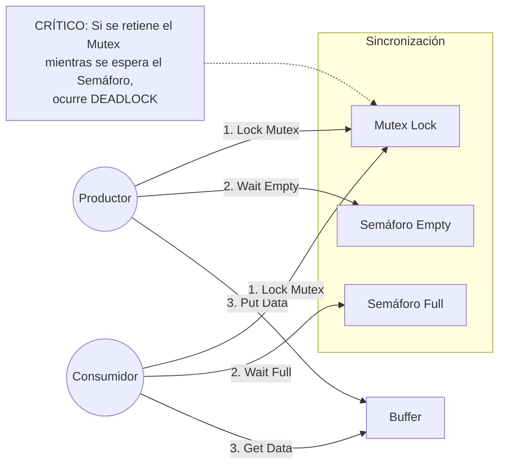

# Problema del Productor-Consumidor: Buffer Circular (Intento 2 - Mutex con Interbloqueo)

## Descripción General

Este proyecto (`pc_attemp2`) representa la segunda iteración en la implementación del Buffer Circular. Su objetivo principal es solucionar la **Condición de Carrera** detectada en el *Intento 1* (donde los índices se corrompían por falta de atomicidad).

Para ello, se introduce un **Mutex** (`pthread_mutex_t`) que protege la sección crítica (el acceso al buffer y la actualización de índices). Sin embargo, la ubicación de este cerrojo introduce un error de diseño fatal conocido como **Interbloqueo (Deadlock)**, que congela la aplicación bajo ciertas condiciones.

## Arquitectura del Sistema

Se añade un componente de exclusión mutua para serializar el acceso a la estructura de datos compartida.



## Estructura del Proyecto

  * **`pc_circular.c`**: Código fuente modificado que incluye `pthread_mutex_lock` y `unlock`.
  * **`common.h` / `common_threads.h`**: Librerías auxiliares.
  * **`Makefile`**: Script de compilación.

## Mecanismo de Sincronización

Además de los semáforos contadores (`empty`, `full`), se emplea un cerrojo binario.

### Nuevas Variables

  * **`pthread_mutex_t mutex`**: Garantiza que solo un hilo a la vez pueda modificar los índices `fill` o `use` y acceder al buffer.

## Lógica de Ejecución (Y el Error)

### La "Solución" Propuesta

Para evitar que dos productores escriban a la vez, se envuelve toda la lógica de inserción/extracción dentro del Mutex:

```c
// Lógica del Productor en Attempt 2
sem_wait(&mutex);       // (P0) Adquirir cerrojo
sem_wait(&empty);       // (P1) Esperar espacio
put(i);                 // (P2) Sección Crítica
sem_post(&full);        // (P3) Avisar dato listo
sem_post(&mutex);       // (P4) Liberar cerrojo
```

### Análisis del Fallo: Interbloqueo (Deadlock)

Esta implementación viola una regla de oro en concurrencia: **Nunca esperar por un evento externo (como un semáforo) mientras se retiene un cerrojo (mutex).**

#### Escenario de Bloqueo

Suponga que el buffer está lleno (`empty = 0`, `full = MAX`) y entra el Productor.

1.  **Productor**: Ejecuta `sem_wait(&mutex)` y adquiere el cerrojo.
2.  **Productor**: Ejecuta `sem_wait(&empty)`. Como el buffer está lleno, **se duerme**, pero **MANTIENE EL MUTEX CERRADO**.
3.  **Consumidor**: Intenta entrar para leer y liberar espacio.
4.  **Consumidor**: Ejecuta `sem_wait(&mutex)`. Como el Productor tiene el mutex, el Consumidor **se bloquea**.
5.  **Resultado**: El Productor espera espacio que solo el Consumidor puede liberar, y el Consumidor espera el mutex que el Productor tiene retenido. **El sistema se detiene para siempre.**

*Este escenario se describe detalladamente en la diapositiva 23 del curso.*

## Compilación y Ejecución

1.  **Compilar**:

    ```bash
    make
    ```

2.  **Ejecutar**:

    ```bash
    ./pc_circular
    ```

    *(Nota: Es muy probable que el programa se congele inmediatamente o tras llenar el buffer por primera vez).*

## Actividades Académicas

1.  **Observación**: Ejecute el programa y observe cómo deja de imprimir mensajes inesperadamente. Use `Ctrl+C` para terminarlo.
2.  **Diagnóstico**: Utilice herramientas como `helgrind` (si está disponible) o depuración visual para confirmar que ambos hilos están en estado de espera (`waiting`).
3.  **Reflexión**: ¿Cómo reordenaría las instrucciones `sem_wait` para que el hilo pueda esperar el semáforo *sin* bloquear el acceso al Mutex para los demás? (Pista: Esto conduce al *Intento 3*).


