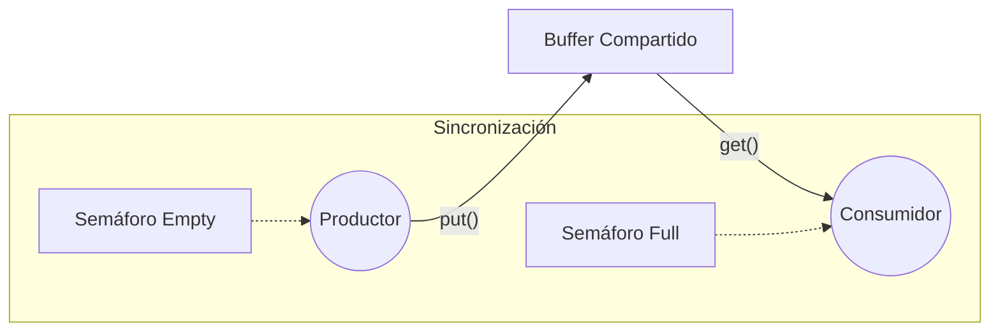

# Problema del Productor-Consumidor: Sincronización con Buffer Acotado (N=1)

## Descripción General

Este proyecto ilustra una solución clásica al problema de concurrencia del **Productor-Consumidor** empleando **semáforos** como primitiva de sincronización. El objetivo es coordinar dos hilos de ejecución (un productor y un consumidor) que comparten un recurso de memoria común de tamaño fijo (Buffer de tamaño 1), garantizando la integridad de los datos y evitando condiciones de carrera.

La implementación se basa en el archivo `pc_single.c` y demuestra el uso de las operaciones atómicas `wait` (decrementar/bloquear) y `post` (incrementar/desbloquear).

## Arquitectura del Sistema

El siguiente diagrama ilustra la interacción entre los agentes y los mecanismos de sincronización:


## Estructura del Proyecto

* **`pc_single.c`**: Código fuente principal que implementa la lógica de los hilos y las rutinas de sincronización.

* **`common.h` / `common_threads.h`**: Encabezados auxiliares para la gestión de tiempos y wrappers de la librería pthread.

* **`Makefile`**: Script de automatización para la compilación del binario.

## Mecanismo de Sincronización

El sistema utiliza dos semáforos para orquestar el flujo de datos y asegurar la exclusión mutua implícita sobre el buffer de un solo elemento.

### Variables de Estado y Semáforos

1. **Buffer Compartido (`int buffer`)**: Espacio de memoria crítico donde se almacena temporalmente el dato producido. Al ser una variable global, su acceso debe ser controlado.
2. **Semáforo `empty` (Inicializado en 1)**:
   * **Semántica**: Representa la disponibilidad de espacio en el buffer para escribir.
   * **Función**: Controla el acceso del productor. Un valor de 1 indica que el buffer está vacío y es seguro escribir.
3. **Semáforo `full` (Inicializado en 0)**:
   * **Semántica**: Representa la disponibilidad de datos en el buffer para leer.
   * **Función**: Controla el acceso del consumidor. Un valor de 0 indica que no hay datos válidos para consumir, forzando al hilo a esperar.

## Lógica de Ejecución

El algoritmo implementa un protocolo de paso de mensajes estricto. Las líneas referenciadas corresponden a los comentarios en `pc_single.c`.

### Hilo Productor (`producer`)

Su función es generar datos e insertarlos en el buffer crítico.

1.  **Adquisición de Recurso (`sem_wait(&empty)`)**: [Línea P1]
    El hilo solicita permiso para escribir. Si `empty` es 0 (buffer lleno), el hilo se bloquea hasta que el consumidor libere espacio. Si es 1, decrementar el semáforo y entra a la sección crítica.
2.  **Operación de Escritura (`put(i)`)**: [Línea P2]
    Se inserta el dato en la variable compartida `buffer`.
3.  **Notificación de Disponibilidad (`sem_post(&full)`)**: [Línea P3]
    El productor incrementa el semáforo `full`, señalizando al consumidor que existe un nuevo dato válido listo para ser procesado.
4.  **Condición de Terminación**:
    Al finalizar el ciclo de producción, se envía un valor centinela (`-1`) para notificar al consumidor el fin del flujo de datos.

### Hilo Consumidor (`consumer`)

Su función es procesar los datos generados por el productor.

1.  **Espera de Datos (`sem_wait(&full)`)**: [Línea C1]
    El hilo solicita permiso para leer. Si `full` es 0 (buffer vacío), el hilo se bloquea. Esto evita la lectura de datos basura o duplicados.
2.  **Operación de Lectura (`get()`)**: [Línea C2]
    Se extrae el valor del `buffer` a una variable local.
3.  **Liberación de Recurso (`sem_post(&empty)`)**: [Línea C3]
    El consumidor incrementa el semáforo `empty`, señalizando al productor que el buffer está libre nuevamente para recibir nuevos datos.

## Compilación y Ejecución

Para compilar y ejecutar el programa, utilice los siguientes comandos en su terminal:

1.  **Compilar**:

    ```bash
    make
    ```

    Esto genera el ejecutable `pc_single` enlazando la librería `pthread`.

2.  **Ejecutar**:

    ```bash
    ./pc_single
    ```

3.  **Limpiar Directorio**:

    ```bash
    make clean
    ```

## Actividades Académicas Sugeridas

Para profundizar en los conceptos de condiciones de carrera y deadlocks (interbloqueos):

1.  **Análisis de Atomicidad**: Modifique el código para eliminar `sem_wait(&empty)` en el productor. Analice cómo esto viola la integridad del buffer al permitir sobrescritura de datos no leídos.
2.  **Escalabilidad**: Modifique las variables `consumers` y `producers` en el `main` para que sean mayores a 1. Observe cómo el buffer simple ($N=1$) se convierte en un cuello de botella y cómo, sin un control de exclusión mutua adicional (Mutex) para los índices, se producirían condiciones de carrera si el buffer fuera un arreglo.
  
> [!NOTE]
> **AI Disclosure:** This document was created with the assistance of Artificial Intelligence language models. The content has been reviewed, edited, and validated by a human author to ensure accuracy and quality.


