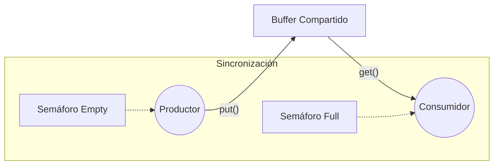

# Problema del Productor-Consumidor (Buffer Simple)

Este proyecto implementa una solución clásica al problema de concurrencia del Productor-Consumidor utilizando un buffer de capacidad 1 y semáforos para orquestar la cooperación entre hilos.

El objetivo es entender cómo dos hilos (uno que genera datos y otro que los procesa) pueden sincronizarse para no perder datos ni leer "basura".

## Arquitectura del sistema

Este código implementa una solución al problema del **Productor-Consumidor** utilizando un **buffer de tamaño 1** y **semáforos** para la sincronización.

### Componentes Principales:

1.  **Buffer Compartido**:
    -   `int buffer`: Variable global que actúa como el buffer de un solo espacio.

2.  **Semáforos**:
    -   `sem_t empty`: Inicializado en **1**. Indica si el buffer está vacío y listo para recibir datos.
    -   `sem_t full`: Inicializado en **0**. Indica si el buffer tiene datos listos para ser consumidos.

### Lógica de Funcionamiento:

-   **Productor (`producer`)**:
    1.  Espera a que el buffer esté vacío (`sem_wait(&empty)`).
    2.  Escribe un valor en el buffer (`put(i)`).
    3.  Señala que el buffer está lleno (`sem_post(&full)`).
    4.  Al finalizar sus datos, envía un valor centinela (`-1`) para indicar a los consumidores que terminen.
       

-   **Consumidor (`consumer`)**:
    1.  Espera a que el buffer tenga datos (`sem_wait(&full)`).
    2.  Lee el valor del buffer (`get()`).
    3.  Señala que el buffer está vacío (`sem_post(&empty)`).
    4.  Si lee el valor centinela (`-1`), termina su ejecución.

### Notas:
-   Esta implementación asume un único productor (`producers = 1`) pero soporta múltiples consumidores.
-   El uso de semáforos garantiza que el productor no sobrescriba datos antes de ser leídos y que el consumidor no lea datos inválidos o repetidos.

