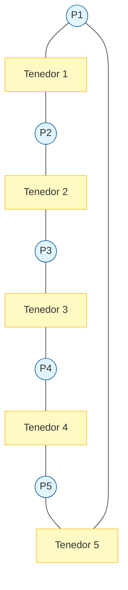
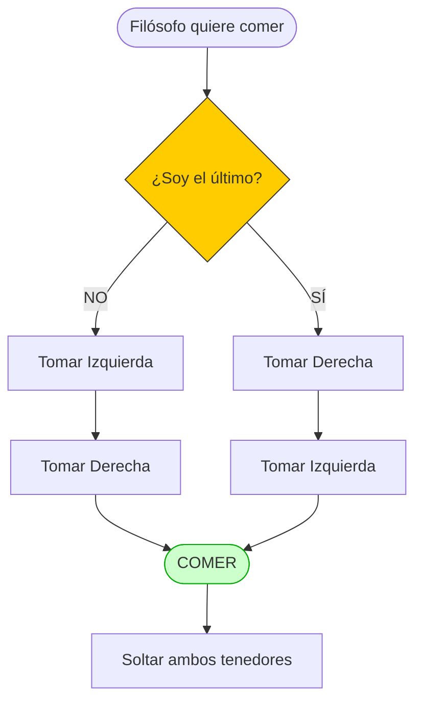

# La Cena de los Filósofos (The Dining Philosophers)

Este directorio contiene la implementación del clásico problema de sincronización **"Dining Philosophers"**, basado en la Sección 31.6 del libro *Operating Systems: Three Easy Pieces* (Remzi).

El objetivo es demostrar problemas complejos de concurrencia como el **Deadlock** (Bloqueo Mutuo) y la **Inanición** (Starvation), y cómo resolverlos utilizando semáforos y ordenamiento de recursos.

## Descripción del Escenario

* **5 Filósofos** se sientan alrededor de una mesa redonda.
* Pasan su vida alternando entre dos estados: **Pensar** y **Comer**.
* Para comer, un filósofo necesita **dos tenedores**: el que está a su izquierda y el que está a su derecha.
* **Restricción:** Hay solo 5 tenedores en total (uno entre cada par de filósofos). Si un filósofo toma un tenedor, su vecino no puede usarlo.

### Estructura Lógica

Cada "tenedor" se representa como un **Semáforo Binario** (o Mutex).




## El Problema: Deadlock (Abrazo Mortal)

Si implementamos una lógica ingenua donde todos los filósofos actúan igual:

1.  Tomar tenedor izquierdo.
2.  Tomar tenedor derecho.
3.  Comer.

...y todos intentan comer al mismo tiempo, ocurre lo siguiente:

  * Todos toman su tenedor izquierdo simultáneamente.
  * Todos esperan que se libere el tenedor derecho.
  * **Resultado:** Nadie come, nadie suelta el tenedor. El sistema se detiene para siempre.

## La Solución (The Broken Dependency)

La solución implementada (sugerida por Remzi) consiste en **romper el ciclo de dependencia** cambiando el orden de adquisición de recursos para al menos uno de los filósofos.

  * **Filósofos 0 al 3:** Toman Izquierda (`Left`) y luego Derecha (`Right`).
  * **Filósofo 4 (El último):** Toma Derecha (`Right`) y luego Izquierda (`Left`).

### Pseudocódigo de la Solución

```c
void *philosopher(void *arg) {
    int p = (int) arg; // ID del filósofo
    
    if (p == 4) { // El último rompe el ciclo
        sem_wait(&forks[right(p)]);
        sem_wait(&forks[left(p)]);
    } else {      // Los demás siguen el orden estándar
        sem_wait(&forks[left(p)]);
        sem_wait(&forks[right(p)]);
    }
    
    eat();
    
    sem_post(&forks[left(p)]);
    sem_post(&forks[right(p)]);
}
```

### Diagrama de Flujo de la Solución



## Compilación y Ejecución

Para facilitar la compilación de los múltiples archivos involucrados, se incluye un archivo `Makefile`.

### 1\. Compilar

Simplemente ejecuta el comando `make` en la terminal dentro de esta carpeta. El `Makefile` se encargará de enlazar las librerías necesarias (`-pthread`).

```bash
make
```

### 2\. Ejecutar

Una vez compilado, se generará el ejecutable (generalmente llamado `dining` o `main`).

```bash
./dining_philosophers
```

*(Verifica el nombre exacto del ejecutable generado por el Makefile haciendo un `ls`).*

### 3\. Limpiar

Para borrar los archivos binarios y objetos generados:

```bash
make clean
```

## Qué observar durante la ejecución

Al correr el programa, deberías ver mensajes en la consola indicando qué filósofo está comiendo. Gracias a la solución implementada:

1.  El programa **no se congela** (No hay Deadlock).
2.  Eventualmente, todos los filósofos logran comer (puedes verificar que no haya Starvation si la ejecución es larga).

> [!note]
> **Nota sobre IA**: Este contenido fue elaborado y estructurado con la asistencia de un modelo de inteligencia artificial. Puede contener errores.