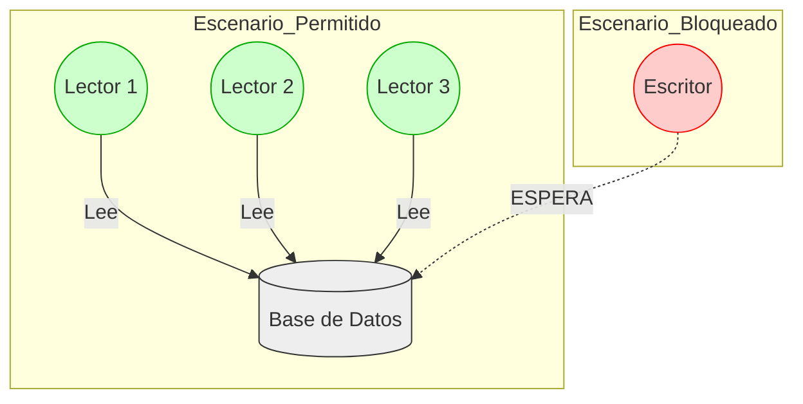
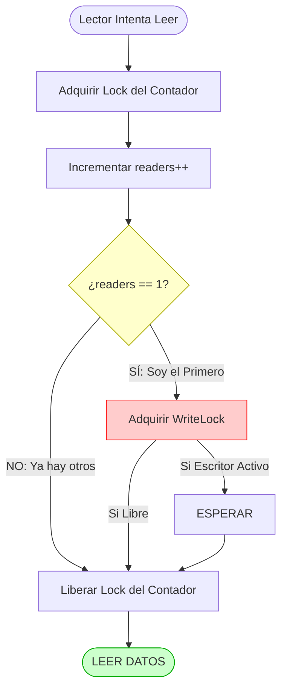

# Implementación de Reader-Writer Locks (Semáforos)

Este directorio contiene una implementación del patrón **Lectores-Escritores** utilizando **Semáforos**, basado en la teoría del Capítulo 31 ("Semaphores") del libro *Operating Systems: Three Easy Pieces* (Remzi).

## Descripción del Problema

Un `mutex` tradicional es demasiado restrictivo para ciertas estructuras de datos (como bases de datos o cachés). Si un hilo solo quiere **leer** datos, no debería impedir que otros hilos también lean.

* **El Problema del Mutex Simple:** Bloquea a *todos*, incluso si varios hilos solo quieren mirar (leer) sin tocar (escribir).
* **La Solución (RWLock):**
    * Permite **Múltiples Lectores** simultáneos.
    * Permite **Solo un Escritor** (exclusión mutua total).
    * Los escritores esperan a que no haya lectores activos.

### Estructura de Datos (`rwlock.h`)

La estructura típica definida por Remzi utiliza dos semáforos y un contador:

```c
typedef struct _rwlock_t {
    sem_t lock;      // Semáforo binario (mutex) para proteger el contador 'readers'
    sem_t writelock; // Semáforo para exclusión de escritores
    int readers;     // Cuenta cuántos lectores están activos actualmente
} rwlock_t;
````

### Visualización del Concepto

A diferencia de la lista enlazada anterior, aquí permitimos concurrencia real en la lectura:



## Lógica de Implementación

La magia de este algoritmo reside en cómo los lectores coordinan el acceso al "permiso de escritura".

### 1\. El Primer Lector (`rwlock_acquire_readlock`)

El **primer** lector que llega tiene la responsabilidad de bloquear a los escritores.

```c
sem_wait(&lock);
readers++;
if (readers == 1)      // ¿Soy el primero?
    sem_wait(&writelock); // ¡Cierro la puerta a los escritores!
sem_post(&lock);
```

### 2\. El Último Lector (`rwlock_release_readlock`)

El **último** lector que sale tiene la responsabilidad de desbloquear a los escritores.

```c
sem_wait(&lock);
readers--;
if (readers == 0)      // ¿Soy el último?
    sem_post(&writelock); // ¡Abro la puerta para los escritores!
sem_post(&lock);
```

### 3\. El Escritor (`rwlock_acquire_writelock`)

Para el escritor, es simple: necesita el `writelock` para él solo. Si hay lectores leyendo (que tomaron el lock en el paso 1), el escritor se duerme.

## Compilación y Ejecución

Para compilar este ejemplo se requiere la librería `pthread` (para hilos y semáforos).

### 1\. Compilar

```bash
gcc -o rwlock main.c rwlock.c -Wall -pthread
```

### 2\. Ejecutar

El `main.c` usualmente simula un escenario con muchos lectores y pocos escritores para demostrar que los lectores no se bloquean entre sí.

```bash
./rwlock
```

## Análisis de Flujo

El siguiente diagrama explica la lógica crítica del "Primer Lector":



## Advertencia: Inanición de Escritores (Writer Starvation)

Esta implementación específica (conocida como **Reader-Preference** o Preferencia de Lectores) tiene una debilidad importante señalada en el libro:

> **El Problema:** Si siguen llegando lectores continuamente, el contador `readers` nunca llegará a 0.
> **La Consecuencia:** El escritor nunca obtendrá el `writelock` y sufrirá de **Inanición (Starvation)**. Nunca podrá escribir.

Es ideal para cargas de trabajo donde las lecturas son frecuentes pero hay pausas que permiten escribir, pero peligroso si el flujo de lectura es infinito.

> [!note]
> **Nota sobre IA**: Este contenido fue elaborado y estructurado con la asistencia de un modelo de inteligencia artificial. Puede contener errores.